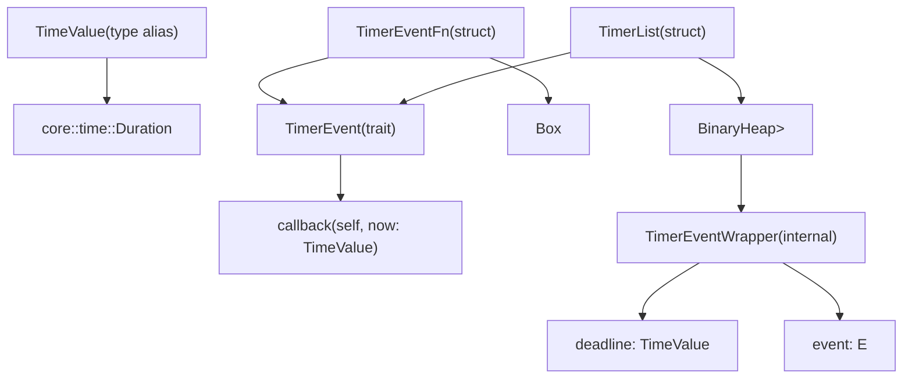
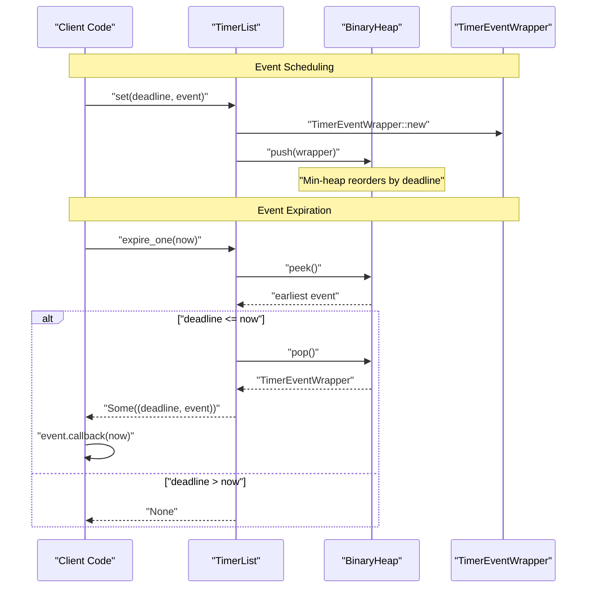
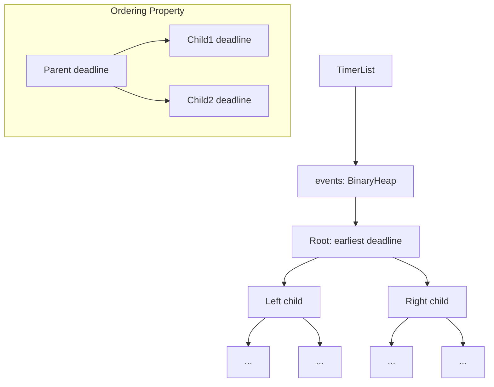

# Core API Reference

> **Relevant source files**
> * [src/lib.rs](https://github.com/arceos-org/timer_list/blob/4fa2875f/src/lib.rs)

This document provides comprehensive reference documentation for all public types, traits, and methods exposed by the `timer_list` crate. The API consists of four main components: the `TimerList` data structure for managing timed events, the `TimerEvent` trait for defining event callbacks, the `TimerEventFn` wrapper for closure-based events, and the `TimeValue` type alias for time representation.

For practical usage examples and integration patterns, see [Usage Guide and Examples](/arceos-org/timer_list/3-usage-guide-and-examples). For detailed explanations of the internal architecture, see [TimerList Data Structure](/arceos-org/timer_list/2.1-timerlist-data-structure) and [TimerEvent System](/arceos-org/timer_list/2.2-timerevent-system).

## Type System Overview



**Type Relationships in timer_list Crate**

This diagram shows the complete type hierarchy and relationships within the crate. The `TimerList` is parameterized over types implementing `TimerEvent`, while `TimerEventFn` provides a concrete implementation for closure-based events.

Sources: [src/lib.rs(L10 - L32)&emsp;](https://github.com/arceos-org/timer_list/blob/4fa2875f/src/lib.rs#L10-L32) [src/lib.rs(L108 - L127)&emsp;](https://github.com/arceos-org/timer_list/blob/4fa2875f/src/lib.rs#L108-L127)

## Core Types

### TimeValue

```
pub type TimeValue = Duration;
```

The `TimeValue` type is an alias for `core::time::Duration` and represents all time values used throughout the timer system. This includes event deadlines, current time measurements, and time deltas.

|Usage Context|Description|
| --- | --- |
|Event deadlines|Absolute time when events should expire|
|Current time|Time parameter passed toexpire_one()|
|Callback parameter|Time value passed toTimerEvent::callback()|

Sources: [src/lib.rs(L10 - L13)&emsp;](https://github.com/arceos-org/timer_list/blob/4fa2875f/src/lib.rs#L10-L13)

### TimerEvent Trait

The `TimerEvent` trait defines the interface that all timed events must implement. It consists of a single required method:

```rust
pub trait TimerEvent {
    fn callback(self, now: TimeValue);
}
```

|Method|Parameters|Description|
| --- | --- | --- |
|callback|self, now: TimeValue|Called when the timer expires; consumes the event|

The `callback` method takes ownership of the event (`self`) and receives the current time when the event expires. This design ensures that each event can only be triggered once.

Sources: [src/lib.rs(L15 - L19)&emsp;](https://github.com/arceos-org/timer_list/blob/4fa2875f/src/lib.rs#L15-L19)

### TimerEventFn Wrapper

The `TimerEventFn` struct provides a convenient way to create timer events from closures without implementing the `TimerEvent` trait manually.

```
pub struct TimerEventFn(Box<dyn FnOnce(TimeValue) + 'static>);
```

|Method|Signature|Description|
| --- | --- | --- |
|new|pub fn new<F>(f: F) -> Self where F: FnOnce(TimeValue) + 'static|Creates a newTimerEventFnfrom a closure|

The wrapper automatically implements `TimerEvent` by calling the stored closure when the event expires.

Sources: [src/lib.rs(L108 - L127)&emsp;](https://github.com/arceos-org/timer_list/blob/4fa2875f/src/lib.rs#L108-L127)

## TimerList API Methods

### Constructor and State

|Method|Signature|Description|
| --- | --- | --- |
|new|pub fn new() -> Self|Creates a new empty timer list|
|is_empty|pub fn is_empty(&self) -> bool|Returnstrueif no events are scheduled|

The `TimerList` also implements `Default`, which delegates to `new()`.

Sources: [src/lib.rs(L55 - L66)&emsp;](https://github.com/arceos-org/timer_list/blob/4fa2875f/src/lib.rs#L55-L66) [src/lib.rs(L102 - L106)&emsp;](https://github.com/arceos-org/timer_list/blob/4fa2875f/src/lib.rs#L102-L106)

### Event Management

|Method|Signature|Description|
| --- | --- | --- |
|set|pub fn set(&mut self, deadline: TimeValue, event: E)|Schedules an event to expire at the specified deadline|
|cancel|pub fn cancel<F>(&mut self, condition: F) where F: Fn(&E) -> bool|Removes all events matching the condition function|
|next_deadline|pub fn next_deadline(&self) -> Option<TimeValue>|Returns the deadline of the earliest scheduled event|
|expire_one|pub fn expire_one(&mut self, now: TimeValue) -> Option<(TimeValue, E)>|Expires the earliest event if its deadline has passed|

The `set` method has O(log n) complexity due to the underlying min-heap structure. The `cancel` method currently has O(n) complexity and includes a TODO comment for performance optimization.

Sources: [src/lib.rs(L68 - L99)&emsp;](https://github.com/arceos-org/timer_list/blob/4fa2875f/src/lib.rs#L68-L99)

## Event Processing Flow



**Event Lifecycle from Scheduling to Expiration**

This sequence diagram illustrates the complete flow from event scheduling through expiration processing, showing how the `TimerList` coordinates with the internal `BinaryHeap` and `TimerEventWrapper` structures.

Sources: [src/lib.rs(L21 - L24)&emsp;](https://github.com/arceos-org/timer_list/blob/4fa2875f/src/lib.rs#L21-L24) [src/lib.rs(L68 - L99)&emsp;](https://github.com/arceos-org/timer_list/blob/4fa2875f/src/lib.rs#L68-L99)

## Internal Implementation Details

### TimerEventWrapper

The internal `TimerEventWrapper<E>` struct combines an event with its deadline and implements the ordering traits required for the min-heap:

```css
struct TimerEventWrapper<E> {
    deadline: TimeValue,
    event: E,
}
```

The wrapper implements `Ord`, `PartialOrd`, `Eq`, and `PartialEq` with reversed ordering to create a min-heap from Rust's max-heap `BinaryHeap`. The comparison is based solely on the `deadline` field.

|Trait Implementation|Behavior|
| --- | --- |
|Ord::cmp|Comparesother.deadlinewithself.deadline(reversed)|
|PartialOrd::partial_cmp|Delegates toOrd::cmp|
|Eq,PartialEq|Compares deadlines for equality|

Sources: [src/lib.rs(L21 - L24)&emsp;](https://github.com/arceos-org/timer_list/blob/4fa2875f/src/lib.rs#L21-L24) [src/lib.rs(L34 - L52)&emsp;](https://github.com/arceos-org/timer_list/blob/4fa2875f/src/lib.rs#L34-L52)

### Min-Heap Architecture



**Internal Min-Heap Structure for Event Ordering**

The `BinaryHeap` maintains the min-heap property where each parent node has a deadline less than or equal to its children, ensuring O(1) access to the earliest event and O(log n) insertion.

Sources: [src/lib.rs(L26 - L32)&emsp;](https://github.com/arceos-org/timer_list/blob/4fa2875f/src/lib.rs#L26-L32) [src/lib.rs(L40 - L43)&emsp;](https://github.com/arceos-org/timer_list/blob/4fa2875f/src/lib.rs#L40-L43)