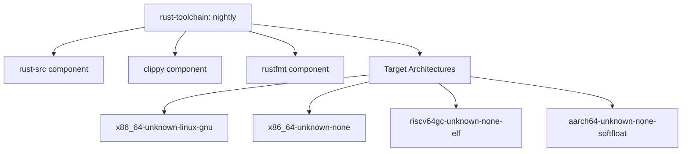
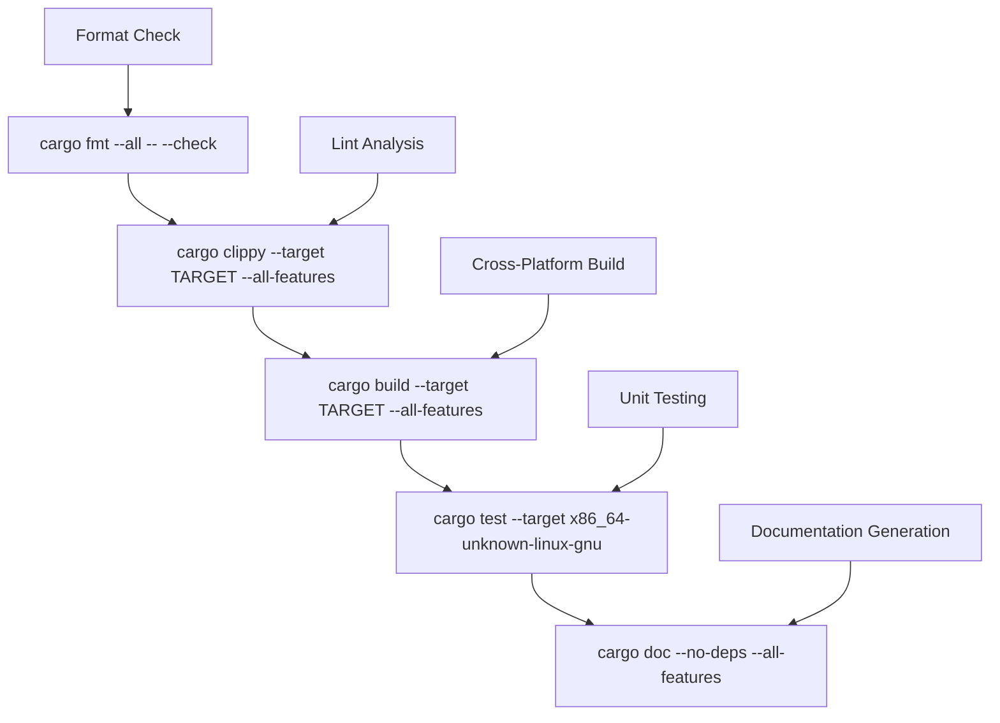
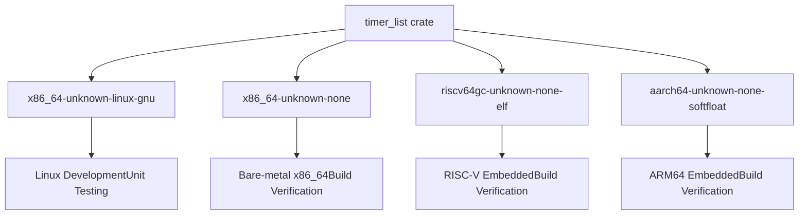
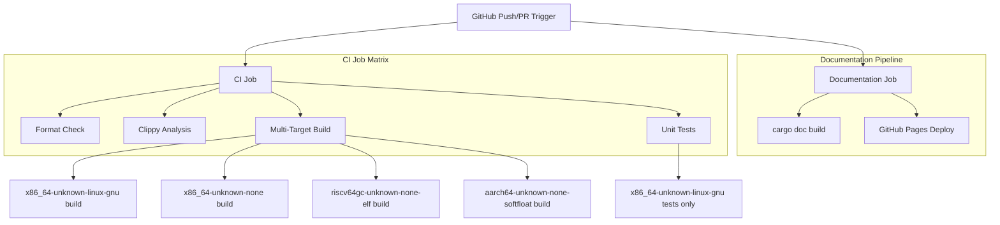
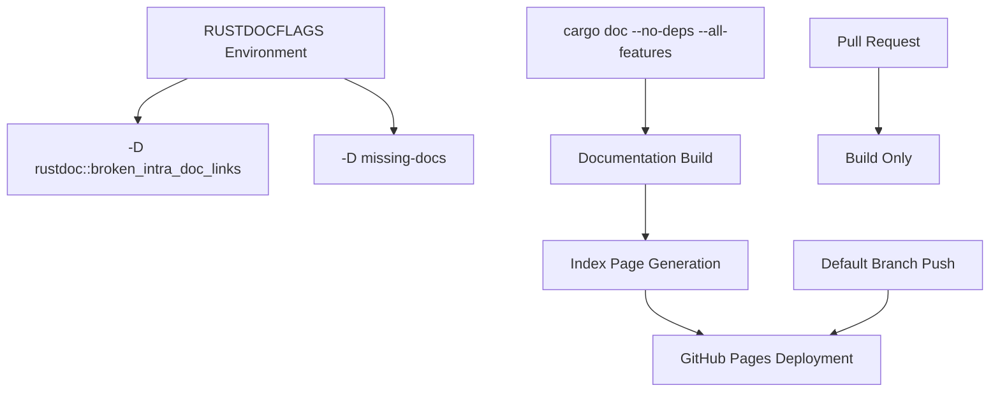
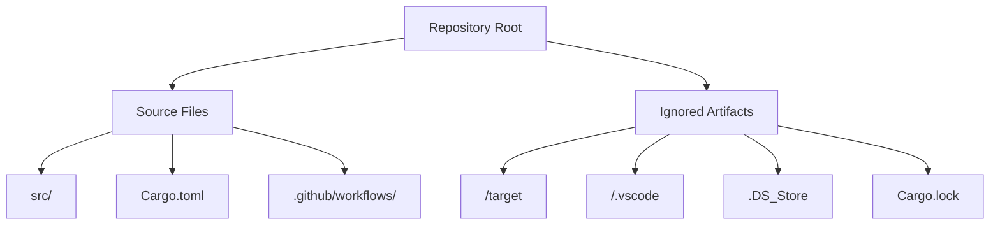

# Development Workflow

> **Relevant source files**
> * [.github/workflows/ci.yml](https://github.com/arceos-org/timer_list/blob/4fa2875f/.github/workflows/ci.yml)
> * [.gitignore](https://github.com/arceos-org/timer_list/blob/4fa2875f/.gitignore)

This document provides guidance for contributors working on the `timer_list` crate. It covers local development setup, build processes, testing procedures, and the automated CI/CD pipeline. For detailed API documentation, see [Core API Reference](/arceos-org/timer_list/2-core-api-reference). For usage examples and integration patterns, see [Usage Guide and Examples](/arceos-org/timer_list/3-usage-guide-and-examples).

## Local Development Environment

The `timer_list` crate requires the Rust nightly toolchain with specific components and target architectures. The development environment must support cross-compilation for embedded and bare-metal targets.

### Required Toolchain Components



**Toolchain Setup**

The project requires `rustc nightly` with cross-compilation support for multiple architectures. Install the required components:

```
rustup toolchain install nightly
rustup component add rust-src clippy rustfmt --toolchain nightly
rustup target add x86_64-unknown-none riscv64gc-unknown-none-elf aarch64-unknown-none-softfloat --toolchain nightly
```

Sources: [.github/workflows/ci.yml(L15 - L19)&emsp;](https://github.com/arceos-org/timer_list/blob/4fa2875f/.github/workflows/ci.yml#L15-L19)

## Build and Development Commands

### Core Development Workflow



**Format Checking**

```
cargo fmt --all -- --check
```

**Lint Analysis**

```
cargo clippy --target <TARGET> --all-features -- -A clippy::new_without_default
```

**Building for Specific Targets**

```
cargo build --target <TARGET> --all-features
```

**Running Tests**

```
cargo test --target x86_64-unknown-linux-gnu -- --nocapture
```

Sources: [.github/workflows/ci.yml(L22 - L30)&emsp;](https://github.com/arceos-org/timer_list/blob/4fa2875f/.github/workflows/ci.yml#L22-L30)

## Multi-Target Architecture Support

The crate supports four distinct target architectures, each serving different deployment scenarios:

|Target Architecture|Use Case|Testing Support|
| --- | --- | --- |
|x86_64-unknown-linux-gnu|Standard Linux development|Full unit testing|
|x86_64-unknown-none|Bare-metal x86_64 systems|Build-only|
|riscv64gc-unknown-none-elf|RISC-V embedded systems|Build-only|
|aarch64-unknown-none-softfloat|ARM64 embedded systems|Build-only|



Unit tests execute only on `x86_64-unknown-linux-gnu` due to the `no-std` nature of other targets and the lack of standard library support for test execution.

Sources: [.github/workflows/ci.yml(L12)&emsp;](https://github.com/arceos-org/timer_list/blob/4fa2875f/.github/workflows/ci.yml#L12-L12) [.github/workflows/ci.yml(L29 - L30)&emsp;](https://github.com/arceos-org/timer_list/blob/4fa2875f/.github/workflows/ci.yml#L29-L30)

## Continuous Integration Pipeline

### CI Job Matrix Strategy



**CI Job Execution Steps:**

1. **Environment Setup**: Ubuntu latest with nightly Rust toolchain
2. **Format Verification**: `cargo fmt --all -- --check`
3. **Lint Analysis**: `cargo clippy` with custom configuration
4. **Cross-Compilation**: Build for all four target architectures
5. **Test Execution**: Unit tests on Linux target only

**Documentation Job Features:**

* Builds documentation with strict link checking
* Enforces complete documentation coverage
* Deploys to GitHub Pages on default branch pushes
* Generates redirect index page automatically

Sources: [.github/workflows/ci.yml(L6 - L31)&emsp;](https://github.com/arceos-org/timer_list/blob/4fa2875f/.github/workflows/ci.yml#L6-L31) [.github/workflows/ci.yml(L32 - L55)&emsp;](https://github.com/arceos-org/timer_list/blob/4fa2875f/.github/workflows/ci.yml#L32-L55)

## Documentation Standards

### Documentation Pipeline Configuration



The documentation system enforces strict standards:

* **Broken Link Detection**: All intra-doc links must resolve correctly
* **Complete Coverage**: Missing documentation generates build failures
* **Dependency Exclusion**: Only project documentation is generated (`--no-deps`)
* **Feature Complete**: All features are documented (`--all-features`)

The system automatically generates an index redirect page using the crate name extracted from `cargo tree` output.

Sources: [.github/workflows/ci.yml(L40)&emsp;](https://github.com/arceos-org/timer_list/blob/4fa2875f/.github/workflows/ci.yml#L40-L40) [.github/workflows/ci.yml(L47 - L48)&emsp;](https://github.com/arceos-org/timer_list/blob/4fa2875f/.github/workflows/ci.yml#L47-L48)

## Repository Structure and Ignored Files

### Git Configuration



**Ignored Files and Directories:**

* `/target`: Rust build artifacts and compiled binaries
* `/.vscode`: Visual Studio Code workspace settings
* `.DS_Store`: macOS filesystem metadata files
* `Cargo.lock`: Dependency lock file (excluded for library crates)

The `Cargo.lock` exclusion indicates this crate follows Rust library conventions, allowing downstream projects to resolve their own dependency versions.

Sources: [.gitignore(L1 - L4)&emsp;](https://github.com/arceos-org/timer_list/blob/4fa2875f/.gitignore#L1-L4)

## Contributing Guidelines

### Code Quality Requirements

All contributions must pass the complete CI pipeline:

1. **Format Compliance**: Code must conform to `rustfmt` standards
2. **Lint Compliance**: Must pass `clippy` analysis with project-specific exceptions
3. **Cross-Platform Compatibility**: Must build successfully on all four target architectures
4. **Test Coverage**: New functionality requires corresponding unit tests
5. **Documentation**: All public APIs must include comprehensive documentation

### Development Branch Strategy

The project uses a straightforward branching model:

* **Default Branch**: Primary development and release branch
* **Feature Branches**: Individual contributions via pull requests
* **GitHub Pages**: Automatic deployment from default branch

Documentation deployment occurs automatically on default branch pushes, ensuring the published documentation remains current with the latest code changes.

Sources: [.github/workflows/ci.yml(L3)&emsp;](https://github.com/arceos-org/timer_list/blob/4fa2875f/.github/workflows/ci.yml#L3-L3) [.github/workflows/ci.yml(L50)&emsp;](https://github.com/arceos-org/timer_list/blob/4fa2875f/.github/workflows/ci.yml#L50-L50)