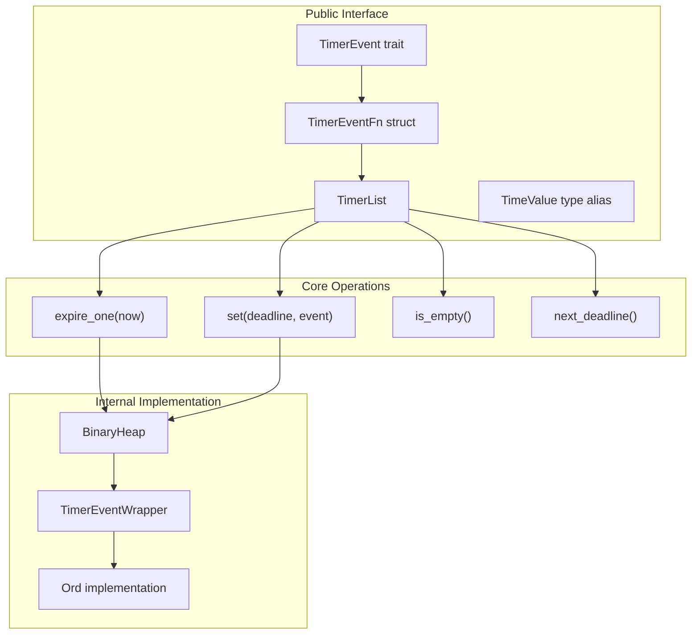
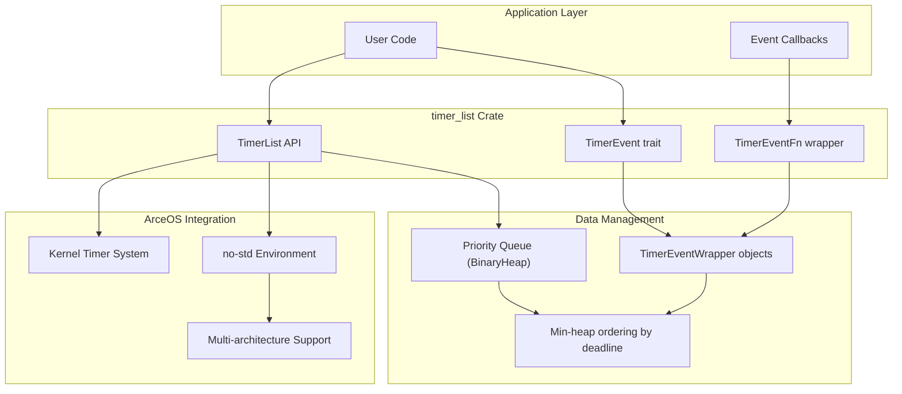
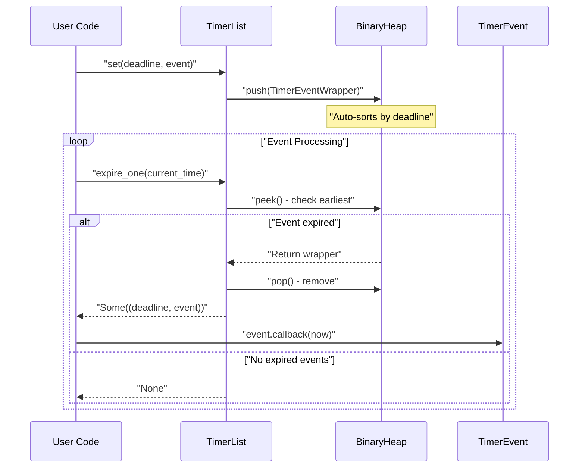

# Overview

> **Relevant source files**
> * [Cargo.toml](https://github.com/arceos-org/timer_list/blob/4fa2875f/Cargo.toml)
> * [README.md](https://github.com/arceos-org/timer_list/blob/4fa2875f/README.md)

This document covers the `timer_list` crate, a Rust library that provides efficient timer event management for the ArceOS operating system. The crate implements a priority queue-based system for scheduling and triggering time-based events in `no-std` environments. For detailed API documentation, see [Core API Reference](/arceos-org/timer_list/2-core-api-reference). For practical implementation examples, see [Usage Guide and Examples](/arceos-org/timer_list/3-usage-guide-and-examples).

## Purpose and Core Design

The `timer_list` crate serves as a foundational component for time-based event scheduling in operating system kernels and embedded systems. It provides a `TimerList` data structure that manages `TimerEvent` objects, ensuring they are triggered sequentially when their deadlines expire.

**Core Design Principles**

The following diagram illustrates the core system architecture and maps natural language concepts to specific code entities:

Sources: [Cargo.toml(L1 - L15)&emsp;](https://github.com/arceos-org/timer_list/blob/4fa2875f/Cargo.toml#L1-L15) [README.md(L12 - L34)&emsp;](https://github.com/arceos-org/timer_list/blob/4fa2875f/README.md#L12-L34)

## System Architecture

The `timer_list` crate implements a min-heap based priority queue system for efficient timer management. The following diagram shows the complete system architecture:

Sources: [Cargo.toml(L6 - L7)&emsp;](https://github.com/arceos-org/timer_list/blob/4fa2875f/Cargo.toml#L6-L7) [Cargo.toml(L12)&emsp;](https://github.com/arceos-org/timer_list/blob/4fa2875f/Cargo.toml#L12-L12) [README.md(L7 - L8)&emsp;](https://github.com/arceos-org/timer_list/blob/4fa2875f/README.md#L7-L8)

## Key Capabilities

The `timer_list` crate provides the following core capabilities:

|Capability|Implementation|Code Entity|
| --- | --- | --- |
|Event Scheduling|Priority queue with O(log n) insertion|TimerList::set()|
|Event Expiration|O(1) access to next expired event|TimerList::expire_one()|
|Custom Events|Trait-based event system|TimerEventtrait|
|Function Callbacks|Wrapper for closure-based events|TimerEventFn|
|Queue Status|Check if events are pending|TimerList::is_empty()|
|Deadline Access|Get next event deadline|TimerList::next_deadline()|

**Sequential Processing Model**

The crate enforces sequential processing of timer events, where events are triggered one at a time in deadline order. This design ensures deterministic behavior suitable for real-time systems and kernel environments.

Sources: [README.md(L24 - L33)&emsp;](https://github.com/arceos-org/timer_list/blob/4fa2875f/README.md#L24-L33)

## ArceOS Ecosystem Integration

The `timer_list` crate is designed specifically for integration with the ArceOS operating system ecosystem. Key integration aspects include:

* **No-std Compatibility**: Designed for kernel and embedded environments without standard library dependencies
* **Multi-architecture Support**: Compatible with x86_64, RISC-V, and ARM architectures
* **License Flexibility**: Triple-licensed (GPL-3.0, Apache-2.0, MulanPSL-2.0) for broad ecosystem compatibility
* **Crates.io Publication**: Available as a standalone library for reuse in other projects

The crate serves as a foundational component that other ArceOS modules can depend on for timer-based functionality, from interrupt handling to task scheduling.

Sources: [Cargo.toml(L7 - L12)&emsp;](https://github.com/arceos-org/timer_list/blob/4fa2875f/Cargo.toml#L7-L12) [README.md(L3 - L5)&emsp;](https://github.com/arceos-org/timer_list/blob/4fa2875f/README.md#L3-L5)