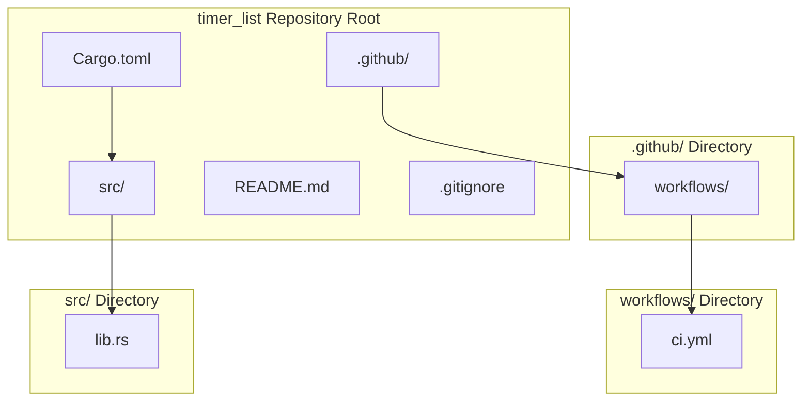
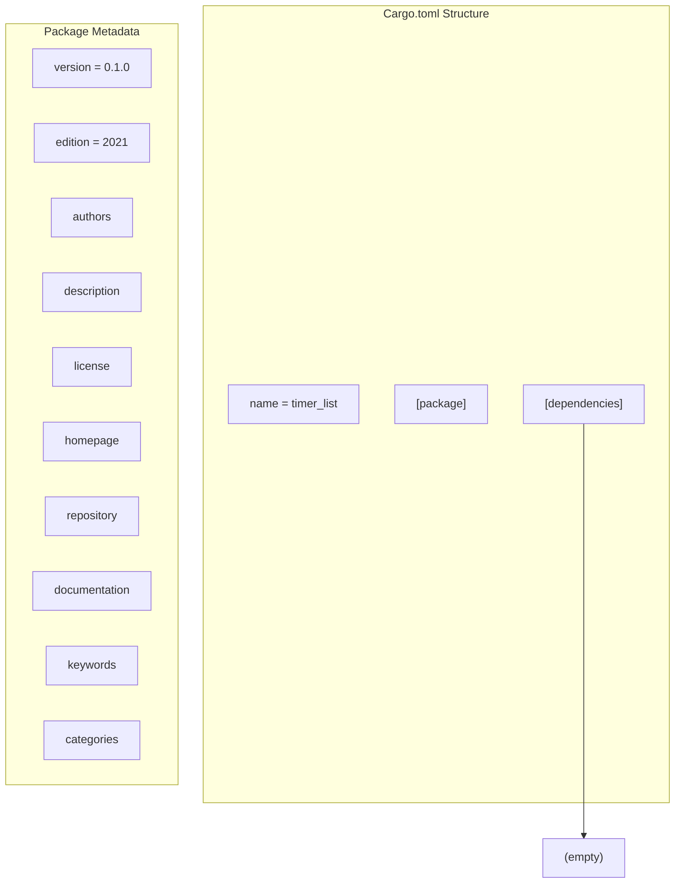
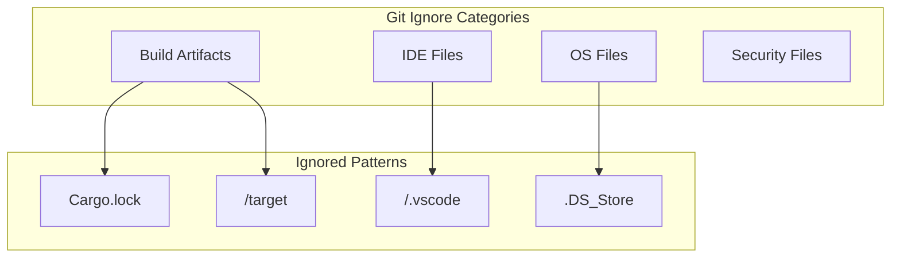
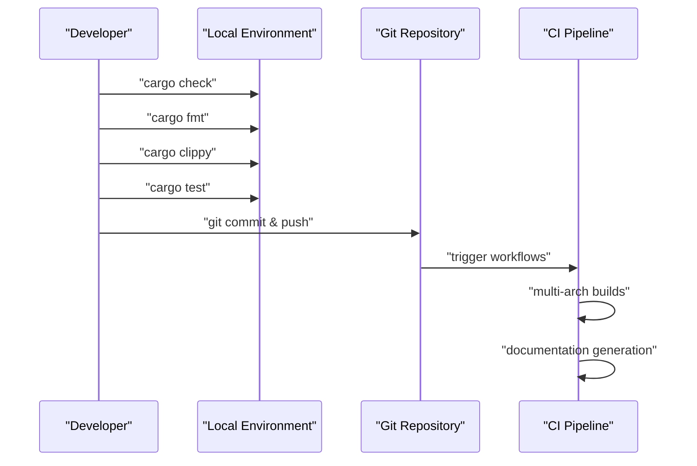

# Project Structure

> **Relevant source files**
> * [.gitignore](https://github.com/arceos-org/timer_list/blob/4fa2875f/.gitignore)
> * [Cargo.toml](https://github.com/arceos-org/timer_list/blob/4fa2875f/Cargo.toml)

This document provides an overview of the `timer_list` repository organization, key configuration files, and development environment setup. It is intended for contributors who need to understand how the codebase is structured and how to set up a local development environment.

For information about building and testing the crate, see [Building and Testing](/arceos-org/timer_list/4.1-building-and-testing). For details about the core API implementation, see [Core API Reference](/arceos-org/timer_list/2-core-api-reference).

## Repository Layout

The `timer_list` repository follows a standard Rust crate structure with additional configuration for CI/CD and documentation.

### Overall Repository Structure

Sources: [Cargo.toml(L1 - L15)&emsp;](https://github.com/arceos-org/timer_list/blob/4fa2875f/Cargo.toml#L1-L15) [.gitignore(L1 - L5)&emsp;](https://github.com/arceos-org/timer_list/blob/4fa2875f/.gitignore#L1-L5)

### File Organization Principles

The repository follows these organizational principles:

|Directory/File|Purpose|Key Contents|
| --- | --- | --- |
|Cargo.toml|Package configuration|Dependencies, metadata, build settings|
|src/lib.rs|Core implementation|TimerList,TimerEventtrait, main API|
|.gitignore|Version control exclusions|Build artifacts, IDE files, OS files|
|.github/workflows/|CI/CD automation|Format checking, linting, multi-arch builds|
|README.md|Project documentation|Usage examples, feature overview|

Sources: [Cargo.toml(L1 - L15)&emsp;](https://github.com/arceos-org/timer_list/blob/4fa2875f/Cargo.toml#L1-L15) [.gitignore(L1 - L5)&emsp;](https://github.com/arceos-org/timer_list/blob/4fa2875f/.gitignore#L1-L5)

## Core Configuration Files

### Package Configuration

The `Cargo.toml` file defines the crate's identity, dependencies, and metadata:

Sources: [Cargo.toml(L1 - L15)&emsp;](https://github.com/arceos-org/timer_list/blob/4fa2875f/Cargo.toml#L1-L15)

#### Key Package Metadata

|Field|Value|Purpose|
| --- | --- | --- |
|name|"timer_list"|Crate identifier for cargo and crates.io|
|version|"0.1.0"|Semantic version following semver|
|edition|"2021"|Rust edition for language features|
|description|Timer events description|Brief summary for crate discovery|
|license|Triple license|GPL-3.0-or-later OR Apache-2.0 OR MulanPSL-2.0|
|categories|["no-std", "data-structures", "date-and-time"]|Categorization for crates.io|
|keywords|["arceos", "timer", "events"]|Search tags for discoverability|

Sources: [Cargo.toml(L2 - L12)&emsp;](https://github.com/arceos-org/timer_list/blob/4fa2875f/Cargo.toml#L2-L12)

#### External References

The package configuration includes several external links:

* **Homepage**: [Cargo.toml(L8)&emsp;](https://github.com/arceos-org/timer_list/blob/4fa2875f/Cargo.toml#L8-L8) points to the ArceOS organization
* **Repository**: [Cargo.toml(L9)&emsp;](https://github.com/arceos-org/timer_list/blob/4fa2875f/Cargo.toml#L9-L9) points to the specific timer_list repository
* **Documentation**: [Cargo.toml(L10)&emsp;](https://github.com/arceos-org/timer_list/blob/4fa2875f/Cargo.toml#L10-L10) points to docs.rs for API documentation

Sources: [Cargo.toml(L8 - L10)&emsp;](https://github.com/arceos-org/timer_list/blob/4fa2875f/Cargo.toml#L8-L10)

#### Dependencies

The crate currently has no external dependencies, as shown by the empty `[dependencies]` section at [Cargo.toml(L14 - L15)&emsp;](https://github.com/arceos-org/timer_list/blob/4fa2875f/Cargo.toml#L14-L15) This supports the crate's `no-std` design and minimal footprint for embedded environments.

Sources: [Cargo.toml(L14 - L15)&emsp;](https://github.com/arceos-org/timer_list/blob/4fa2875f/Cargo.toml#L14-L15)

### Git Configuration

The `.gitignore` file excludes development artifacts and environment-specific files:

Sources: [.gitignore(L1 - L5)&emsp;](https://github.com/arceos-org/timer_list/blob/4fa2875f/.gitignore#L1-L5)

#### Ignored File Types

|Pattern|Category|Reason for Exclusion|
| --- | --- | --- |
|/target|Build artifacts|Cargo build output directory|
|/.vscode|IDE configuration|Visual Studio Code workspace settings|
|.DS_Store|OS metadata|macOS directory metadata files|
|Cargo.lock|Dependency lockfile|Generated file, not needed for libraries|

Sources: [.gitignore(L1 - L4)&emsp;](https://github.com/arceos-org/timer_list/blob/4fa2875f/.gitignore#L1-L4)

## Development Environment Setup

### Prerequisites

To contribute to the `timer_list` crate, developers need:

1. **Rust Toolchain**: Edition 2021 or later
2. **Target Support**: Multiple architectures supported by CI
3. **Development Tools**: `cargo fmt`, `cargo clippy` for code quality

### Local Development Workflow

Sources: [Cargo.toml(L1 - L15)&emsp;](https://github.com/arceos-org/timer_list/blob/4fa2875f/Cargo.toml#L1-L15) [.gitignore(L1 - L5)&emsp;](https://github.com/arceos-org/timer_list/blob/4fa2875f/.gitignore#L1-L5)

### File Modification Guidelines

When modifying the repository structure:

* **Core Implementation**: Changes to `src/lib.rs` affect the main API
* **Package Configuration**: Changes to `Cargo.toml` affect crate metadata and dependencies
* **CI Configuration**: Changes to `.github/workflows/` affect automated testing
* **Documentation**: Changes to `README.md` affect project overview and examples

The minimal file structure supports the crate's focused purpose as a lightweight timer event management system for `no-std` environments.

Sources: [Cargo.toml(L12)&emsp;](https://github.com/arceos-org/timer_list/blob/4fa2875f/Cargo.toml#L12-L12) [.gitignore(L1 - L5)&emsp;](https://github.com/arceos-org/timer_list/blob/4fa2875f/.gitignore#L1-L5)