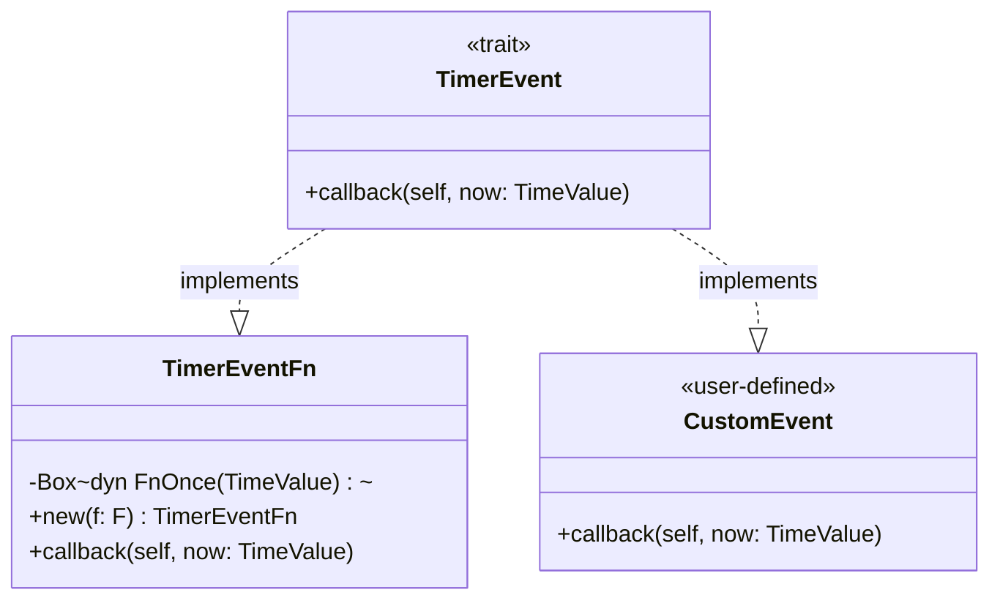
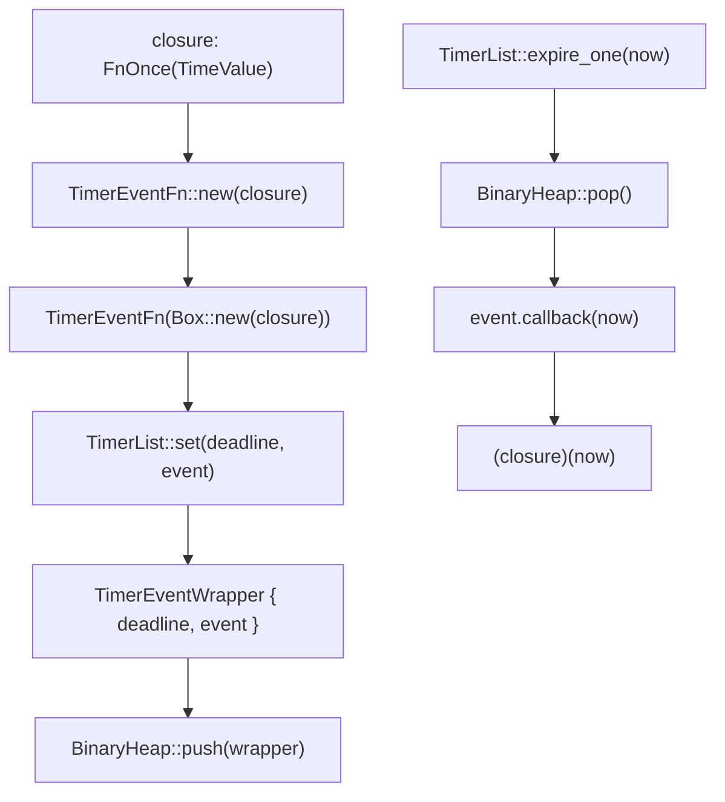
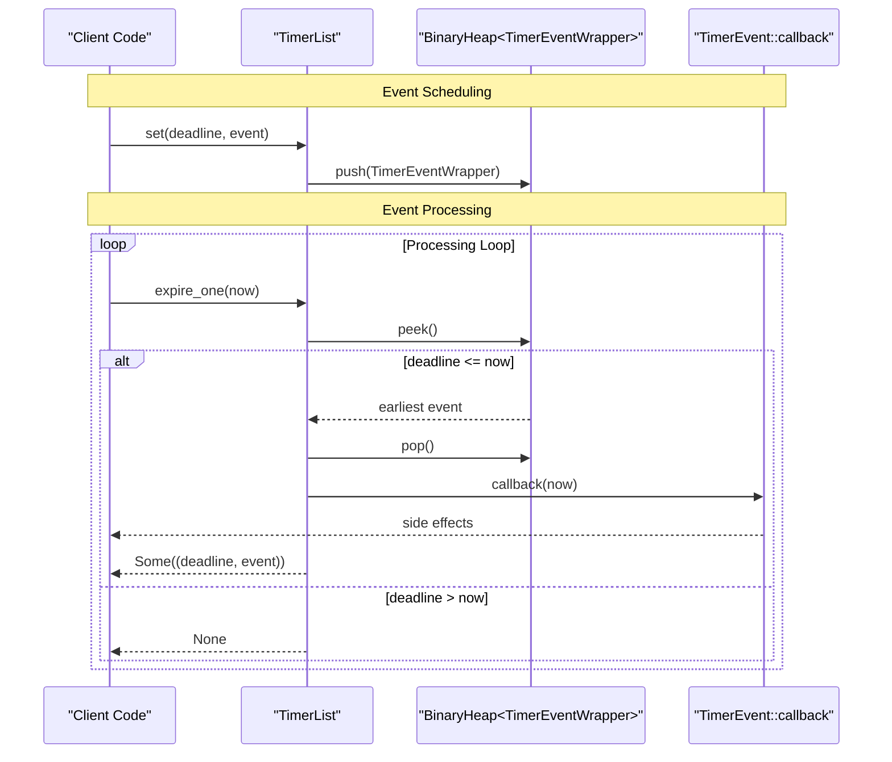
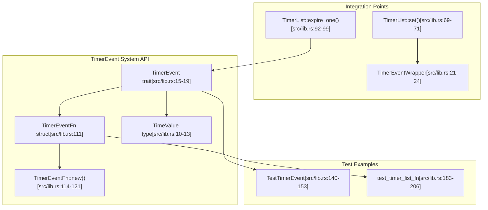

# TimerEvent System

> **Relevant source files**
> * [src/lib.rs](https://github.com/arceos-org/timer_list/blob/4fa2875f/src/lib.rs)

This document covers the timer event system that defines how callbacks are executed when timers expire in the timer_list crate. It focuses on the `TimerEvent` trait and its implementations, particularly the `TimerEventFn` wrapper for closure-based events.

For information about the underlying timer storage and scheduling mechanisms, see [TimerList Data Structure](/arceos-org/timer_list/2.1-timerlist-data-structure).

## Purpose and Scope

The TimerEvent system provides the interface and implementations for executable timer callbacks in the timer_list crate. It defines how events are structured and executed when their deadlines are reached, supporting both custom event types and simple closure-based events.

## TimerEvent Trait

The `TimerEvent` trait serves as the core interface that all timer events must implement. It defines a single callback method that consumes the event when executed.

### Trait Definition

The trait is defined with a simple interface at [src/lib.rs(L15 - L19)&emsp;](https://github.com/arceos-org/timer_list/blob/4fa2875f/src/lib.rs#L15-L19):

```rust
pub trait TimerEvent {
    fn callback(self, now: TimeValue);
}
```

### Key Characteristics

|Aspect|Description|
| --- | --- |
|Consumption|Thecallbackmethod takesselfby value, consuming the event|
|Time Parameter|Receives the current time asTimeValue(alias forDuration)|
|Return Type|Returns()- events perform side effects rather than return values|
|Execution Model|Called exactly once when the timer expires|

The trait design ensures that events cannot be accidentally reused after execution, providing memory safety and preventing common timer-related bugs.

**TimerEvent Trait Architecture**



Sources: [src/lib.rs(L15 - L19)&emsp;](https://github.com/arceos-org/timer_list/blob/4fa2875f/src/lib.rs#L15-L19) [src/lib.rs(L108 - L127)&emsp;](https://github.com/arceos-org/timer_list/blob/4fa2875f/src/lib.rs#L108-L127)

## TimerEventFn Implementation

The `TimerEventFn` struct provides a convenient wrapper that allows closures to be used as timer events without requiring custom trait implementations.

### Structure and Construction

The `TimerEventFn` wraps a boxed closure at [src/lib.rs(L111)&emsp;](https://github.com/arceos-org/timer_list/blob/4fa2875f/src/lib.rs#L111-L111):

```
pub struct TimerEventFn(Box<dyn FnOnce(TimeValue) + 'static>);
```

Construction is handled by the `new` method at [src/lib.rs(L114 - L121)&emsp;](https://github.com/arceos-org/timer_list/blob/4fa2875f/src/lib.rs#L114-L121):

|Parameter|Type|Description|
| --- | --- | --- |
|f|F: FnOnce(TimeValue) + 'static|Closure to execute when timer expires|
|Return|TimerEventFn|Wrapped timer event ready for scheduling|

### TimerEvent Implementation

The trait implementation at [src/lib.rs(L123 - L127)&emsp;](https://github.com/arceos-org/timer_list/blob/4fa2875f/src/lib.rs#L123-L127) simply extracts and calls the wrapped closure:

```rust
impl TimerEvent for TimerEventFn {
    fn callback(self, now: TimeValue) {
        (self.0)(now)
    }
}
```

This design enables functional programming patterns while maintaining the trait's consumption semantics.

**TimerEventFn Data Flow**



Sources: [src/lib.rs(L108 - L127)&emsp;](https://github.com/arceos-org/timer_list/blob/4fa2875f/src/lib.rs#L108-L127) [src/lib.rs(L69 - L71)&emsp;](https://github.com/arceos-org/timer_list/blob/4fa2875f/src/lib.rs#L69-L71)

## Event Lifecycle Integration

Timer events integrate with the `TimerList` through a well-defined lifecycle that ensures proper execution timing and resource management.

### Event Scheduling Process

Events are scheduled through the `TimerList::set` method, which wraps them in `TimerEventWrapper` structures for heap management:

|Step|Component|Action|
| --- | --- | --- |
|1|Client Code|Creates event implementingTimerEvent|
|2|TimerList::set|Wraps event inTimerEventWrapperwith deadline|
|3|BinaryHeap|Stores wrapper using min-heap ordering|
|4|TimerList::expire_one|Checks earliest deadline against current time|
|5|Event Callback|Executesevent.callback(now)if expired|

### Execution Semantics

When events expire, they follow a strict execution pattern defined at [src/lib.rs(L92 - L99)&emsp;](https://github.com/arceos-org/timer_list/blob/4fa2875f/src/lib.rs#L92-L99):

* Events are processed one at a time in deadline order
* Only events with `deadline <= now` are eligible for execution
* Events are removed from the heap before callback execution
* Callbacks receive the actual current time, not the original deadline

**Event Execution Flow**



Sources: [src/lib.rs(L69 - L71)&emsp;](https://github.com/arceos-org/timer_list/blob/4fa2875f/src/lib.rs#L69-L71) [src/lib.rs(L92 - L99)&emsp;](https://github.com/arceos-org/timer_list/blob/4fa2875f/src/lib.rs#L92-L99) [src/lib.rs(L21 - L24)&emsp;](https://github.com/arceos-org/timer_list/blob/4fa2875f/src/lib.rs#L21-L24)

## Custom Event Implementation

While `TimerEventFn` handles simple closure cases, custom event types can implement `TimerEvent` directly for more complex scenarios. The test suite demonstrates this pattern at [src/lib.rs(L140 - L153)&emsp;](https://github.com/arceos-org/timer_list/blob/4fa2875f/src/lib.rs#L140-L153):

### Example Pattern

```rust
struct TestTimerEvent(usize, TimeValue);

impl TimerEvent for TestTimerEvent {
    fn callback(self, now: TimeValue) {
        // Custom logic with access to event data
        println!("Event {} executed at {:?}", self.0, now);
    }
}
```

This approach allows events to carry additional data and implement complex callback logic while maintaining the same execution guarantees as `TimerEventFn`.

**Code Entity Mapping**



Sources: [src/lib.rs(L15 - L19)&emsp;](https://github.com/arceos-org/timer_list/blob/4fa2875f/src/lib.rs#L15-L19) [src/lib.rs(L108 - L127)&emsp;](https://github.com/arceos-org/timer_list/blob/4fa2875f/src/lib.rs#L108-L127) [src/lib.rs(L69 - L71)&emsp;](https://github.com/arceos-org/timer_list/blob/4fa2875f/src/lib.rs#L69-L71) [src/lib.rs(L92 - L99)&emsp;](https://github.com/arceos-org/timer_list/blob/4fa2875f/src/lib.rs#L92-L99) [src/lib.rs(L140 - L153)&emsp;](https://github.com/arceos-org/timer_list/blob/4fa2875f/src/lib.rs#L140-L153) [src/lib.rs(L183 - L206)&emsp;](https://github.com/arceos-org/timer_list/blob/4fa2875f/src/lib.rs#L183-L206)