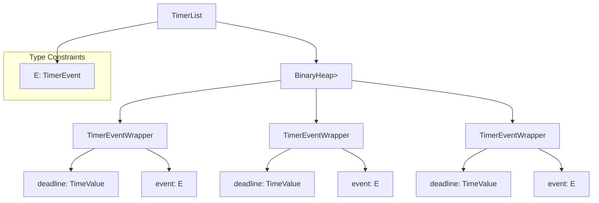
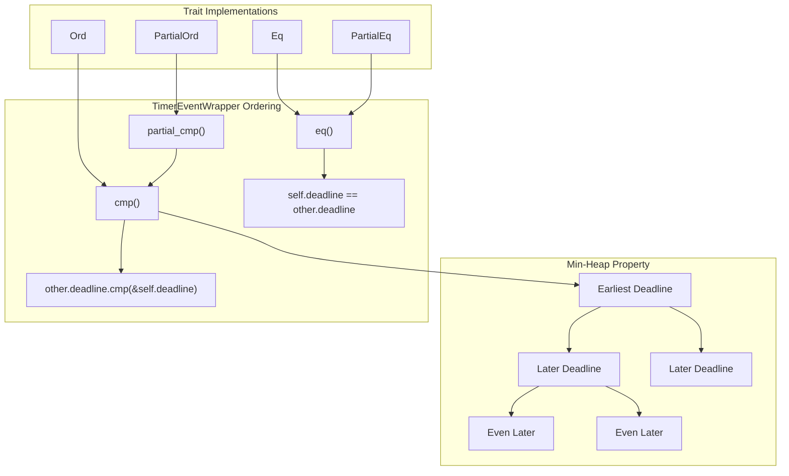
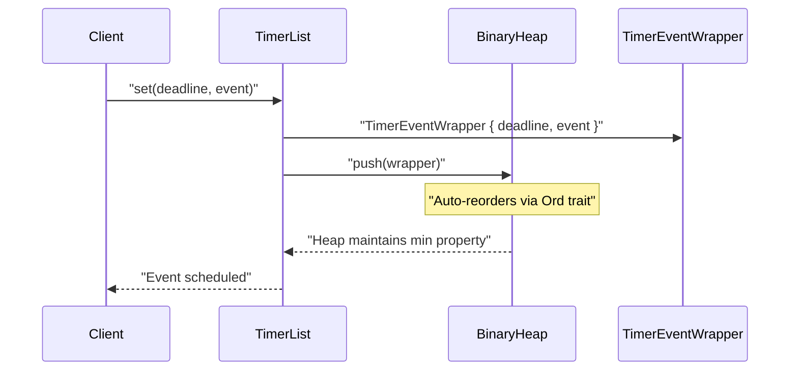
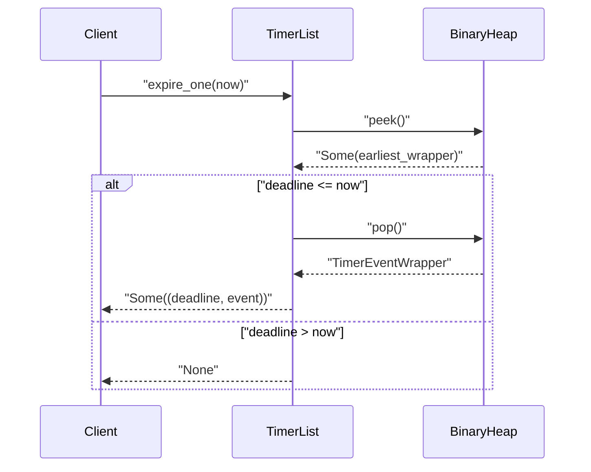
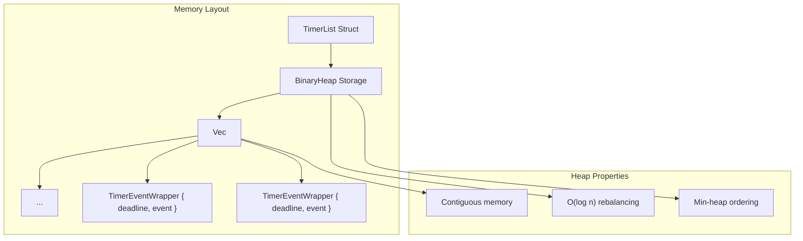

# TimerList Data Structure

> **Relevant source files**
> * [src/lib.rs](https://github.com/arceos-org/timer_list/blob/4fa2875f/src/lib.rs)

This document provides detailed technical documentation of the `TimerList` struct, which serves as the core data structure for managing timed events in the timer_list crate. It covers the internal min-heap architecture, public methods, performance characteristics, and implementation details.

For information about the `TimerEvent` trait and event callback system, see [TimerEvent System](/arceos-org/timer_list/2.2-timerevent-system). For practical usage examples, see [Usage Guide and Examples](/arceos-org/timer_list/3-usage-guide-and-examples).

## Core Structure Overview

The `TimerList<E: TimerEvent>` struct provides an efficient priority queue implementation for managing timed events. It internally uses a binary heap data structure to maintain events in deadline order, enabling O(log n) insertions and O(1) access to the next expiring event.

### Primary Components

**Sources:** [src/lib.rs(L30 - L32)&emsp;](https://github.com/arceos-org/timer_list/blob/4fa2875f/src/lib.rs#L30-L32) [src/lib.rs(L21 - L24)&emsp;](https://github.com/arceos-org/timer_list/blob/4fa2875f/src/lib.rs#L21-L24)

The structure consists of three main components:

|Component|Type|Purpose|
| --- | --- | --- |
|TimerList<E>|Public struct|Main interface for timer management|
|BinaryHeap<TimerEventWrapper<E>>|Internal field|Heap storage for efficient ordering|
|TimerEventWrapper<E>|Internal struct|Wrapper containing deadline and event data|

## Min-Heap Architecture

The `TimerList` implements a min-heap through custom ordering logic on `TimerEventWrapper<E>`. This ensures that events with earlier deadlines are always at the top of the heap for efficient retrieval.

### Heap Ordering Implementation

**Sources:** [src/lib.rs(L34 - L52)&emsp;](https://github.com/arceos-org/timer_list/blob/4fa2875f/src/lib.rs#L34-L52)

The ordering implementation uses reversed comparison logic:

|Trait|Implementation|Purpose|
| --- | --- | --- |
|Ord::cmp()|other.deadline.cmp(&self.deadline)|Reverses natural ordering for min-heap|
|PartialOrd::partial_cmp()|Delegates tocmp()|Required for heap operations|
|Eq/PartialEq::eq()|self.deadline == other.deadline|Deadline-based equality|

## Public Methods

The `TimerList` provides a clean API for timer management operations:

### Core Operations

|Method|Signature|Complexity|Purpose|
| --- | --- | --- | --- |
|new()|fn new() -> Self|O(1)|Creates empty timer list|
|set()|fn set(&mut self, deadline: TimeValue, event: E)|O(log n)|Schedules new event|
|expire_one()|fn expire_one(&mut self, now: TimeValue) -> Option<(TimeValue, E)>|O(log n)|Processes earliest expired event|
|cancel()|fn cancel<F>(&mut self, condition: F)|O(n)|Removes events matching condition|

### Query Operations

|Method|Signature|Complexity|Purpose|
| --- | --- | --- | --- |
|is_empty()|fn is_empty(&self) -> bool|O(1)|Checks if any events exist|
|next_deadline()|fn next_deadline(&self) -> Option<TimeValue>|O(1)|Returns earliest deadline|

**Sources:** [src/lib.rs(L54 - L100)&emsp;](https://github.com/arceos-org/timer_list/blob/4fa2875f/src/lib.rs#L54-L100)

## Internal Implementation Details

### Event Scheduling Flow

**Sources:** [src/lib.rs(L69 - L71)&emsp;](https://github.com/arceos-org/timer_list/blob/4fa2875f/src/lib.rs#L69-L71)

### Event Expiration Flow

**Sources:** [src/lib.rs(L92 - L99)&emsp;](https://github.com/arceos-org/timer_list/blob/4fa2875f/src/lib.rs#L92-L99)

### Data Structure Memory Layout

The `TimerList` maintains minimal memory overhead with efficient heap allocation:

**Sources:** [src/lib.rs(L30 - L32)&emsp;](https://github.com/arceos-org/timer_list/blob/4fa2875f/src/lib.rs#L30-L32) [src/lib.rs(L21 - L24)&emsp;](https://github.com/arceos-org/timer_list/blob/4fa2875f/src/lib.rs#L21-L24)

## Performance Characteristics

|Operation|Time Complexity|Space Complexity|Notes|
| --- | --- | --- | --- |
|Insert (set)|O(log n)|O(1) additional|Binary heap insertion|
|Peek next (next_deadline)|O(1)|O(1)|Heap root access|
|Pop next (expire_one)|O(log n)|O(1)|Heap rebalancing required|
|Cancel events|O(n)|O(n)|Linear scan with filtering|
|Check empty|O(1)|O(1)|Heap size check|

The min-heap implementation provides optimal performance for the primary use case of sequential event processing by deadline order.

**Sources:** [src/lib.rs(L54 - L100)&emsp;](https://github.com/arceos-org/timer_list/blob/4fa2875f/src/lib.rs#L54-L100)