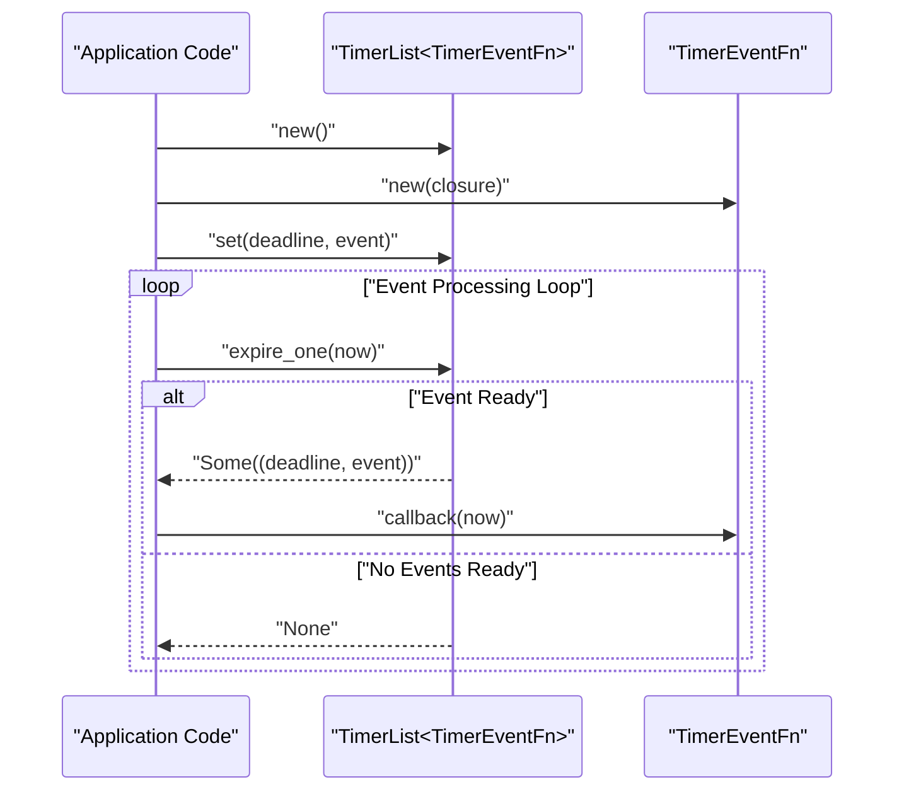
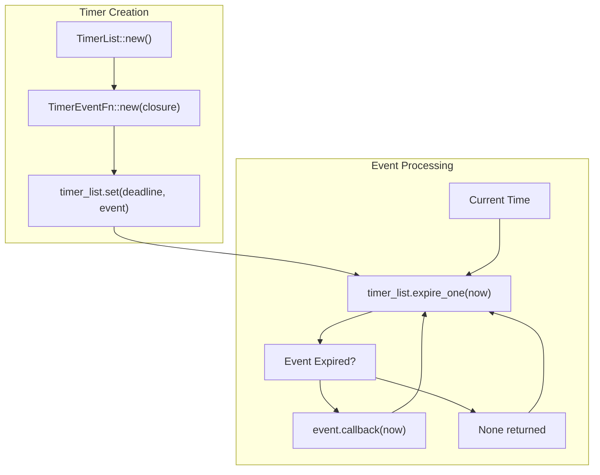
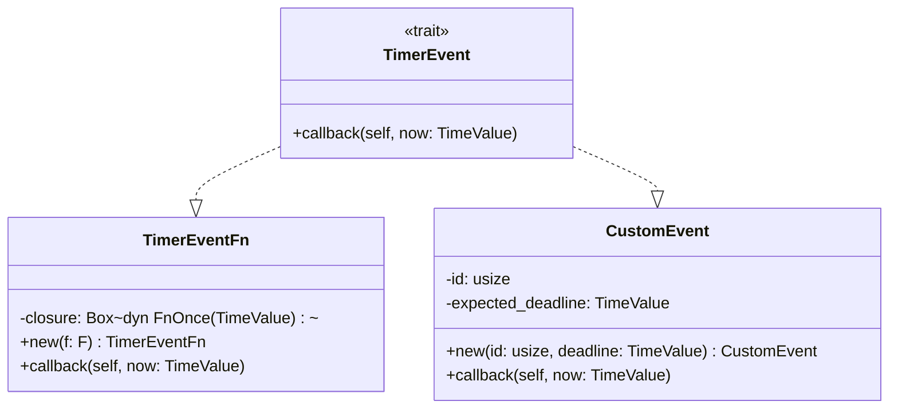
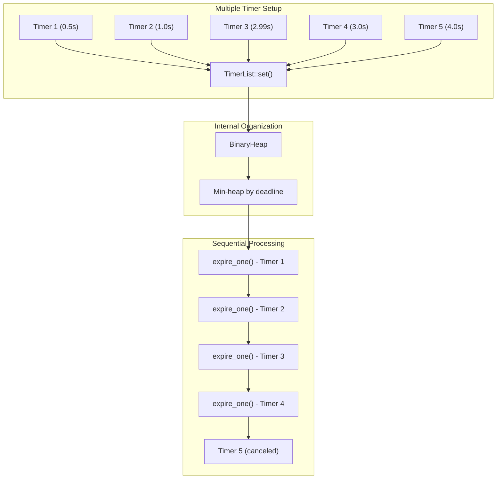
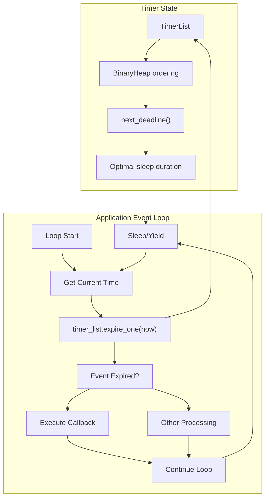
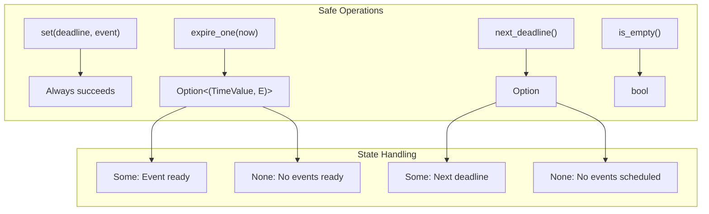

# Usage Guide and Examples

> **Relevant source files**
> * [README.md](https://github.com/arceos-org/timer_list/blob/4fa2875f/README.md)
> * [src/lib.rs](https://github.com/arceos-org/timer_list/blob/4fa2875f/src/lib.rs)

This document provides practical examples and usage patterns for the `timer_list` crate, demonstrating how to integrate timer management functionality into applications. The examples range from basic single-timer usage to advanced patterns for managing multiple concurrent timers with custom events.

For detailed API documentation of the core types and methods, see [Core API Reference](/arceos-org/timer_list/2-core-api-reference). For information about the internal implementation architecture, see [TimerList Data Structure](/arceos-org/timer_list/2.1-timerlist-data-structure) and [TimerEvent System](/arceos-org/timer_list/2.2-timerevent-system).

## Basic Timer Usage with Closures

The simplest way to use `timer_list` is with the `TimerEventFn` wrapper, which allows you to schedule closures to execute at specific deadlines.

### Simple Timer Example

**Basic Timer Setup and Processing**

The core pattern involves creating a `TimerList`, setting timer events with deadlines, and periodically checking for expired events in a processing loop.

Sources: [README.md(L12 - L34)&emsp;](https://github.com/arceos-org/timer_list/blob/4fa2875f/README.md#L12-L34) [src/lib.rs(L111 - L127)&emsp;](https://github.com/arceos-org/timer_list/blob/4fa2875f/src/lib.rs#L111-L127)

### Implementation Pattern

The basic usage follows this pattern:

1. Create a `TimerList<TimerEventFn>` instance
2. Use `TimerEventFn::new()` to wrap closures as timer events
3. Call `set()` method with a `TimeValue` deadline and the event
4. Periodically call `expire_one()` with current time to process expired events
5. Execute the callback when events are returned

**Timer Event Lifecycle from Creation to Execution**

Sources: [README.md(L16 - L33)&emsp;](https://github.com/arceos-org/timer_list/blob/4fa2875f/README.md#L16-L33) [src/lib.rs(L69 - L98)&emsp;](https://github.com/arceos-org/timer_list/blob/4fa2875f/src/lib.rs#L69-L98)

## Custom Timer Events

For more complex use cases, implement the `TimerEvent` trait directly to create custom timer events with specific behavior and data.

### Custom Event Implementation

The `TimerEvent` trait requires implementing a single `callback` method that consumes the event and receives the current time.

**TimerEvent Trait Implementation Hierarchy**

Sources: [src/lib.rs(L15 - L19)&emsp;](https://github.com/arceos-org/timer_list/blob/4fa2875f/src/lib.rs#L15-L19) [src/lib.rs(L123 - L127)&emsp;](https://github.com/arceos-org/timer_list/blob/4fa2875f/src/lib.rs#L123-L127) [src/lib.rs(L140 - L153)&emsp;](https://github.com/arceos-org/timer_list/blob/4fa2875f/src/lib.rs#L140-L153)

### Custom Event Example

The test case in the source code demonstrates a custom `TestTimerEvent` that tracks execution order and timing accuracy:

|Component|Purpose|Key Methods|
| --- | --- | --- |
|TestTimerEvent|Custom event with ID and expected deadline|callback(self, now: TimeValue)|
|Event validation|Verify execution order and timing|Comparenowwith stored deadline|
|Atomic counter|Track execution sequence|AtomicUsizefor thread-safe counting|

The custom event pattern allows embedding application-specific data and logic within timer events, enabling complex scheduling scenarios.

Sources: [src/lib.rs(L140 - L153)&emsp;](https://github.com/arceos-org/timer_list/blob/4fa2875f/src/lib.rs#L140-L153)

## Advanced Usage Patterns

### Multiple Timer Management

When managing multiple concurrent timers, the `TimerList` maintains them in deadline order using an internal min-heap structure.

**Multiple Timer Processing Order**

The timers are processed in deadline order regardless of insertion sequence. The min-heap ensures `O(log n)` insertion and `O(1)` access to the earliest deadline.

Sources: [src/lib.rs(L157 - L167)&emsp;](https://github.com/arceos-org/timer_list/blob/4fa2875f/src/lib.rs#L157-L167) [src/lib.rs(L30 - L32)&emsp;](https://github.com/arceos-org/timer_list/blob/4fa2875f/src/lib.rs#L30-L32) [src/lib.rs(L40 - L43)&emsp;](https://github.com/arceos-org/timer_list/blob/4fa2875f/src/lib.rs#L40-L43)

### Timer Cancellation

The `cancel()` method allows removing events that match a specified condition before they expire.

|Operation|Method Signature|Use Case|
| --- | --- | --- |
|Cancel by condition|cancel<F>(&mut self, condition: F)|Remove events matching predicate|
|Check empty|is_empty(&self) -> bool|Verify if any timers remain|
|Next deadline|next_deadline(&self) -> Option<TimeValue>|Get earliest scheduled time|

The cancellation mechanism uses a closure to test each event, providing flexible filtering capabilities. The implementation uses `BinaryHeap::retain()` to remove matching events.

Sources: [src/lib.rs(L73 - L80)&emsp;](https://github.com/arceos-org/timer_list/blob/4fa2875f/src/lib.rs#L73-L80) [src/lib.rs(L171 - L173)&emsp;](https://github.com/arceos-org/timer_list/blob/4fa2875f/src/lib.rs#L171-L173)

## Integration Patterns

### Event Loop Integration

Timer management typically integrates with application event loops or system schedulers using a polling pattern.

**Event Loop Integration Pattern**

Applications can use `next_deadline()` to calculate optimal sleep durations, reducing unnecessary CPU usage while maintaining timer accuracy.

Sources: [src/lib.rs(L169 - L178)&emsp;](https://github.com/arceos-org/timer_list/blob/4fa2875f/src/lib.rs#L169-L178) [src/lib.rs(L84 - L86)&emsp;](https://github.com/arceos-org/timer_list/blob/4fa2875f/src/lib.rs#L84-L86)

### No-std Environment Usage

The crate is designed for `no-std` environments, making it suitable for embedded systems and kernel-level code.

|Requirement|Implementation|Benefit|
| --- | --- | --- |
|no-stdcompatibility|#![cfg_attr(not(test), no_std)]|Embedded/kernel usage|
|Heap allocation|extern crate alloc|Dynamic timer storage|
|Core types only|core::time::Duration|Minimal dependencies|
|No threading|Sequential processing|Deterministic behavior|

The design ensures predictable performance characteristics essential for real-time and embedded applications.

Sources: [src/lib.rs(L1)&emsp;](https://github.com/arceos-org/timer_list/blob/4fa2875f/src/lib.rs#L1-L1) [src/lib.rs(L4)&emsp;](https://github.com/arceos-org/timer_list/blob/4fa2875f/src/lib.rs#L4-L4) [src/lib.rs(L10 - L13)&emsp;](https://github.com/arceos-org/timer_list/blob/4fa2875f/src/lib.rs#L10-L13)

## Common Patterns and Best Practices

### Error Handling and Edge Cases

The `TimerList` API is designed to be infallible for core operations, with `Option` types indicating state rather than errors.

**API Safety and State Management**

All operations are memory-safe and return clear indicators of timer list state, eliminating common timer management error scenarios.

Sources: [src/lib.rs(L54 - L100)&emsp;](https://github.com/arceos-org/timer_list/blob/4fa2875f/src/lib.rs#L54-L100)

### Performance Considerations

|Operation|Complexity|Notes|
| --- | --- | --- |
|set()|O(log n)|Heap insertion|
|expire_one()|O(log n)|Heap removal when expired|
|next_deadline()|O(1)|Heap peek operation|
|cancel()|O(n)|Linear scan with rebuild|

The min-heap structure provides efficient access to the earliest deadline, but cancellation operations require full heap traversal. For frequent cancellation scenarios, consider alternative approaches like event flags.

Sources: [src/lib.rs(L69 - L71)&emsp;](https://github.com/arceos-org/timer_list/blob/4fa2875f/src/lib.rs#L69-L71) [src/lib.rs(L92 - L98)&emsp;](https://github.com/arceos-org/timer_list/blob/4fa2875f/src/lib.rs#L92-L98) [src/lib.rs(L74 - L80)&emsp;](https://github.com/arceos-org/timer_list/blob/4fa2875f/src/lib.rs#L74-L80)