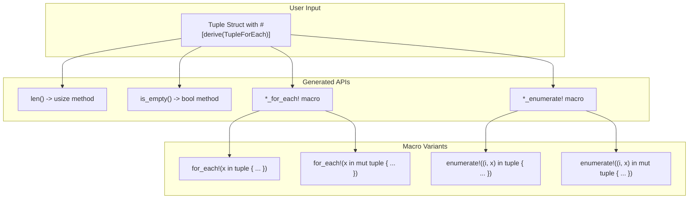
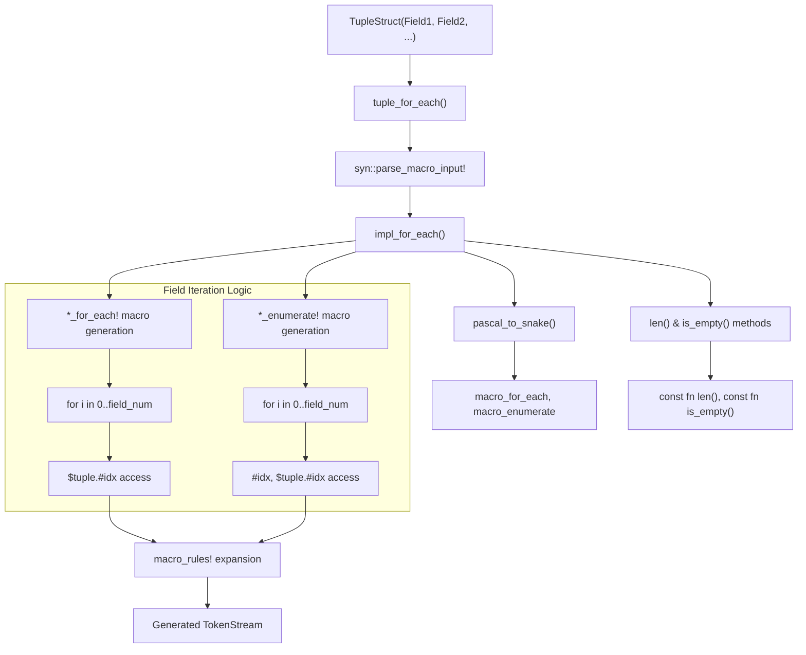
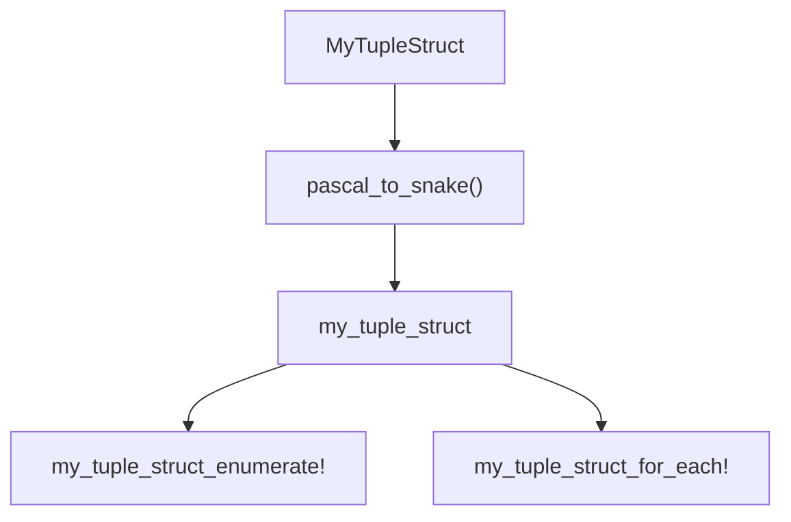

# API Reference

> **Relevant source files**
> * [README.md](https://github.com/arceos-org/tuple_for_each/blob/19a3b4d3/README.md)
> * [src/lib.rs](https://github.com/arceos-org/tuple_for_each/blob/19a3b4d3/src/lib.rs)

This document provides comprehensive reference documentation for all public APIs and generated functionality provided by the `tuple_for_each` crate. It covers the `TupleForEach` derive macro and all code it generates, including macros and methods added to tuple structs.

For implementation details about how the derive macro works internally, see [Implementation Guide](/arceos-org/tuple_for_each/3-implementation-guide). For basic usage examples and getting started information, see [Getting Started](/arceos-org/tuple_for_each/2-getting-started).

## API Surface Overview

The `tuple_for_each` crate provides a single derive macro that generates multiple APIs for tuple structs. The following diagram shows the complete API surface generated by the derive macro:



Sources: [src/lib.rs(L10 - L24)&emsp;](https://github.com/arceos-org/tuple_for_each/blob/19a3b4d3/src/lib.rs#L10-L24) [src/lib.rs(L88 - L121)&emsp;](https://github.com/arceos-org/tuple_for_each/blob/19a3b4d3/src/lib.rs#L88-L121)

## TupleForEach Derive Macro

The `TupleForEach` derive macro is the primary entry point of the crate, implemented as a procedural macro that transforms tuple struct definitions at compile time.

|Attribute|Value|
| --- | --- |
|Macro Type|#[proc_macro_derive]|
|Target|Tuple structs with unnamed fields only|
|Entry Point|tuple_for_each()function|
|Location|src/lib.rs10-24|

### Validation Rules

The derive macro validates input and only accepts tuple structs:

* **Accepted**: `struct MyTuple(Type1, Type2, Type3);`
* **Rejected**: Named struct fields, unit structs, enums
* **Error Message**: `"attribute 'tuple_for_each' can only be attached to tuple structs"`

The validation logic checks for `Data::Struct` with `Fields::Unnamed` at [src/lib.rs(L13 - L14)&emsp;](https://github.com/arceos-org/tuple_for_each/blob/19a3b4d3/src/lib.rs#L13-L14)

Sources: [src/lib.rs(L10 - L24)&emsp;](https://github.com/arceos-org/tuple_for_each/blob/19a3b4d3/src/lib.rs#L10-L24)

## Generated API Components

When applied to a tuple struct, the derive macro generates four distinct API components. The following diagram shows the code generation pipeline and relationships:



Sources: [src/lib.rs(L58 - L122)&emsp;](https://github.com/arceos-org/tuple_for_each/blob/19a3b4d3/src/lib.rs#L58-L122) [src/lib.rs(L124 - L133)&emsp;](https://github.com/arceos-org/tuple_for_each/blob/19a3b4d3/src/lib.rs#L124-L133)

### Methods Added to Tuple Structs

Two constant methods are added to every tuple struct via an `impl` block:

|Method|Signature|Description|Implementation|
| --- | --- | --- | --- |
|len()|pub const fn len(&self) -> usize|Returns the number of fields|src/lib.rs90-92|
|is_empty()|pub const fn is_empty(&self) -> bool|Returnstrueif no fields|src/lib.rs95-97|

Both methods are `const fn`, allowing compile-time evaluation. The `len()` method returns the literal field count (`#field_num`), while `is_empty()` compares against zero.

### Generated Iteration Macros

Two macro families are generated, each with immutable and mutable variants:

#### *_for_each! Macro

```
<snake_case_name>_for_each!(item in tuple { code_block })
<snake_case_name>_for_each!(item in mut tuple { code_block })
```

* **Pattern**: `$item:ident in $tuple:ident $code:block`
* **Mutable Pattern**: `$item:ident in mut $tuple:ident $code:block`
* **Implementation**: [src/lib.rs(L102 - L109)&emsp;](https://github.com/arceos-org/tuple_for_each/blob/19a3b4d3/src/lib.rs#L102-L109)

#### *_enumerate! Macro

```
<snake_case_name>_enumerate!((index, item) in tuple { code_block })
<snake_case_name>_enumerate!((index, item) in mut tuple { code_block })
```

* **Pattern**: `($idx:ident, $item:ident) in $tuple:ident $code:block`
* **Mutable Pattern**: `($idx:ident, $item:ident) in mut $tuple:ident $code:block`
* **Implementation**: [src/lib.rs(L113 - L120)&emsp;](https://github.com/arceos-org/tuple_for_each/blob/19a3b4d3/src/lib.rs#L113-L120)

Sources: [src/lib.rs(L100 - L121)&emsp;](https://github.com/arceos-org/tuple_for_each/blob/19a3b4d3/src/lib.rs#L100-L121)

## Name Generation Strategy

The macro names are derived from the tuple struct name using a `pascal_to_snake` conversion:



The conversion algorithm at [src/lib.rs(L124 - L133)&emsp;](https://github.com/arceos-org/tuple_for_each/blob/19a3b4d3/src/lib.rs#L124-L133) processes each character, inserting underscores before uppercase letters (except the first) and converting to lowercase.

Sources: [src/lib.rs(L60 - L62)&emsp;](https://github.com/arceos-org/tuple_for_each/blob/19a3b4d3/src/lib.rs#L60-L62) [src/lib.rs(L124 - L133)&emsp;](https://github.com/arceos-org/tuple_for_each/blob/19a3b4d3/src/lib.rs#L124-L133)

## Documentation Generation

The generated macros include automatically generated documentation using the `gen_doc()` function at [src/lib.rs(L26 - L56)&emsp;](https://github.com/arceos-org/tuple_for_each/blob/19a3b4d3/src/lib.rs#L26-L56) Documentation templates provide usage examples and link back to the derive macro.

### Documentation Template Variables

|Variable|Purpose|Example|
| --- | --- | --- |
|tuple_name|Original struct name|"MyTuple"|
|macro_name|Snake case name|"my_tuple"|
|kind|Macro type|"for_each"or"enumerate"|

Sources: [src/lib.rs(L26 - L56)&emsp;](https://github.com/arceos-org/tuple_for_each/blob/19a3b4d3/src/lib.rs#L26-L56) [src/lib.rs(L85 - L86)&emsp;](https://github.com/arceos-org/tuple_for_each/blob/19a3b4d3/src/lib.rs#L85-L86)

## Complete API Reference

For detailed information about specific components:

* **TupleForEach Derive Macro**: See [TupleForEach Derive Macro](/arceos-org/tuple_for_each/5.1-tupleforeach-derive-macro)
* **Generated Macros**: See [Generated Macros](/arceos-org/tuple_for_each/5.2-generated-macros)
* **Generated Methods**: See [Generated Methods](/arceos-org/tuple_for_each/5.3-generated-methods)

Each subsection provides comprehensive documentation, usage patterns, and implementation details for the respective API components.

Sources: [src/lib.rs(L1 - L134)&emsp;](https://github.com/arceos-org/tuple_for_each/blob/19a3b4d3/src/lib.rs#L1-L134) [README.md(L1 - L40)&emsp;](https://github.com/arceos-org/tuple_for_each/blob/19a3b4d3/README.md#L1-L40)