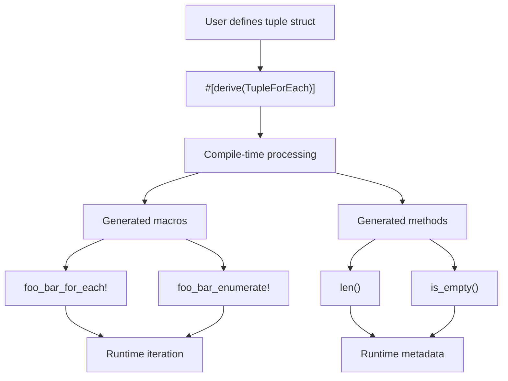
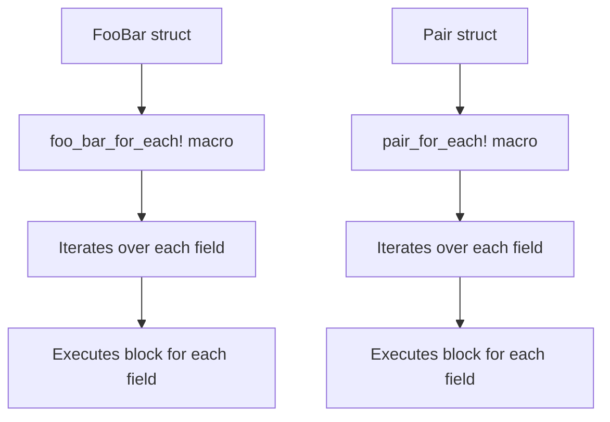
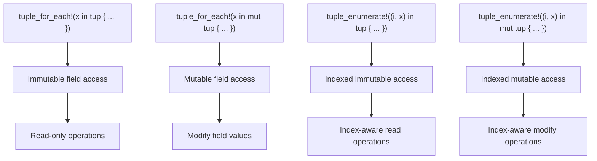

# Basic Usage

> **Relevant source files**
> * [README.md](https://github.com/arceos-org/tuple_for_each/blob/19a3b4d3/README.md)
> * [tests/test_tuple_for_each.rs](https://github.com/arceos-org/tuple_for_each/blob/19a3b4d3/tests/test_tuple_for_each.rs)

This document covers the fundamental usage patterns for the `tuple_for_each` crate, demonstrating how to apply the `TupleForEach` derive macro to tuple structs and use the generated iteration functionality. This page focuses on simple, straightforward examples that illustrate the core workflow from struct definition to runtime usage.

For detailed information about the generated API surface and all available methods, see [Generated Functionality](/arceos-org/tuple_for_each/2.2-generated-functionality). For comprehensive API reference documentation, see [API Reference](/arceos-org/tuple_for_each/5-api-reference).

## Applying the Derive Macro

The `TupleForEach` derive macro is applied to tuple structs to automatically generate iteration utilities. The basic pattern involves importing the trait and applying the derive attribute:

```
use tuple_for_each::TupleForEach;

#[derive(TupleForEach)]
struct FooBar(u32, &'static str, bool);
```

The derive macro analyzes the tuple struct at compile time and generates several pieces of functionality based on the struct's name and field structure.

**Basic Derive Workflow**



Sources: [README.md(L20 - L28)&emsp;](https://github.com/arceos-org/tuple_for_each/blob/19a3b4d3/README.md#L20-L28) [tests/test_tuple_for_each.rs(L44 - L48)&emsp;](https://github.com/arceos-org/tuple_for_each/blob/19a3b4d3/tests/test_tuple_for_each.rs#L44-L48)

## Generated Methods

The derive macro automatically implements two utility methods on the tuple struct:

|Method|Return Type|Purpose|
| --- | --- | --- |
|len()|usize|Returns the number of fields in the tuple|
|is_empty()|bool|Returnstrueif the tuple has no fields|

These methods provide metadata about the tuple structure:

```javascript
let tup = FooBar(23, "hello", true);
assert_eq!(tup.len(), 3);
assert!(!tup.is_empty());
```

Sources: [README.md(L9 - L11)&emsp;](https://github.com/arceos-org/tuple_for_each/blob/19a3b4d3/README.md#L9-L11) [README.md(L26 - L28)&emsp;](https://github.com/arceos-org/tuple_for_each/blob/19a3b4d3/README.md#L26-L28) [tests/test_tuple_for_each.rs(L53)&emsp;](https://github.com/arceos-org/tuple_for_each/blob/19a3b4d3/tests/test_tuple_for_each.rs#L53-L53) [tests/test_tuple_for_each.rs(L67)&emsp;](https://github.com/arceos-org/tuple_for_each/blob/19a3b4d3/tests/test_tuple_for_each.rs#L67-L67)

## Generated For-Each Macros

The derive macro generates iteration macros that follow a naming convention based on the struct name converted from PascalCase to snake_case. For a struct named `FooBar`, the generated macro is `foo_bar_for_each!`.

**For-Each Macro Usage**



The macro syntax uses the pattern `<struct_name>_for_each!(variable in tuple { block })`:

```
// Immutable iteration
foo_bar_for_each!(x in tup {
    println!("{}", x);
});

// Mutable iteration
foo_bar_for_each!(x in mut tup {
    // Can modify x here
});
```

Sources: [README.md(L30 - L33)&emsp;](https://github.com/arceos-org/tuple_for_each/blob/19a3b4d3/README.md#L30-L33) [tests/test_tuple_for_each.rs(L56 - L61)&emsp;](https://github.com/arceos-org/tuple_for_each/blob/19a3b4d3/tests/test_tuple_for_each.rs#L56-L61) [tests/test_tuple_for_each.rs(L70 - L75)&emsp;](https://github.com/arceos-org/tuple_for_each/blob/19a3b4d3/tests/test_tuple_for_each.rs#L70-L75)

## Generated Enumerate Macros

The enumerate macros provide indexed iteration, giving access to both the field index and the field value. The macro follows the pattern `<struct_name>_enumerate!((index, variable) in tuple { block })`:

```css
foo_bar_enumerate!((i, x) in tup {
    println!("{}: {}", i, x);
});
```

The index starts at 0 and increments for each field in the tuple. Like the for-each macros, enumerate macros support both immutable and mutable access patterns.

**Runtime Iteration Patterns**



Sources: [README.md(L35 - L38)&emsp;](https://github.com/arceos-org/tuple_for_each/blob/19a3b4d3/README.md#L35-L38) [tests/test_tuple_for_each.rs(L84 - L90)&emsp;](https://github.com/arceos-org/tuple_for_each/blob/19a3b4d3/tests/test_tuple_for_each.rs#L84-L90) [tests/test_tuple_for_each.rs(L99 - L105)&emsp;](https://github.com/arceos-org/tuple_for_each/blob/19a3b4d3/tests/test_tuple_for_each.rs#L99-L105)

## Mutable Access Patterns

Both for-each and enumerate macros support mutable access by adding the `mut` keyword before the tuple variable. This allows the iteration block to modify the fields during iteration:

```javascript
let mut t = Tuple(A, B, C);

// Mutable for-each
tuple_for_each!(x in mut t {
    x.bar_mut(); // Can call mutable methods
});

// Mutable enumerate
tuple_enumerate!((i, x) in mut t {
    x.bar_mut(); // Can call mutable methods with index
});
```

The mutable access pattern is particularly useful when the tuple fields implement traits that require mutable methods or when you need to modify the state of the contained values during iteration.

Sources: [tests/test_tuple_for_each.rs(L65 - L76)&emsp;](https://github.com/arceos-org/tuple_for_each/blob/19a3b4d3/tests/test_tuple_for_each.rs#L65-L76) [tests/test_tuple_for_each.rs(L94 - L106)&emsp;](https://github.com/arceos-org/tuple_for_each/blob/19a3b4d3/tests/test_tuple_for_each.rs#L94-L106)