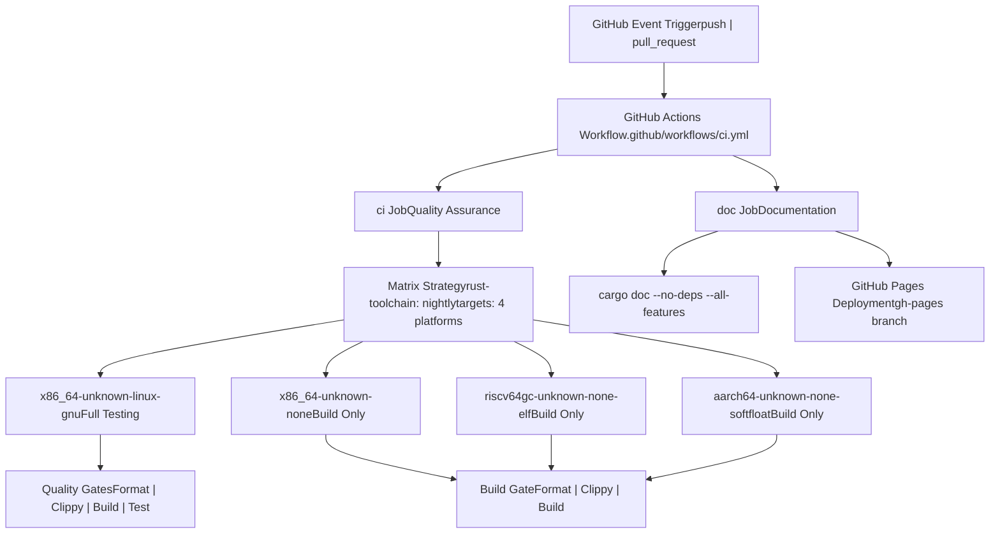
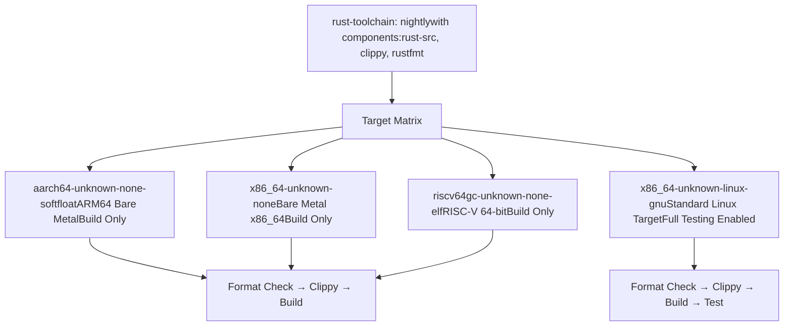
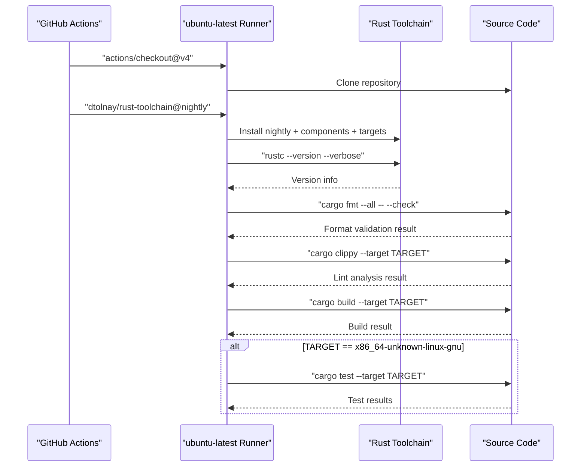
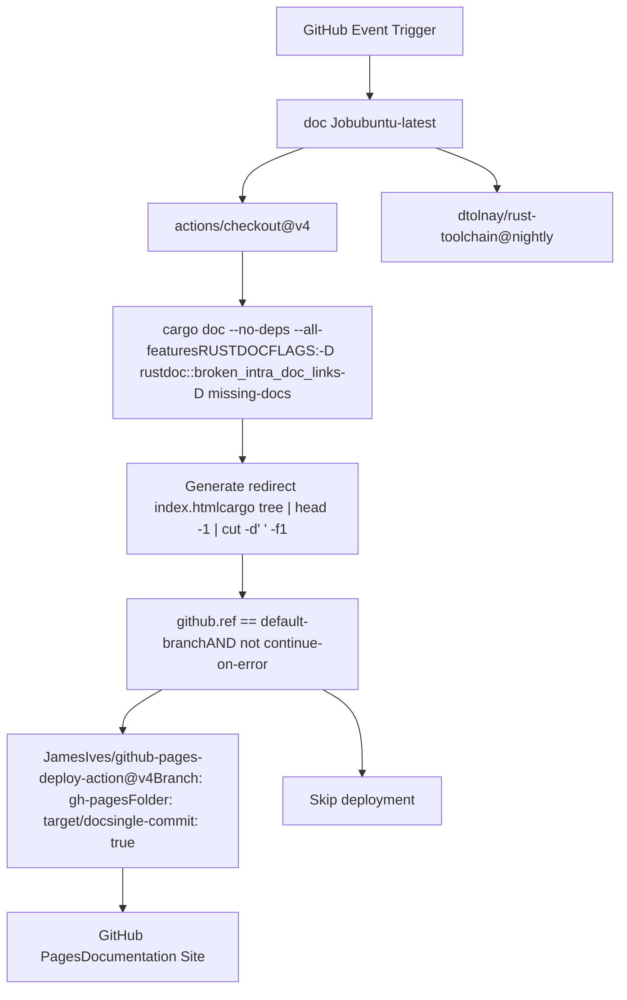
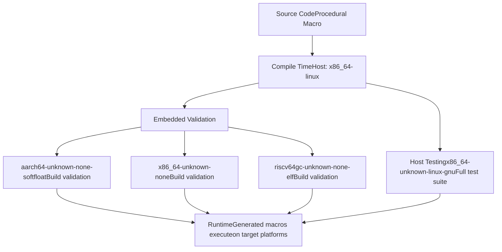

# CI/CD Pipeline

> **Relevant source files**
> * [.github/workflows/ci.yml](https://github.com/arceos-org/tuple_for_each/blob/19a3b4d3/.github/workflows/ci.yml)

This document covers the continuous integration and continuous deployment (CI/CD) infrastructure for the `tuple_for_each` crate. The pipeline is implemented using GitHub Actions and provides automated quality assurance, multi-target compilation, and documentation deployment.

The CI/CD system ensures code quality across multiple target architectures and automatically publishes documentation. For information about local development testing, see [Testing](/arceos-org/tuple_for_each/4.1-testing).

## Pipeline Overview

The CI/CD pipeline consists of two primary jobs defined in the GitHub Actions workflow: the `ci` job for quality assurance and multi-target builds, and the `doc` job for documentation generation and deployment.

### CI/CD Architecture



Sources: [.github/workflows/ci.yml(L1 - L56)&emsp;](https://github.com/arceos-org/tuple_for_each/blob/19a3b4d3/.github/workflows/ci.yml#L1-L56)

## CI Job Workflow

The `ci` job implements a comprehensive quality assurance pipeline that runs across multiple target architectures using a matrix strategy.

### Matrix Build Strategy

The CI job uses a fail-fast strategy disabled to ensure all target builds are attempted even if one fails:

|Configuration|Value|
| --- | --- |
|Runner|ubuntu-latest|
|Rust Toolchain|nightly|
|Target Architectures|4 platforms|
|Fail Fast|false|

The target matrix includes both hosted and embedded platforms:



Sources: [.github/workflows/ci.yml(L8 - L12)&emsp;](https://github.com/arceos-org/tuple_for_each/blob/19a3b4d3/.github/workflows/ci.yml#L8-L12) [.github/workflows/ci.yml(L15 - L19)&emsp;](https://github.com/arceos-org/tuple_for_each/blob/19a3b4d3/.github/workflows/ci.yml#L15-L19)

### Quality Gates

The CI pipeline implements several sequential quality gates:

#### 1. Code Format Verification

```
cargo fmt --all -- --check
```

Ensures all code follows consistent formatting standards using `rustfmt`.

#### 2. Linting with Clippy

```css
cargo clippy --target ${{ matrix.targets }} --all-features -- -A clippy::new_without_default
```

Performs static analysis with the `new_without_default` warning specifically allowed.

#### 3. Compilation

```
cargo build --target ${{ matrix.targets }} --all-features
```

Validates successful compilation for each target architecture.

#### 4. Unit Testing

```
cargo test --target ${{ matrix.targets }} -- --nocapture
```

Executes the test suite, but only for the `x86_64-unknown-linux-gnu` target due to testing infrastructure limitations on bare-metal targets.

### CI Job Steps Flow



Sources: [.github/workflows/ci.yml(L13 - L30)&emsp;](https://github.com/arceos-org/tuple_for_each/blob/19a3b4d3/.github/workflows/ci.yml#L13-L30)

## Documentation Job

The `doc` job handles automated documentation generation and deployment to GitHub Pages.

### Documentation Build Process

The documentation job runs independently of the CI matrix and focuses on generating comprehensive API documentation:



Sources: [.github/workflows/ci.yml(L32 - L56)&emsp;](https://github.com/arceos-org/tuple_for_each/blob/19a3b4d3/.github/workflows/ci.yml#L32-L56)

### Documentation Configuration

The documentation build enforces strict standards through `RUSTDOCFLAGS`:

|Flag|Purpose|
| --- | --- |
|-D rustdoc::broken_intra_doc_links|Treat broken documentation links as errors|
|-D missing-docs|Require documentation for all public items|

The build generates a redirect index page using project metadata:

```
printf '<meta http-equiv="refresh" content="0;url=%s/index.html">' $(cargo tree | head -1 | cut -d' ' -f1) > target/doc/index.html
```

### Deployment Strategy

Documentation deployment occurs only on the default branch using the `JamesIves/github-pages-deploy-action@v4` action with single-commit mode to maintain a clean `gh-pages` branch history.

Sources: [.github/workflows/ci.yml(L36 - L55)&emsp;](https://github.com/arceos-org/tuple_for_each/blob/19a3b4d3/.github/workflows/ci.yml#L36-L55)

## Multi-Target Architecture Support

The pipeline supports diverse target architectures to ensure compatibility across different deployment environments:

### Target Architecture Matrix

|Target|Architecture|Environment|Testing Level|
| --- | --- | --- | --- |
|x86_64-unknown-linux-gnu|x86_64|Linux with libc|Full (build + test)|
|x86_64-unknown-none|x86_64|Bare metal|Build only|
|riscv64gc-unknown-none-elf|RISC-V 64-bit|Bare metal ELF|Build only|
|aarch64-unknown-none-softfloat|ARM64|Bare metal soft-float|Build only|

The restricted testing on embedded targets reflects the procedural macro nature of the crate - the generated code needs to compile for embedded targets, but the macro itself only executes during compilation on the host.



Sources: [.github/workflows/ci.yml(L12)&emsp;](https://github.com/arceos-org/tuple_for_each/blob/19a3b4d3/.github/workflows/ci.yml#L12-L12) [.github/workflows/ci.yml(L29 - L30)&emsp;](https://github.com/arceos-org/tuple_for_each/blob/19a3b4d3/.github/workflows/ci.yml#L29-L30)