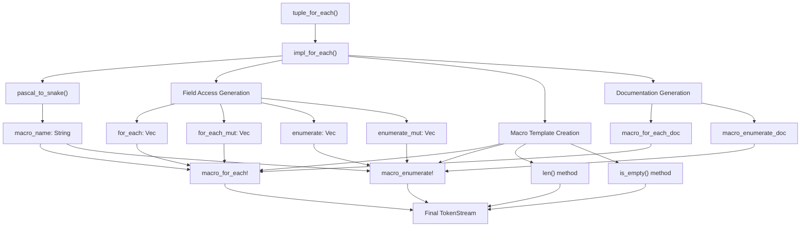
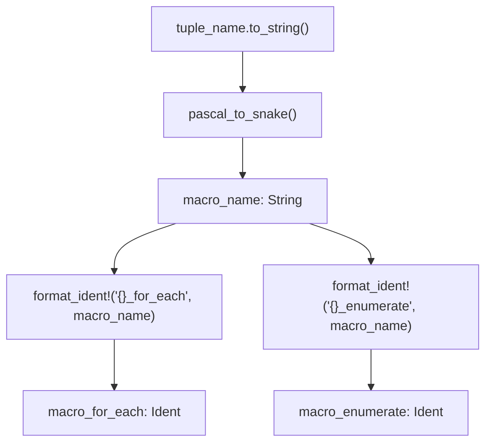
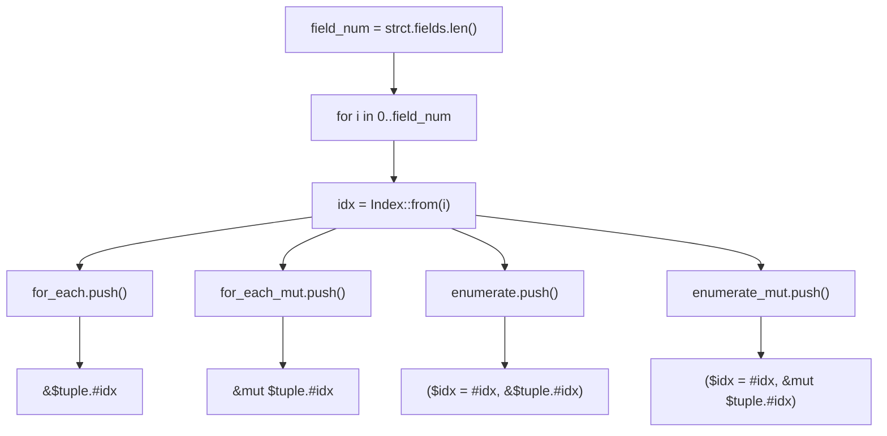
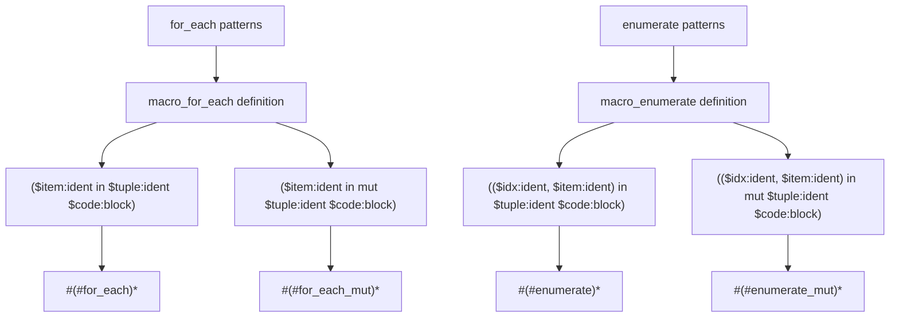
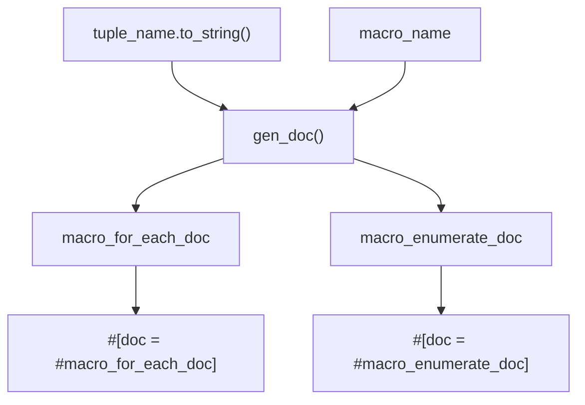
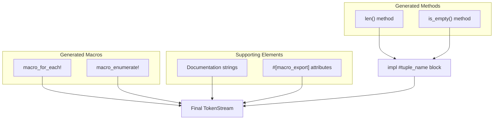

# Code Generation Pipeline

> **Relevant source files**
> * [src/lib.rs](https://github.com/arceos-org/tuple_for_each/blob/19a3b4d3/src/lib.rs)

This document details the core code generation logic within the `tuple_for_each` crate, specifically focusing on the `impl_for_each` function and its supporting components. This covers the transformation process from parsed AST input to generated Rust code output, including field iteration patterns, macro template creation, and documentation generation.

For information about the initial parsing and validation phase, see [Derive Macro Processing](/arceos-org/tuple_for_each/3.1-derive-macro-processing). For details about the generated API surface, see [Generated Functionality](/arceos-org/tuple_for_each/2.2-generated-functionality).

## Pipeline Overview

The code generation pipeline transforms a validated tuple struct AST into executable Rust code through a series of well-defined steps. The process centers around the `impl_for_each` function, which orchestrates the entire generation workflow.

### Code Generation Flow

Sources: [src/lib.rs(L58 - L122)&emsp;](https://github.com/arceos-org/tuple_for_each/blob/19a3b4d3/src/lib.rs#L58-L122)

## Name Conversion Process

The pipeline begins by converting the tuple struct's PascalCase name to snake_case for macro naming. This conversion is handled by the `pascal_to_snake` utility function.

### Conversion Algorithm

|Input (PascalCase)|Output (snake_case)|Generated Macro Names|
| --- | --- | --- |
|MyTuple|my_tuple|my_tuple_for_each!,my_tuple_enumerate!|
|HTTPResponse|h_t_t_p_response|h_t_t_p_response_for_each!,h_t_t_p_response_enumerate!|
|SimpleStruct|simple_struct|simple_struct_for_each!,simple_struct_enumerate!|

The conversion process inserts underscores before uppercase characters (except the first character) and converts all characters to lowercase:

Sources: [src/lib.rs(L60 - L62)&emsp;](https://github.com/arceos-org/tuple_for_each/blob/19a3b4d3/src/lib.rs#L60-L62) [src/lib.rs(L124 - L133)&emsp;](https://github.com/arceos-org/tuple_for_each/blob/19a3b4d3/src/lib.rs#L124-L133)

## Field Access Code Generation

The core of the pipeline generates field access patterns for each tuple field. This process creates four distinct code patterns to handle different iteration scenarios.

### Field Iteration Logic

Each field access pattern is generated using the `quote!` macro to create `TokenStream` fragments:

|Pattern Type|Code Template|Variable Binding|
| --- | --- | --- |
|for_each|let $item = &$tuple.#idx; $code|Immutable reference|
|for_each_mut|let $item = &mut $tuple.#idx; $code|Mutable reference|
|enumerate|let $idx = #idx; let $item = &$tuple.#idx; $code|Index + immutable reference|
|enumerate_mut|let $idx = #idx; let $item = &mut $tuple.#idx; $code|Index + mutable reference|

Sources: [src/lib.rs(L64 - L83)&emsp;](https://github.com/arceos-org/tuple_for_each/blob/19a3b4d3/src/lib.rs#L64-L83)

## Macro Template Creation

The generated field access patterns are assembled into complete macro definitions using Rust's `macro_rules!` system. Each macro supports both immutable and mutable variants through pattern matching.

### Macro Structure Assembly

The macro definitions use repetition syntax (`#()*`) to expand the vector of field access patterns into sequential code blocks. This creates the illusion of iteration over heterogeneous tuple fields at compile time.

Sources: [src/lib.rs(L102 - L120)&emsp;](https://github.com/arceos-org/tuple_for_each/blob/19a3b4d3/src/lib.rs#L102-L120)

## Documentation Generation

The pipeline includes automated documentation generation for the created macros. The `gen_doc` function creates formatted documentation strings with usage examples.

### Documentation Template System

|Documentation Type|Template Function|Generated Content|
| --- | --- | --- |
|for_each|gen_doc("for_each", tuple_name, macro_name)|Usage examples with field iteration|
|enumerate|gen_doc("enumerate", tuple_name, macro_name)|Usage examples with index + field iteration|

The documentation templates include:

* Description of macro purpose
* Reference to the derive macro that generated it
* Code examples showing proper usage syntax
* Placeholder substitution for tuple and macro names

Sources: [src/lib.rs(L26 - L56)&emsp;](https://github.com/arceos-org/tuple_for_each/blob/19a3b4d3/src/lib.rs#L26-L56) [src/lib.rs(L85 - L86)&emsp;](https://github.com/arceos-org/tuple_for_each/blob/19a3b4d3/src/lib.rs#L85-L86)

## Final Assembly

The pipeline concludes by assembling all generated components into a single `TokenStream` using the `quote!` macro. This creates the complete implementation that will be inserted into the user's code.

### Component Integration

The final assembly includes:

* An `impl` block for the original tuple struct containing `len()` and `is_empty()` methods
* Two exported macros with complete documentation
* All necessary attributes for proper macro visibility

The entire generated code block is wrapped in a single `quote!` invocation that produces the final `proc_macro2::TokenStream` returned to the Rust compiler.

Sources: [src/lib.rs(L87 - L122)&emsp;](https://github.com/arceos-org/tuple_for_each/blob/19a3b4d3/src/lib.rs#L87-L122)