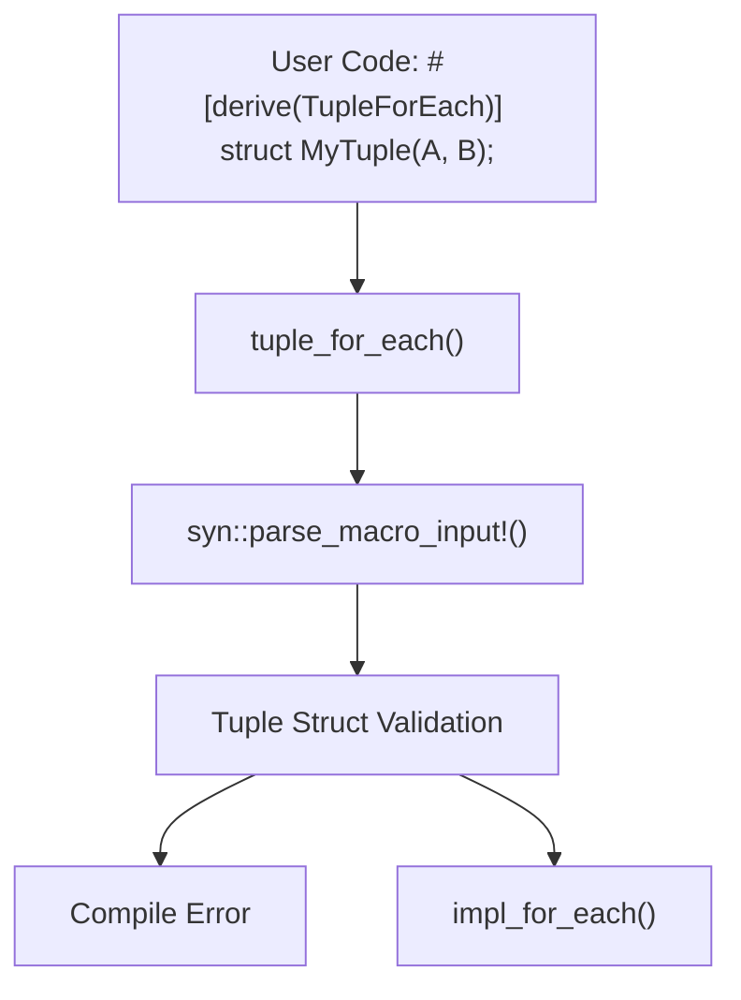
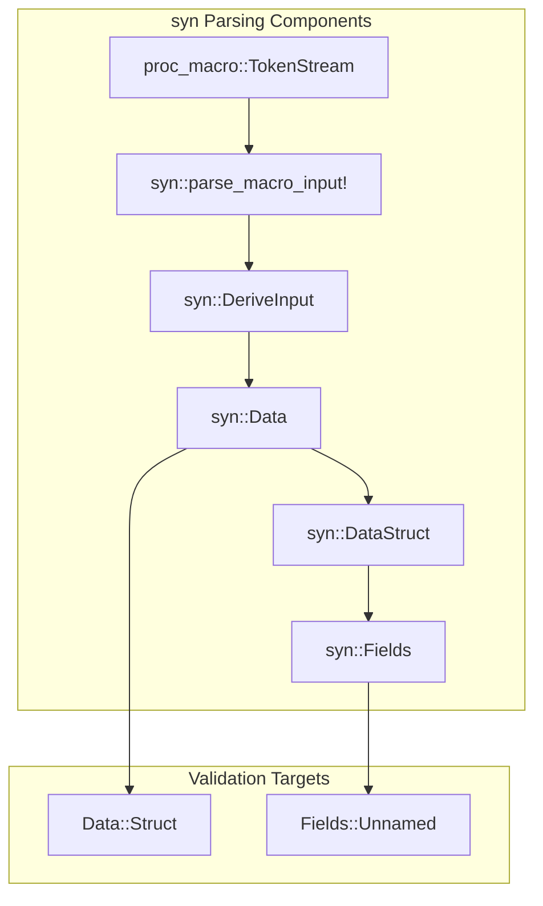
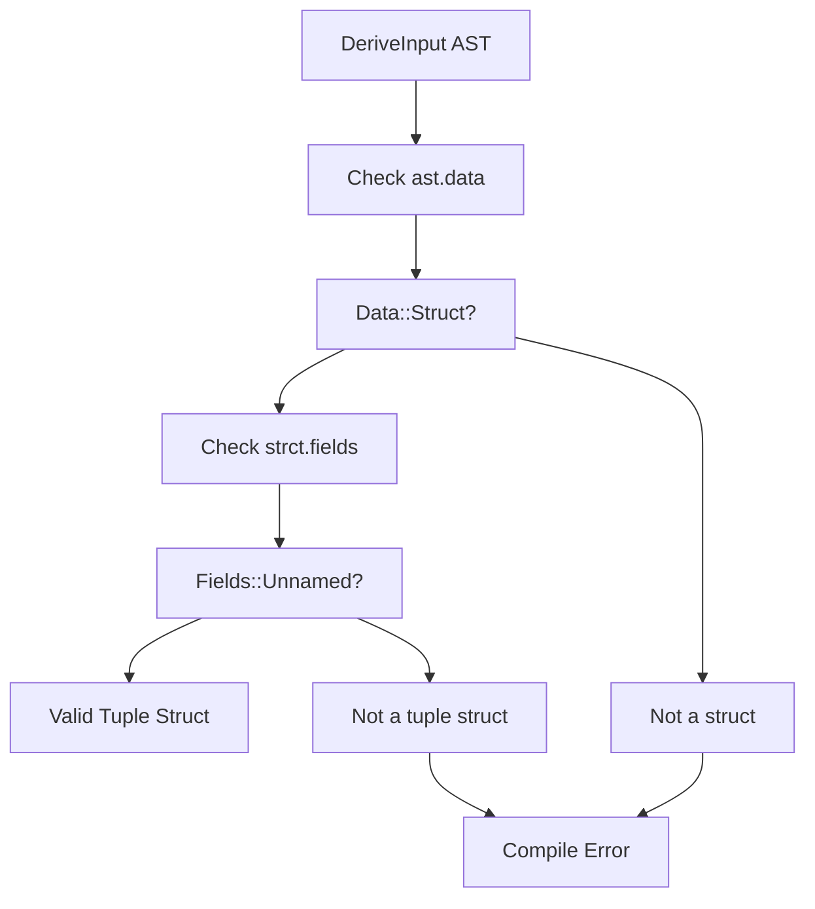
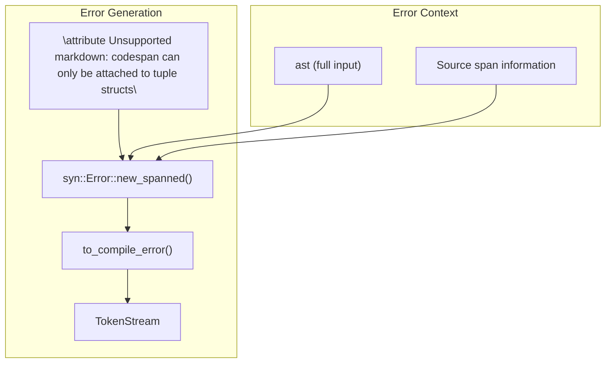
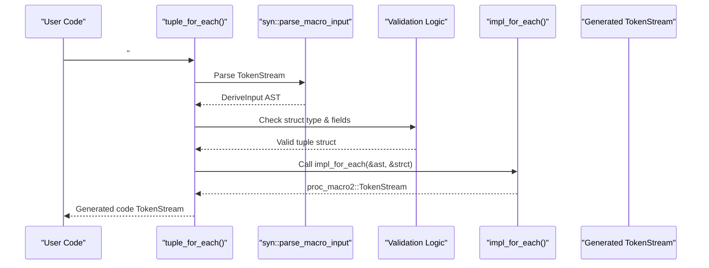

# Derive Macro Processing

> **Relevant source files**
> * [src/lib.rs](https://github.com/arceos-org/tuple_for_each/blob/19a3b4d3/src/lib.rs)

This document explains the entry point processing for the `TupleForEach` derive macro, covering input parsing, validation, and error handling. This covers the initial phase where user-provided tuple struct definitions are parsed and validated before code generation begins. For information about the actual code generation logic, see [Code Generation Pipeline](/arceos-org/tuple_for_each/3.2-code-generation-pipeline).

## Entry Point Function

The derive macro processing begins with the `tuple_for_each()` function, which serves as the procedural macro entry point. This function is marked with the `#[proc_macro_derive(TupleForEach)]` attribute and handles the initial processing of user code.

**Entry Point Processing Flow**

The `tuple_for_each()` function receives a `TokenStream` containing the user's struct definition and immediately delegates parsing to the `syn` crate. The function signature and initial parsing occur at [src/lib.rs(L11 - L12)&emsp;](https://github.com/arceos-org/tuple_for_each/blob/19a3b4d3/src/lib.rs#L11-L12)

Sources: [src/lib.rs(L10 - L24)&emsp;](https://github.com/arceos-org/tuple_for_each/blob/19a3b4d3/src/lib.rs#L10-L24)

## Input Parsing with syn

The macro uses the `syn` crate to parse the incoming `TokenStream` into a structured Abstract Syntax Tree (AST). This parsing transforms the raw token stream into typed Rust syntax structures that can be programmatically analyzed.

**syn AST Structure and Validation Points**

The parsing process extracts key structural information:

|Component|Type|Purpose|Validation|
| --- | --- | --- | --- |
|ast|DeriveInput|Root AST node containing struct metadata|Contains struct name and data|
|ast.data|Data|Discriminates between struct, enum, union|Must beData::Struct|
|strct|DataStruct|Struct-specific data|Extracted fromData::Struct|
|strct.fields|Fields|Field information|Must beFields::Unnamedfor tuple structs|

The parsing occurs with explicit type annotation at [src/lib.rs(L12)&emsp;](https://github.com/arceos-org/tuple_for_each/blob/19a3b4d3/src/lib.rs#L12-L12) ensuring the input conforms to the expected `DeriveInput` structure.

Sources: [src/lib.rs(L11 - L14)&emsp;](https://github.com/arceos-org/tuple_for_each/blob/19a3b4d3/src/lib.rs#L11-L14)

## Tuple Struct Validation

The validation logic implements a two-stage check to ensure the derive macro is only applied to valid tuple structs. This prevents compilation errors and provides clear error messages for invalid usage.

**Validation Decision Tree**

The validation process implements nested pattern matching:

1. **Struct Type Check**: Verifies `ast.data` matches `Data::Struct(strct)` pattern at [src/lib.rs(L13)&emsp;](https://github.com/arceos-org/tuple_for_each/blob/19a3b4d3/src/lib.rs#L13-L13)
2. **Field Type Check**: Verifies `strct.fields` matches `Fields::Unnamed(_)` pattern at [src/lib.rs(L14)&emsp;](https://github.com/arceos-org/tuple_for_each/blob/19a3b4d3/src/lib.rs#L14-L14)
3. **Success Path**: If both checks pass, control flows to `impl_for_each(&ast, strct)` at [src/lib.rs(L15)&emsp;](https://github.com/arceos-org/tuple_for_each/blob/19a3b4d3/src/lib.rs#L15-L15)

The validation logic excludes:

* Named field structs (`struct Foo { a: i32 }`)
* Unit structs (`struct Foo;`)
* Enums and unions
* Any non-struct types

Sources: [src/lib.rs(L13 - L17)&emsp;](https://github.com/arceos-org/tuple_for_each/blob/19a3b4d3/src/lib.rs#L13-L17)

## Error Handling

When validation fails, the macro generates compile-time errors using `syn::Error` to provide meaningful feedback to users. The error handling system ensures that invalid usage is caught early with descriptive messages.

**Error Generation Process**

The error handling mechanism provides:

* **Precise Source Location**: Uses `new_spanned(ast, ...)` to attach error to the original input location at [src/lib.rs(L18 - L19)&emsp;](https://github.com/arceos-org/tuple_for_each/blob/19a3b4d3/src/lib.rs#L18-L19)
* **Clear Error Message**: Explains the constraint that only tuple structs are supported at [src/lib.rs(L20)&emsp;](https://github.com/arceos-org/tuple_for_each/blob/19a3b4d3/src/lib.rs#L20-L20)
* **Compile-Time Failure**: Converts error to token stream that causes compilation to fail at [src/lib.rs(L22 - L23)&emsp;](https://github.com/arceos-org/tuple_for_each/blob/19a3b4d3/src/lib.rs#L22-L23)

This approach ensures users receive actionable feedback when they attempt to apply the derive macro to incompatible types.

Sources: [src/lib.rs(L18 - L24)&emsp;](https://github.com/arceos-org/tuple_for_each/blob/19a3b4d3/src/lib.rs#L18-L24)

## Integration with Code Generation

Upon successful validation, the entry point function delegates to the core code generation system. This handoff represents the transition from input processing to actual macro expansion.

**Processing Handoff Sequence**

The successful path through validation culminates in the call to `impl_for_each(&ast, strct)` at [src/lib.rs(L15)&emsp;](https://github.com/arceos-org/tuple_for_each/blob/19a3b4d3/src/lib.rs#L15-L15) This function receives:

* `&ast`: Reference to the complete `DeriveInput` containing struct metadata
* `strct`: Reference to the `DataStruct` containing field information

The return value is converted from `proc_macro2::TokenStream` to `proc_macro::TokenStream` using `.into()` for compatibility with the procedural macro interface.

Sources: [src/lib.rs(L15)&emsp;](https://github.com/arceos-org/tuple_for_each/blob/19a3b4d3/src/lib.rs#L15-L15) [src/lib.rs(L58)&emsp;](https://github.com/arceos-org/tuple_for_each/blob/19a3b4d3/src/lib.rs#L58-L58)