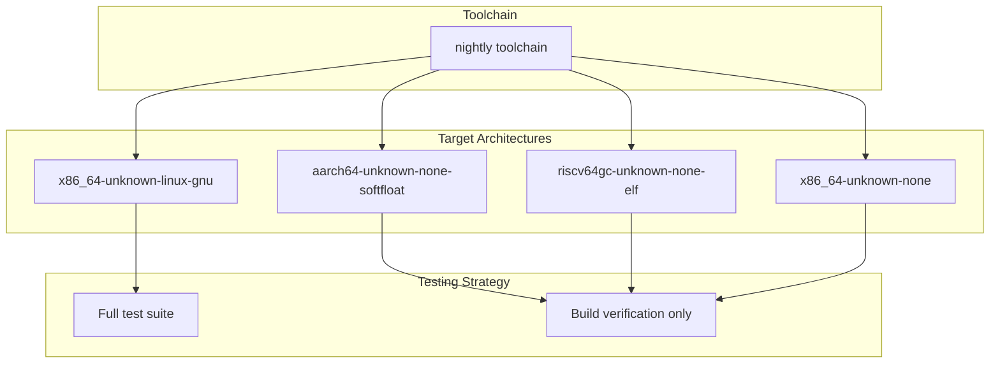
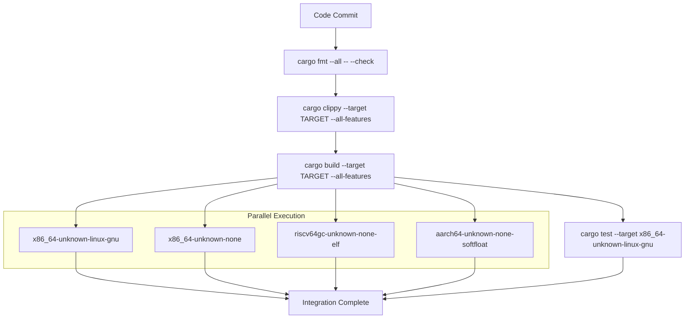
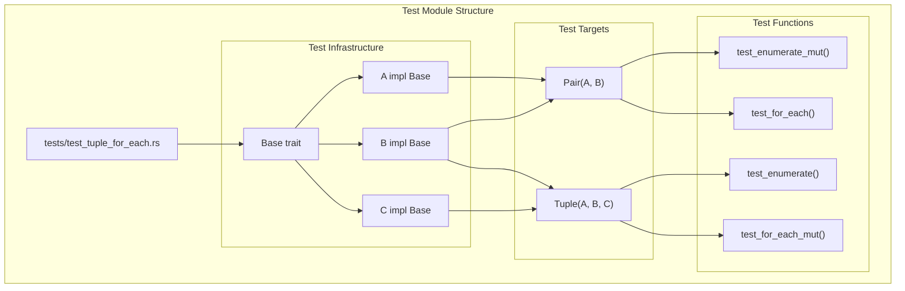
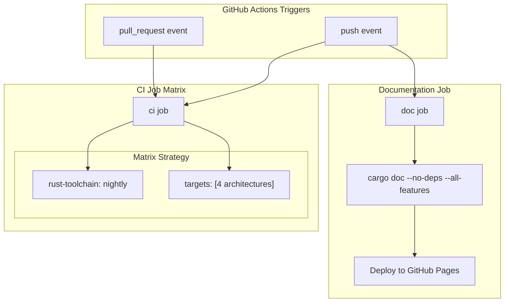
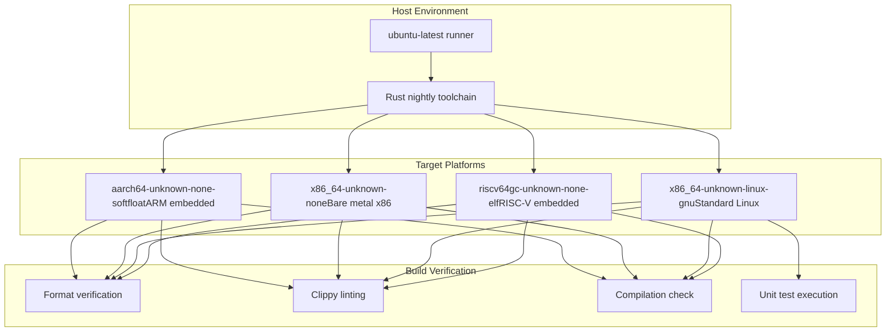

# Development

> **Relevant source files**
> * [.github/workflows/ci.yml](https://github.com/arceos-org/tuple_for_each/blob/19a3b4d3/.github/workflows/ci.yml)
> * [.gitignore](https://github.com/arceos-org/tuple_for_each/blob/19a3b4d3/.gitignore)
> * [tests/test_tuple_for_each.rs](https://github.com/arceos-org/tuple_for_each/blob/19a3b4d3/tests/test_tuple_for_each.rs)

This page provides comprehensive guidance for contributors to the `tuple_for_each` crate, covering development workflow, testing strategies, and quality assurance processes. It focuses on the practical aspects of building, testing, and maintaining the codebase across multiple target architectures.

For detailed information about testing patterns and integration test structure, see [Testing](/arceos-org/tuple_for_each/4.1-testing). For CI/CD pipeline configuration and deployment processes, see [CI/CD Pipeline](/arceos-org/tuple_for_each/4.2-cicd-pipeline).

## Development Environment Setup

The `tuple_for_each` crate requires a Rust nightly toolchain with specific components for cross-platform development and quality checks.

### Required Toolchain Components

|Component|Purpose|
| --- | --- |
|rust-src|Source code for cross-compilation|
|clippy|Linting and static analysis|
|rustfmt|Code formatting|

### Supported Target Architectures

The project supports multiple target architectures to ensure compatibility across embedded and systems programming environments:

**Target Architecture Support Matrix**

Sources: [.github/workflows/ci.yml(L12)&emsp;](https://github.com/arceos-org/tuple_for_each/blob/19a3b4d3/.github/workflows/ci.yml#L12-L12) [.github/workflows/ci.yml(L29 - L30)&emsp;](https://github.com/arceos-org/tuple_for_each/blob/19a3b4d3/.github/workflows/ci.yml#L29-L30)

## Development Workflow

### Quality Gates Pipeline

The development process enforces multiple quality gates before code integration:

**Development Quality Pipeline**

Sources: [.github/workflows/ci.yml(L22 - L30)&emsp;](https://github.com/arceos-org/tuple_for_each/blob/19a3b4d3/.github/workflows/ci.yml#L22-L30)

### Local Development Commands

|Command|Purpose|
| --- | --- |
|cargo fmt --all -- --check|Verify code formatting|
|cargo clippy --all-features|Run linting checks|
|cargo build --all-features|Build for host target|
|cargo test -- --nocapture|Run integration tests|

## Testing Architecture

The testing strategy focuses on integration tests that verify the generated macro functionality across different usage patterns.

### Test Structure Overview

**Integration Test Architecture**

### Test Function Coverage

|Test Function|Target Struct|Generated Macro|Validation|
| --- | --- | --- | --- |
|test_for_each|Pair|pair_for_each!|Iteration count, method calls|
|test_for_each_mut|Tuple|tuple_for_each!|Mutable iteration|
|test_enumerate|Tuple|tuple_enumerate!|Index validation|
|test_enumerate_mut|Pair|pair_enumerate!|Mutable enumeration|

Sources: [tests/test_tuple_for_each.rs(L50 - L106)&emsp;](https://github.com/arceos-org/tuple_for_each/blob/19a3b4d3/tests/test_tuple_for_each.rs#L50-L106)

## CI/CD Infrastructure

### Workflow Jobs Architecture

**CI/CD Job Architecture**

### Documentation Deployment Process

The documentation pipeline includes automated deployment to GitHub Pages with strict quality requirements:

|Environment Variable|Purpose|
| --- | --- |
|RUSTDOCFLAGS: -D rustdoc::broken_intra_doc_links -D missing-docs|Enforce complete documentation|
|default-branch|Control deployment target|

Sources: [.github/workflows/ci.yml(L32 - L55)&emsp;](https://github.com/arceos-org/tuple_for_each/blob/19a3b4d3/.github/workflows/ci.yml#L32-L55) [.github/workflows/ci.yml(L40)&emsp;](https://github.com/arceos-org/tuple_for_each/blob/19a3b4d3/.github/workflows/ci.yml#L40-L40)

## Multi-Target Build Strategy

### Cross-Compilation Support

The crate supports embedded and systems programming environments through comprehensive cross-compilation testing:

**Multi-Target Build Matrix**

### Testing Limitations by Target

Only the `x86_64-unknown-linux-gnu` target supports full test execution due to standard library dependencies in the test environment. Embedded targets (`*-none-*`) undergo build verification to ensure compilation compatibility without runtime testing.

Sources: [.github/workflows/ci.yml(L8 - L30)&emsp;](https://github.com/arceos-org/tuple_for_each/blob/19a3b4d3/.github/workflows/ci.yml#L8-L30)