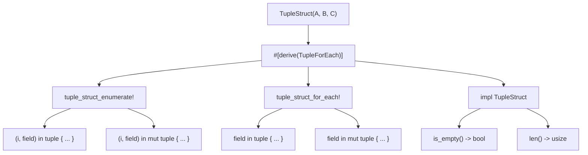
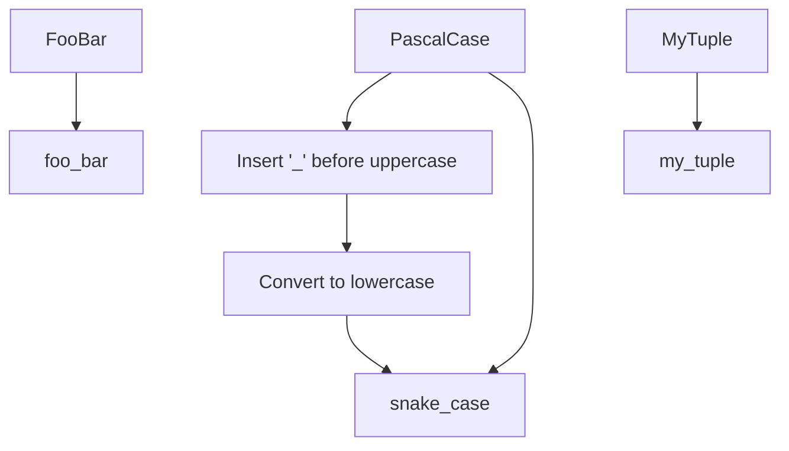
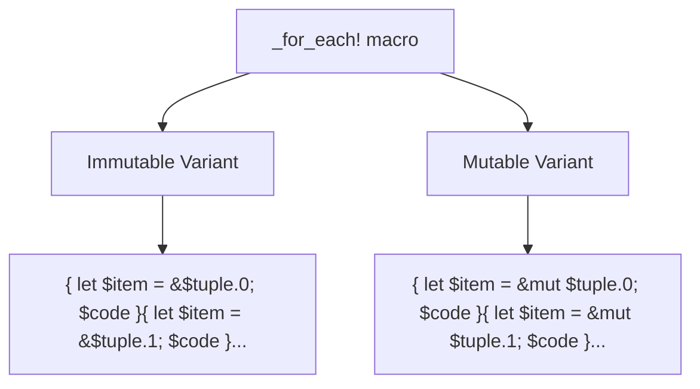
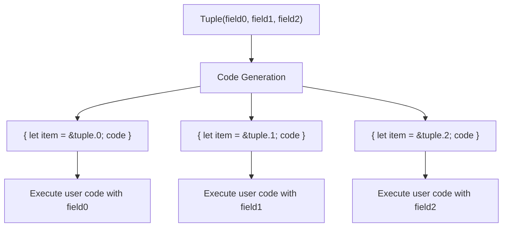

# Generated Functionality

> **Relevant source files**
> * [README.md](https://github.com/arceos-org/tuple_for_each/blob/19a3b4d3/README.md)
> * [src/lib.rs](https://github.com/arceos-org/tuple_for_each/blob/19a3b4d3/src/lib.rs)

This page details the specific functionality generated when applying the `#[derive(TupleForEach)]` attribute to a tuple struct. It covers the generated methods, macros, and their syntax variants.

For basic usage examples, see [Basic Usage](/arceos-org/tuple_for_each/2.1-basic-usage). For implementation details of how this code is generated, see [Code Generation Pipeline](/arceos-org/tuple_for_each/3.2-code-generation-pipeline).

## Overview

When the `TupleForEach` derive macro is applied to a tuple struct, it generates several pieces of functionality:

|Generated Item|Purpose|Variants|
| --- | --- | --- |
|len()method|Returns the number of fields in the tuple|Const method|
|is_empty()method|Returns true if tuple has zero fields|Const method|
|<name>_for_each!macro|Iterates over tuple fields|Immutable, Mutable|
|<name>_enumerate!macro|Iterates over fields with indices|Immutable, Mutable|

**Generated Functionality Mapping**



Sources: [src/lib.rs(L58 - L122)&emsp;](https://github.com/arceos-org/tuple_for_each/blob/19a3b4d3/src/lib.rs#L58-L122)

## Generated Methods

The derive macro adds two constant methods to the tuple struct through an `impl` block:

### len()Method

Returns the number of fields in the tuple as a compile-time constant.

```javascript
pub const fn len(&self) -> usize
```

The implementation directly returns the field count determined at compile time.

### is_empty()Method

Returns `true` if the tuple has zero fields, `false` otherwise.

```javascript
pub const fn is_empty(&self) -> bool
```

The implementation compares `self.len() == 0`.

Sources: [src/lib.rs(L88 - L98)&emsp;](https://github.com/arceos-org/tuple_for_each/blob/19a3b4d3/src/lib.rs#L88-L98)

## Generated Macros

Two primary macros are generated, each with immutable and mutable variants.

### Macro Naming Convention

The macro names are derived from the struct name using `pascal_to_snake` conversion:

|Struct Name|Macro Prefix|
| --- | --- |
|FooBar|foo_bar|
|MyTuple|my_tuple|
|HTTPResponse|h_t_t_p_response|

**Naming Conversion Process**



Sources: [src/lib.rs(L124 - L133)&emsp;](https://github.com/arceos-org/tuple_for_each/blob/19a3b4d3/src/lib.rs#L124-L133) [src/lib.rs(L60)&emsp;](https://github.com/arceos-org/tuple_for_each/blob/19a3b4d3/src/lib.rs#L60-L60)

### <name>_for_each!Macro

Iterates over each field in the tuple, binding each field to a variable.

**Syntax Variants:**

* Immutable: `macro_name_for_each!(item in tuple { code })`
* Mutable: `macro_name_for_each!(item in mut tuple { code })`

**Generated Code Structure:**



Sources: [src/lib.rs(L100 - L109)&emsp;](https://github.com/arceos-org/tuple_for_each/blob/19a3b4d3/src/lib.rs#L100-L109) [src/lib.rs(L71 - L72)&emsp;](https://github.com/arceos-org/tuple_for_each/blob/19a3b4d3/src/lib.rs#L71-L72)

### <name>_enumerate!Macro

Iterates over each field with its index, binding both the index and field to variables.

**Syntax Variants:**

* Immutable: `macro_name_enumerate!((idx, item) in tuple { code })`
* Mutable: `macro_name_enumerate!((idx, item) in mut tuple { code })`

The generated code provides both the field index and field reference for each iteration.

Sources: [src/lib.rs(L111 - L120)&emsp;](https://github.com/arceos-org/tuple_for_each/blob/19a3b4d3/src/lib.rs#L111-L120) [src/lib.rs(L73 - L82)&emsp;](https://github.com/arceos-org/tuple_for_each/blob/19a3b4d3/src/lib.rs#L73-L82)

## Macro Implementation Details

Each macro variant generates a sequence of code blocks, one for each tuple field:

**Field Access Pattern**



The mutable variants follow the same pattern but use `&mut` instead of `&` for field references.

For enumerate macros, an additional index binding is generated: `let $idx = #idx;` where `#idx` is the literal field index (0, 1, 2, etc.).

Sources: [src/lib.rs(L69 - L83)&emsp;](https://github.com/arceos-org/tuple_for_each/blob/19a3b4d3/src/lib.rs#L69-L83)

## Documentation Generation

The generated macros include comprehensive documentation with usage examples. The documentation is generated dynamically based on the struct name and macro type using the `gen_doc` function.

Each generated macro receives structured documentation that includes:

* Purpose description
* Link back to the derive macro
* Code examples with proper syntax

Sources: [src/lib.rs(L26 - L56)&emsp;](https://github.com/arceos-org/tuple_for_each/blob/19a3b4d3/src/lib.rs#L26-L56) [src/lib.rs(L85 - L86)&emsp;](https://github.com/arceos-org/tuple_for_each/blob/19a3b4d3/src/lib.rs#L85-L86)