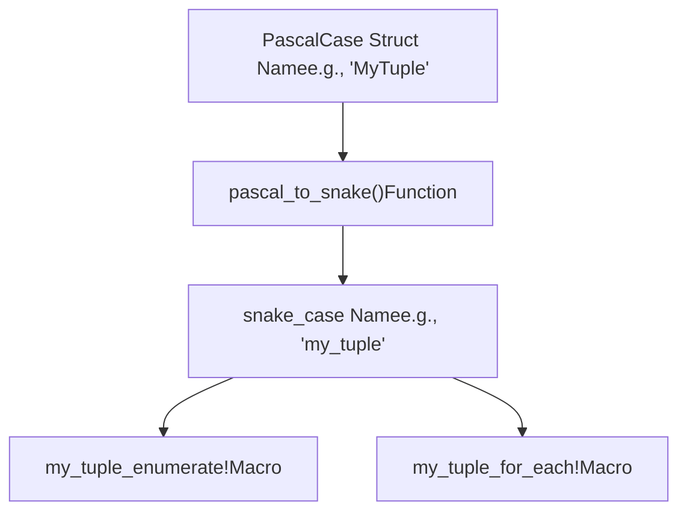
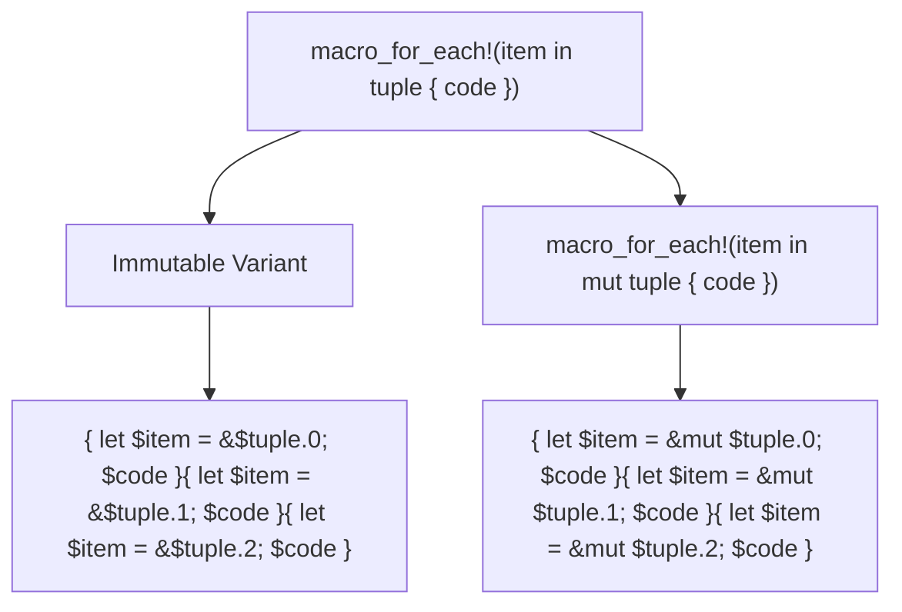
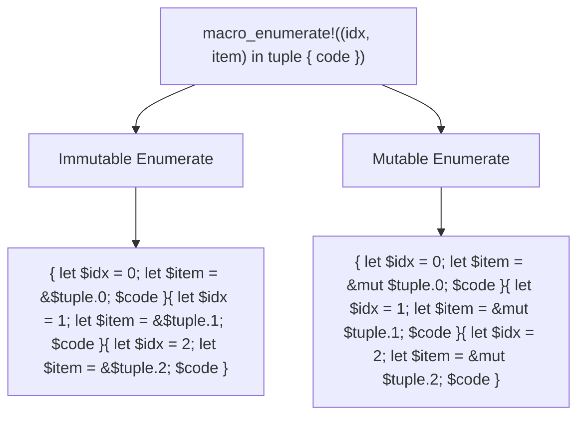
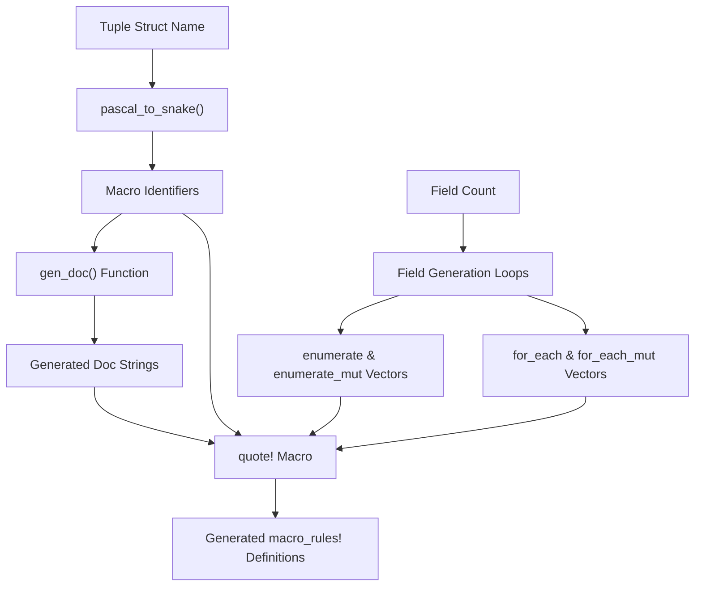

# Generated Macros

> **Relevant source files**
> * [src/lib.rs](https://github.com/arceos-org/tuple_for_each/blob/19a3b4d3/src/lib.rs)
> * [tests/test_tuple_for_each.rs](https://github.com/arceos-org/tuple_for_each/blob/19a3b4d3/tests/test_tuple_for_each.rs)

This page documents the iteration macros automatically generated by the `TupleForEach` derive macro. These macros provide a convenient way to iterate over tuple struct fields at compile time with type safety.

For information about the derive macro itself, see [TupleForEach Derive Macro](/arceos-org/tuple_for_each/5.1-tupleforeach-derive-macro). For the generated methods (`len()` and `is_empty()`), see [Generated Methods](/arceos-org/tuple_for_each/5.3-generated-methods).

## Overview

When you apply `#[derive(TupleForEach)]` to a tuple struct, the macro generates two types of iteration macros:

|Macro Type|Purpose|Naming Pattern|
| --- | --- | --- |
|*_for_each!|Iterate over fields|{snake_case_name}_for_each!|
|*_enumerate!|Iterate with field indices|{snake_case_name}_enumerate!|

Each macro type supports both immutable and mutable variants, allowing you to read from or modify tuple fields during iteration.

**Macro Name Generation**



Sources: [src/lib.rs(L124 - L133)&emsp;](https://github.com/arceos-org/tuple_for_each/blob/19a3b4d3/src/lib.rs#L124-L133) [src/lib.rs(L60 - L62)&emsp;](https://github.com/arceos-org/tuple_for_each/blob/19a3b4d3/src/lib.rs#L60-L62)

## For Each Macros

The `*_for_each!` macros iterate over tuple fields sequentially, providing access to each field value.

### Syntax

```javascript
{name}_for_each!(field_var in tuple_instance {
    // code block using field_var
});

{name}_for_each!(field_var in mut tuple_instance {
    // code block with mutable access to field_var  
});
```

### Generated Implementation

**Macro Structure and Field Access Pattern**



The macro generates sequential code blocks for each tuple field, where:

* `$item` becomes the field variable name you specify
* `$tuple` becomes the tuple instance name you provide
* `$code` becomes your code block
* Field access uses numeric indices (`.0`, `.1`, `.2`, etc.)

Sources: [src/lib.rs(L102 - L109)&emsp;](https://github.com/arceos-org/tuple_for_each/blob/19a3b4d3/src/lib.rs#L102-L109) [src/lib.rs(L71 - L72)&emsp;](https://github.com/arceos-org/tuple_for_each/blob/19a3b4d3/src/lib.rs#L71-L72)

### Usage Examples

From the test suite, here are practical examples:

```css
// Immutable iteration over Pair(A, B)
pair_for_each!(x in t {
    println!("for_each {}: {}", i, x.foo());
    x.bar();
    i += 1;
});

// Mutable iteration over Tuple(A, B, C)  
tuple_for_each!(x in mut t {
    println!("for_each_mut {}: {}", i, x.foo());
    x.bar_mut();
    i += 1;
});
```

Sources: [tests/test_tuple_for_each.rs(L56 - L61)&emsp;](https://github.com/arceos-org/tuple_for_each/blob/19a3b4d3/tests/test_tuple_for_each.rs#L56-L61) [tests/test_tuple_for_each.rs(L70 - L75)&emsp;](https://github.com/arceos-org/tuple_for_each/blob/19a3b4d3/tests/test_tuple_for_each.rs#L70-L75)

## Enumerate Macros

The `*_enumerate!` macros provide both field index and field value during iteration, similar to iterator enumerate functionality.

### Syntax

```javascript
{name}_enumerate!((index_var, field_var) in tuple_instance {
    // code block using index_var and field_var
});

{name}_enumerate!((index_var, field_var) in mut tuple_instance {
    // code block with mutable access to field_var
});
```

### Generated Implementation

**Enumerate Macro Expansion Pattern**



The enumerate macros generate code blocks that provide:

* `$idx` - the field index as a literal value (0, 1, 2, etc.)
* `$item` - reference to the field value (immutable or mutable)
* Sequential execution for each tuple field

Sources: [src/lib.rs(L113 - L120)&emsp;](https://github.com/arceos-org/tuple_for_each/blob/19a3b4d3/src/lib.rs#L113-L120) [src/lib.rs(L73 - L82)&emsp;](https://github.com/arceos-org/tuple_for_each/blob/19a3b4d3/src/lib.rs#L73-L82)

### Usage Examples

```css
// Immutable enumeration over Tuple(A, B, C)
tuple_enumerate!((i, x) in t {
    println!("enumerate {}: {}", i, x.foo());
    x.bar();
    assert_eq!(i, real_idx);
    real_idx += 1;
});

// Mutable enumeration over Pair(A, B)
pair_enumerate!((i, x) in mut t {
    println!("enumerate_mut {}: {}", i, x.foo());
    x.bar_mut();
    assert_eq!(i, real_idx);
    real_idx += 1;
});
```

Sources: [tests/test_tuple_for_each.rs(L84 - L90)&emsp;](https://github.com/arceos-org/tuple_for_each/blob/19a3b4d3/tests/test_tuple_for_each.rs#L84-L90) [tests/test_tuple_for_each.rs(L99 - L105)&emsp;](https://github.com/arceos-org/tuple_for_each/blob/19a3b4d3/tests/test_tuple_for_each.rs#L99-L105)

## Implementation Details

### Macro Export and Documentation

Both macro types are exported using `#[macro_export]` and include generated documentation with usage examples specific to the tuple struct name.

**Code Generation Pipeline for Macros**



The generation process involves:

1. Converting struct name from PascalCase to snake_case
2. Creating macro identifiers with `_for_each` and `_enumerate` suffixes
3. Generating field access code for each tuple position
4. Creating documentation strings with examples
5. Assembling everything into `macro_rules!` definitions using `quote!`

Sources: [src/lib.rs(L58 - L122)&emsp;](https://github.com/arceos-org/tuple_for_each/blob/19a3b4d3/src/lib.rs#L58-L122) [src/lib.rs(L26 - L56)&emsp;](https://github.com/arceos-org/tuple_for_each/blob/19a3b4d3/src/lib.rs#L26-L56)

### Field Access Pattern

All generated macros use numeric field access (`.0`, `.1`, `.2`) since tuple structs have unnamed fields. The field index is determined by the position in the tuple struct definition.

|Field Position|Access Pattern|Generated Index|
| --- | --- | --- |
|First field|$tuple.0|0(for enumerate)|
|Second field|$tuple.1|1(for enumerate)|
|Third field|$tuple.2|2(for enumerate)|

Sources: [src/lib.rs(L69 - L83)&emsp;](https://github.com/arceos-org/tuple_for_each/blob/19a3b4d3/src/lib.rs#L69-L83)