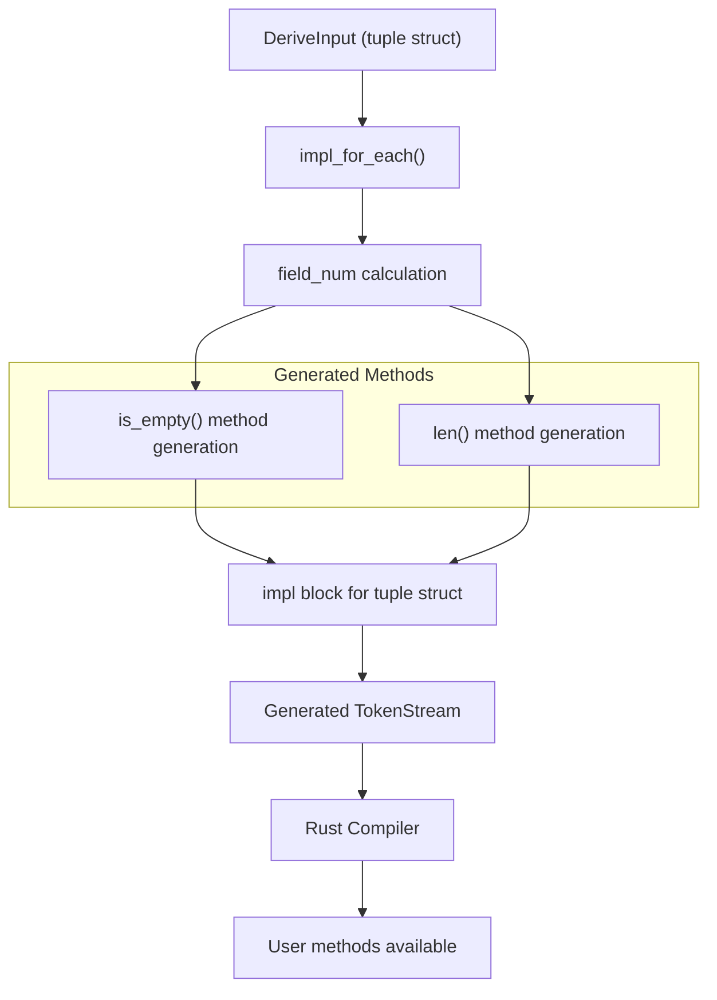
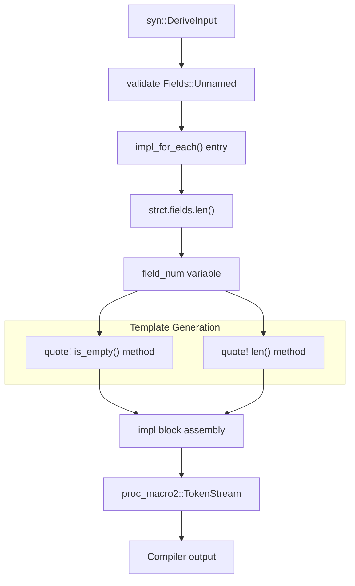
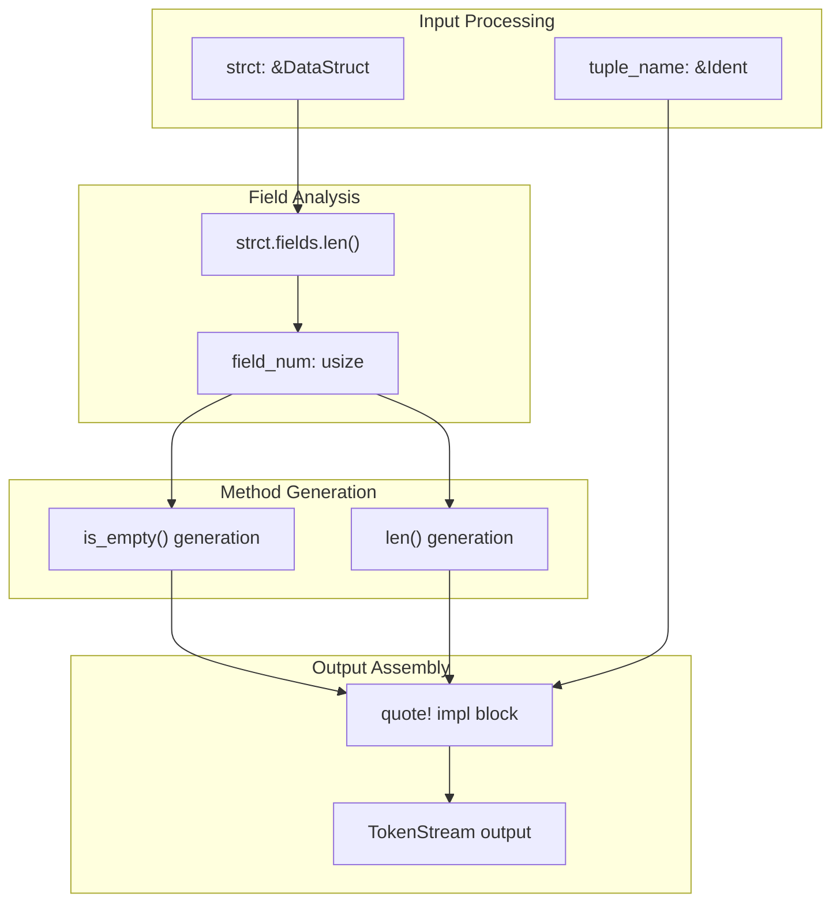

# Generated Methods

> **Relevant source files**
> * [README.md](https://github.com/arceos-org/tuple_for_each/blob/19a3b4d3/README.md)
> * [src/lib.rs](https://github.com/arceos-org/tuple_for_each/blob/19a3b4d3/src/lib.rs)

This page documents the instance methods that are automatically generated when applying the `#[derive(TupleForEach)]` attribute to a tuple struct. These methods provide metadata and utility functions for working with tuple instances.

For information about the generated iteration macros, see [Generated Macros](/arceos-org/tuple_for_each/5.2-generated-macros). For details about the derive macro itself, see [TupleForEach Derive Macro](/arceos-org/tuple_for_each/5.1-tupleforeach-derive-macro).

## Overview

The `TupleForEach` derive macro generates exactly two methods on the target tuple struct, both providing metadata about the tuple's structure:

|Method|Return Type|Purpose|
| --- | --- | --- |
|len()|usize|Returns the number of fields in the tuple|
|is_empty()|bool|Returns whether the tuple contains zero fields|

Both methods are implemented as `const fn`, making them available for compile-time evaluation.

### Generated Method Implementation Pattern



Sources: [src/lib.rs(L58 - L122)&emsp;](https://github.com/arceos-org/tuple_for_each/blob/19a3b4d3/src/lib.rs#L58-L122)

## Thelen()Method

### Signature

```javascript
pub const fn len(&self) -> usize
```

### Behavior

Returns the compile-time constant representing the number of fields in the tuple struct. This value is determined during macro expansion by counting the fields in the `DataStruct`.

### Implementation Details

The method is generated with the field count as a literal value, making it a true compile-time constant:

```javascript
pub const fn len(&self) -> usize {
    #field_num  // Literal field count
}
```

### Usage Characteristics

* **Compile-time evaluation**: Can be used in const contexts
* **Zero-cost**: Resolves to a literal integer at compile time
* **No runtime computation**: Field count is baked into the binary

Sources: [src/lib.rs(L89 - L92)&emsp;](https://github.com/arceos-org/tuple_for_each/blob/19a3b4d3/src/lib.rs#L89-L92)

## Theis_empty()Method

### Signature

```javascript
pub const fn is_empty(&self) -> bool
```

### Behavior

Returns `true` if the tuple has zero fields, `false` otherwise. The implementation delegates to the `len()` method for consistency.

### Implementation Details

```javascript
pub const fn is_empty(&self) -> bool {
    self.len() == 0
}
```

### Edge Cases

For tuple structs with zero fields (unit-like structs), this method returns `true`. However, such structs are uncommon in practice since they're typically represented as unit structs rather than tuple structs.

Sources: [src/lib.rs(L94 - L97)&emsp;](https://github.com/arceos-org/tuple_for_each/blob/19a3b4d3/src/lib.rs#L94-L97)

## Method Generation Process

### Code Generation Pipeline



Sources: [src/lib.rs(L58 - L98)&emsp;](https://github.com/arceos-org/tuple_for_each/blob/19a3b4d3/src/lib.rs#L58-L98)

## Usage Examples

### Basic Metadata Access

```javascript
use tuple_for_each::TupleForEach;

#[derive(TupleForEach)]
struct Triple(i32, String, bool);

let data = Triple(42, "hello".to_string(), true);

// Compile-time accessible
const TRIPLE_SIZE: usize = Triple(0, String::new(), false).len();

// Runtime usage
assert_eq!(data.len(), 3);
assert!(!data.is_empty());
```

### Integration with Generic Code

```rust
fn process_tuple<T>(tuple: T) 
where 
    T: /* has len() and is_empty() methods */
{
    if !tuple.is_empty() {
        println!("Processing tuple with {} fields", tuple.len());
        // Process non-empty tuple
    }
}
```

### Conditional Compilation

```javascript
#[derive(TupleForEach)]
struct Config(u32, String);

const CONFIG_FIELDS: usize = Config(0, String::new()).len();

#[cfg(const_eval)]
const _: () = {
    assert!(CONFIG_FIELDS > 0);
};
```

Sources: [README.md(L20 - L28)&emsp;](https://github.com/arceos-org/tuple_for_each/blob/19a3b4d3/README.md#L20-L28)

## Implementation Architecture

### Method Generation Context



The methods are generated within the same `impl` block that contains the iteration macros, ensuring they're part of a cohesive API surface for tuple manipulation.

Sources: [src/lib.rs(L64 - L98)&emsp;](https://github.com/arceos-org/tuple_for_each/blob/19a3b4d3/src/lib.rs#L64-L98)

## Performance Characteristics

### Compile-Time Properties

* **Zero runtime cost**: Both methods resolve to compile-time constants
* **No memory overhead**: No additional storage required for metadata
* **Inlining friendly**: Simple constant returns are trivially inlined

### Runtime Behavior

* **`len()`**: Single instruction returning immediate value
* **`is_empty()`**: Single comparison against zero, often optimized away

### Const Evaluation

Both methods are `const fn`, enabling their use in:

* Const contexts and const generics
* Array size specifications
* Compile-time assertions
* Static initialization

Sources: [src/lib.rs(L89 - L97)&emsp;](https://github.com/arceos-org/tuple_for_each/blob/19a3b4d3/src/lib.rs#L89-L97)