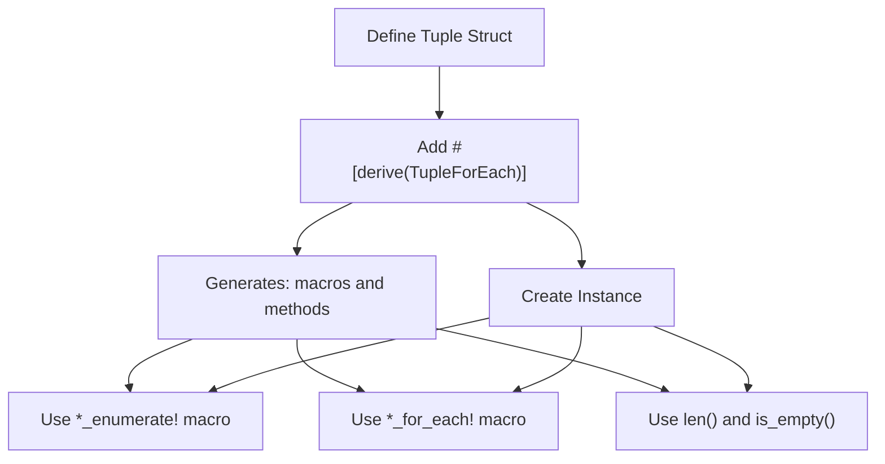
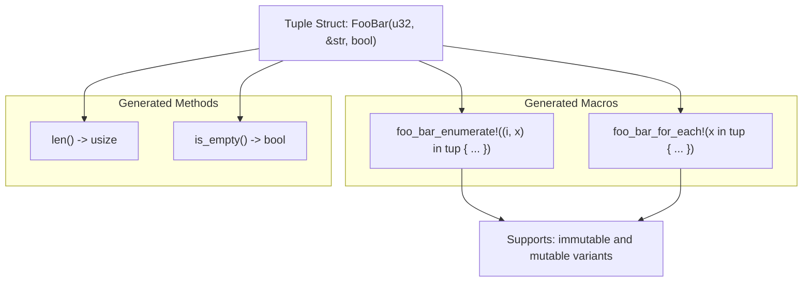

# Getting Started

> **Relevant source files**
> * [README.md](https://github.com/arceos-org/tuple_for_each/blob/19a3b4d3/README.md)
> * [tests/test_tuple_for_each.rs](https://github.com/arceos-org/tuple_for_each/blob/19a3b4d3/tests/test_tuple_for_each.rs)

This page provides a practical introduction to using the `tuple_for_each` crate in your Rust projects. It covers the essential steps needed to apply the `TupleForEach` derive macro to tuple structs and use the generated iteration functionality.

For detailed API documentation, see [API Reference](/arceos-org/tuple_for_each/5-api-reference). For implementation details and advanced topics, see [Implementation Guide](/arceos-org/tuple_for_each/3-implementation-guide).

## Installation and Setup

Add `tuple_for_each` to your `Cargo.toml` dependencies:

```
[dependencies]
tuple_for_each = "0.1"
```

Import the derive macro in your Rust code:

```
use tuple_for_each::TupleForEach;
```

The crate requires no additional setup or configuration. All functionality is generated at compile time through the procedural macro system.

Sources: [README.md(L3 - L4)&emsp;](https://github.com/arceos-org/tuple_for_each/blob/19a3b4d3/README.md#L3-L4) [tests/test_tuple_for_each.rs(L1)&emsp;](https://github.com/arceos-org/tuple_for_each/blob/19a3b4d3/tests/test_tuple_for_each.rs#L1-L1)

## Quick Start Workflow

#### Workflow: From Struct Definition to Iteration



**Step 1: Define and Annotate Tuple Struct**

Apply the `#[derive(TupleForEach)]` attribute to any tuple struct:

```
#[derive(TupleForEach)]
struct FooBar(u32, &'static str, bool);
```

**Step 2: Create Instance and Access Metadata**

```javascript
let tup = FooBar(23, "hello", true);
assert_eq!(tup.len(), 3);
assert!(!tup.is_empty());
```

**Step 3: Iterate Over Fields**

Use the generated `*_for_each!` macro for field iteration:

```
foo_bar_for_each!(x in tup {
    println!("{}", x);
});
```

Use the generated `*_enumerate!` macro for indexed iteration:

```css
foo_bar_enumerate!((i, x) in tup {
    println!("{}: {}", i, x);
});
```

Sources: [README.md(L18 - L39)&emsp;](https://github.com/arceos-org/tuple_for_each/blob/19a3b4d3/README.md#L18-L39) [tests/test_tuple_for_each.rs(L44 - L48)&emsp;](https://github.com/arceos-org/tuple_for_each/blob/19a3b4d3/tests/test_tuple_for_each.rs#L44-L48)

## Generated Code Entities

#### Code Generation Mapping



The derive macro generates the following code entities for each annotated struct:

|Generated Entity|Purpose|Example Usage|
| --- | --- | --- |
|len()method|Returns field count|tup.len()|
|is_empty()method|Checks if tuple has zero fields|tup.is_empty()|
|*_for_each!macro|Iterates over fields|foo_bar_for_each!(x in tup { ... })|
|*_enumerate!macro|Iterates with field index|foo_bar_enumerate!((i, x) in tup { ... })|

**Naming Convention**: Macro names are derived by converting the struct name from PascalCase to snake_case. `FooBar` becomes `foo_bar_for_each!` and `foo_bar_enumerate!`.

Sources: [README.md(L9 - L16)&emsp;](https://github.com/arceos-org/tuple_for_each/blob/19a3b4d3/README.md#L9-L16) [tests/test_tuple_for_each.rs(L52 - L61)&emsp;](https://github.com/arceos-org/tuple_for_each/blob/19a3b4d3/tests/test_tuple_for_each.rs#L52-L61)

## Mutable and Immutable Variants

Both generated macros support mutable and immutable field access:

**Immutable Access:**

```
pair_for_each!(x in t {
    x.bar();  // Call immutable methods
});
```

**Mutable Access:**

```
tuple_for_each!(x in mut t {
    x.bar_mut();  // Call mutable methods
});
```

The same pattern applies to the enumerate macro:

```
pair_enumerate!((i, x) in mut t {
    x.bar_mut();
});
```

Sources: [tests/test_tuple_for_each.rs(L65 - L76)&emsp;](https://github.com/arceos-org/tuple_for_each/blob/19a3b4d3/tests/test_tuple_for_each.rs#L65-L76) [tests/test_tuple_for_each.rs(L94 - L106)&emsp;](https://github.com/arceos-org/tuple_for_each/blob/19a3b4d3/tests/test_tuple_for_each.rs#L94-L106)

## Common Usage Patterns

**Field Type Uniformity**: The macros work with heterogeneous tuple fields. Each field can be a different type, as demonstrated in the test patterns where `A`, `B`, and `C` are distinct types implementing a common trait.

**Trait-Based Operations**: A common pattern is to define a trait that all tuple field types implement, then call trait methods within the iteration macros:

```rust
trait Base {
    fn foo(&self) -> Self::Item;
    fn bar(&self);
}
```

**Index Tracking**: The enumerate macro provides automatic index tracking, eliminating the need for manual counter variables.

Sources: [tests/test_tuple_for_each.rs(L3 - L42)&emsp;](https://github.com/arceos-org/tuple_for_each/blob/19a3b4d3/tests/test_tuple_for_each.rs#L3-L42) [tests/test_tuple_for_each.rs(L83 - L90)&emsp;](https://github.com/arceos-org/tuple_for_each/blob/19a3b4d3/tests/test_tuple_for_each.rs#L83-L90)

## Next Steps

* For complete syntax and advanced usage examples, see [Basic Usage](/arceos-org/tuple_for_each/2.1-basic-usage)
* For detailed explanation of all generated functionality, see [Generated Functionality](/arceos-org/tuple_for_each/2.2-generated-functionality)
* For understanding the internal implementation, see [Implementation Guide](/arceos-org/tuple_for_each/3-implementation-guide)
* For comprehensive API documentation, see [API Reference](/arceos-org/tuple_for_each/5-api-reference)

Sources: [README.md(L1 - L40)&emsp;](https://github.com/arceos-org/tuple_for_each/blob/19a3b4d3/README.md#L1-L40) [tests/test_tuple_for_each.rs(L1 - L107)&emsp;](https://github.com/arceos-org/tuple_for_each/blob/19a3b4d3/tests/test_tuple_for_each.rs#L1-L107)