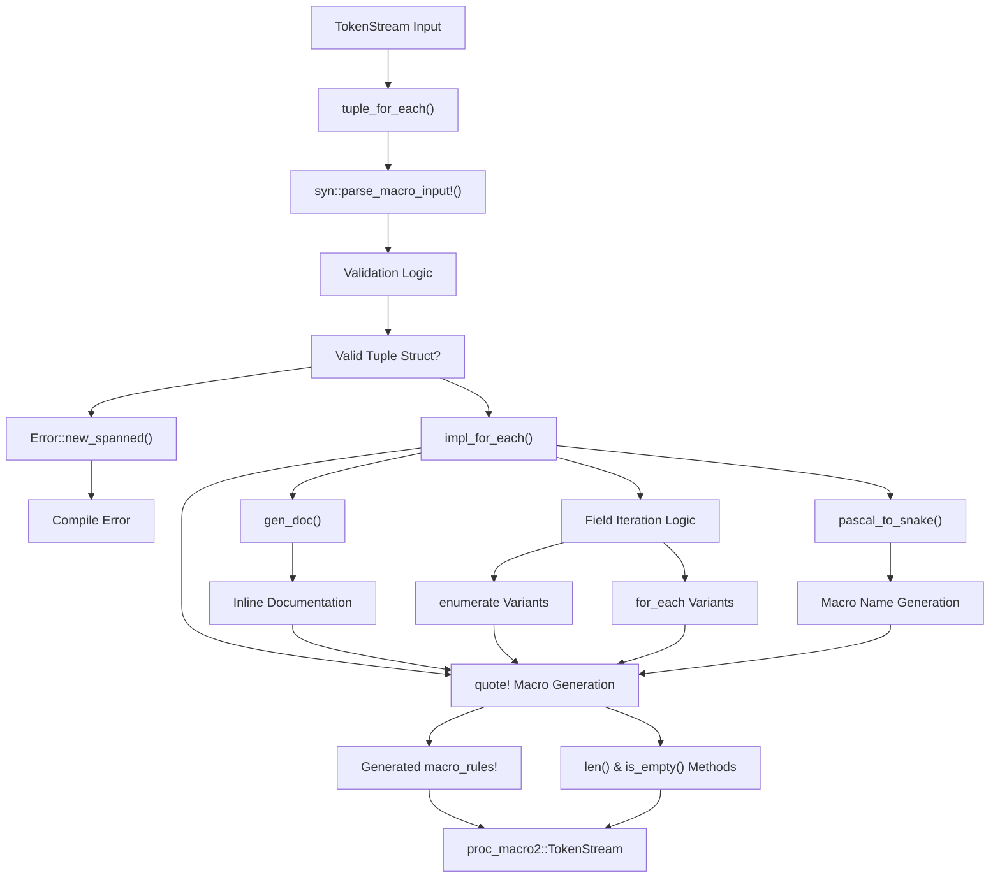
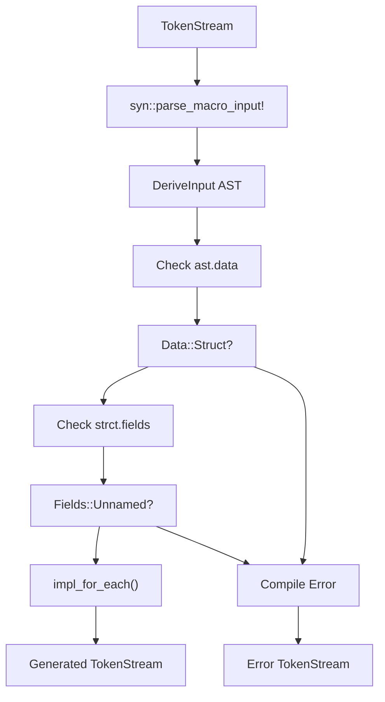
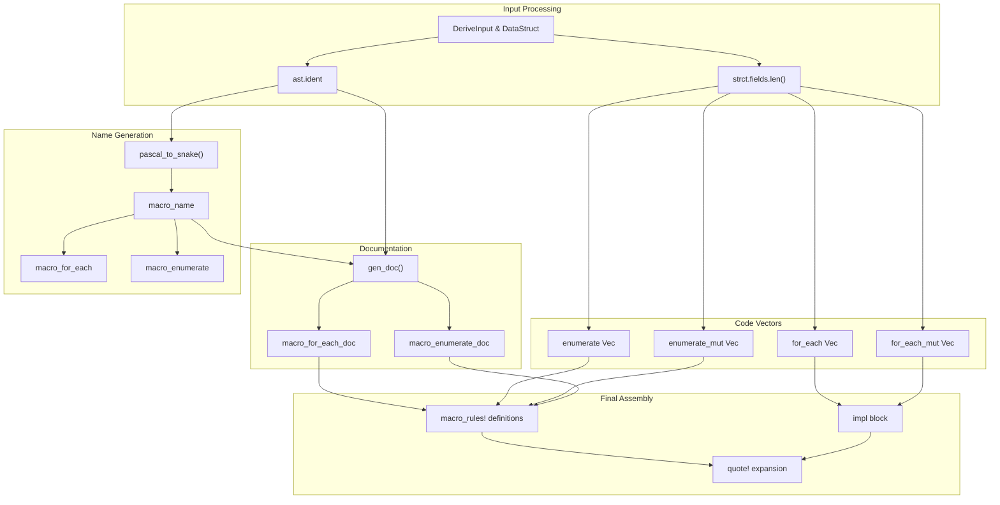
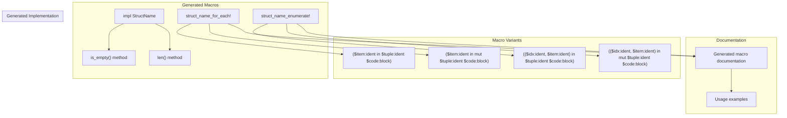
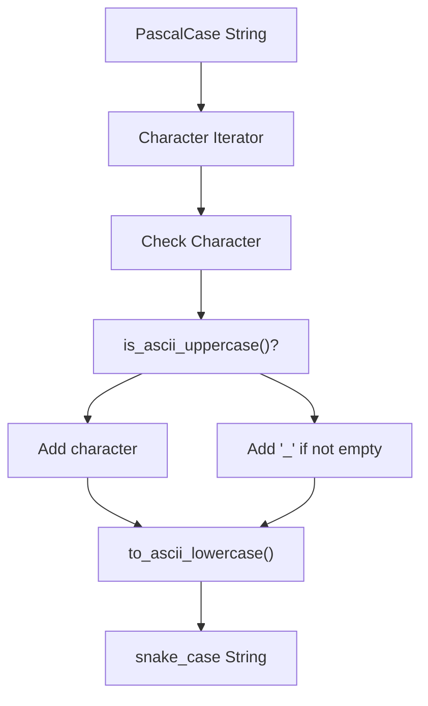

# Implementation Guide

> **Relevant source files**
> * [Cargo.toml](https://github.com/arceos-org/tuple_for_each/blob/19a3b4d3/Cargo.toml)
> * [src/lib.rs](https://github.com/arceos-org/tuple_for_each/blob/19a3b4d3/src/lib.rs)

This document provides a detailed technical guide to the internal implementation of the `tuple_for_each` derive macro. It covers the macro processing pipeline, code generation strategies, and the architectural decisions behind the crate's design.

This guide focuses on how the derive macro transforms user code at compile time. For basic usage examples, see [Getting Started](/arceos-org/tuple_for_each/2-getting-started). For API reference documentation, see [API Reference](/arceos-org/tuple_for_each/5-api-reference).

## Macro Processing Architecture

The `tuple_for_each` derive macro follows a standard procedural macro architecture with clear separation between parsing, validation, and code generation phases.

### Processing Pipeline

The pipeline starts with the `tuple_for_each` function as the entry point and flows through validation, name conversion, and code generation phases before producing the final token stream.

Sources: [src/lib.rs(L10 - L24)&emsp;](https://github.com/arceos-org/tuple_for_each/blob/19a3b4d3/src/lib.rs#L10-L24) [src/lib.rs(L58 - L122)&emsp;](https://github.com/arceos-org/tuple_for_each/blob/19a3b4d3/src/lib.rs#L58-L122)

### Entry Point and Validation

The derive macro entry point performs essential validation to ensure the macro is only applied to tuple structs:

The validation logic specifically checks for `Data::Struct` with `Fields::Unnamed`, ensuring the derive macro only works on tuple structs like `struct MyTuple(A, B, C)`.

Sources: [src/lib.rs(L11 - L24)&emsp;](https://github.com/arceos-org/tuple_for_each/blob/19a3b4d3/src/lib.rs#L11-L24)

## Code Generation Pipeline

The core code generation happens in the `impl_for_each` function, which orchestrates the creation of all generated functionality.

### Generation Strategy

The generation process creates separate code vectors for each variant (immutable/mutable × for_each/enumerate) and assembles them into the final token stream.

Sources: [src/lib.rs(L58 - L122)&emsp;](https://github.com/arceos-org/tuple_for_each/blob/19a3b4d3/src/lib.rs#L58-L122)

### Field Iteration Logic

The macro generates field access code by iterating over field indices and creating appropriate access patterns:

|Variant|Access Pattern|Generated Code Template|
| --- | --- | --- |
|for_each|&$tuple.#idx|{ let $item = &$tuple.#idx; $code }|
|for_each_mut|&mut $tuple.#idx|{ let $item = &mut $tuple.#idx; $code }|
|enumerate|&$tuple.#idxwith index|{ let $idx = #idx; let $item = &$tuple.#idx; $code }|
|enumerate_mut|&mut $tuple.#idxwith index|{ let $idx = #idx; let $item = &mut $tuple.#idx; $code }|

The field iteration uses `syn::Index` to generate numeric field accessors for tuple struct fields.

Sources: [src/lib.rs(L64 - L83)&emsp;](https://github.com/arceos-org/tuple_for_each/blob/19a3b4d3/src/lib.rs#L64-L83)

## Generated Code Structure

The macro produces a comprehensive set of functionality for each tuple struct, including both methods and macros.

### Output Components

Each component serves a specific purpose in providing iteration capabilities for tuple structs.

Sources: [src/lib.rs(L87 - L121)&emsp;](https://github.com/arceos-org/tuple_for_each/blob/19a3b4d3/src/lib.rs#L87-L121)

### Method Generation

The implementation block includes utility methods that provide metadata about the tuple:

|Method|Return Type|Implementation|Purpose|
| --- | --- | --- | --- |
|len()|usize|#field_num(const)|Returns field count|
|is_empty()|bool|self.len() == 0|Checks if tuple has fields|

Both methods are `const fn`, allowing compile-time evaluation when possible.

Sources: [src/lib.rs(L88 - L98)&emsp;](https://github.com/arceos-org/tuple_for_each/blob/19a3b4d3/src/lib.rs#L88-L98)

## Helper Utilities

The implementation includes several utility functions that support the code generation process.

### Name Conversion

The `pascal_to_snake` function converts Pascal case struct names to snake case for macro naming:

This conversion ensures that `MyTupleStruct` becomes `my_tuple_struct_for_each!` for the generated macro names.

Sources: [src/lib.rs(L124 - L133)&emsp;](https://github.com/arceos-org/tuple_for_each/blob/19a3b4d3/src/lib.rs#L124-L133)

### Documentation Generation

The `gen_doc` function creates inline documentation for generated macros:

|Documentation Type|Template|Generated Content|
| --- | --- | --- |
|"for_each"|Field iteration|Usage examples and description for*_for_each!|
|"enumerate"|Indexed iteration|Usage examples and description for*_enumerate!|

The documentation includes proper cross-references to the derive macro and usage examples in ignore blocks.

Sources: [src/lib.rs(L26 - L56)&emsp;](https://github.com/arceos-org/tuple_for_each/blob/19a3b4d3/src/lib.rs#L26-L56)

### Token Stream Assembly

The final assembly uses the `quote!` macro to combine all generated components into a single `proc_macro2::TokenStream`. The macro leverages token interpolation to insert:

* Field counts as literal numbers
* Generated code vectors using `#(#vector)*` expansion
* Dynamically created identifiers via `format_ident!`
* Documentation strings through `#doc` attributes

Sources: [src/lib.rs(L87 - L122)&emsp;](https://github.com/arceos-org/tuple_for_each/blob/19a3b4d3/src/lib.rs#L87-L122)