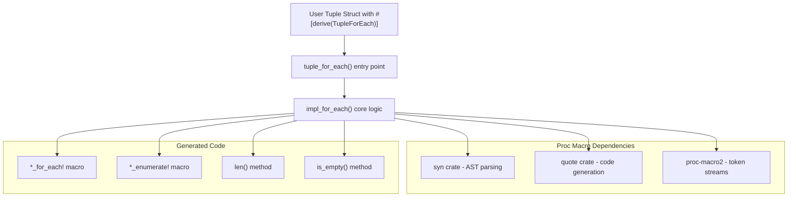
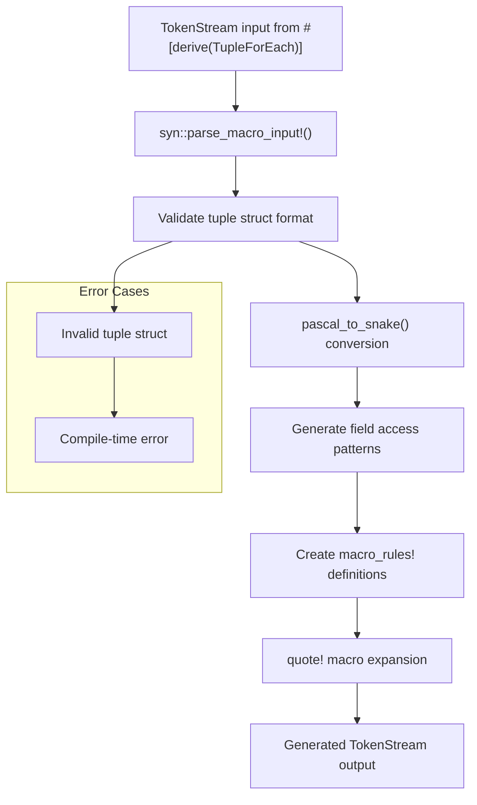

# Overview

> **Relevant source files**
> * [Cargo.toml](https://github.com/arceos-org/tuple_for_each/blob/19a3b4d3/Cargo.toml)
> * [README.md](https://github.com/arceos-org/tuple_for_each/blob/19a3b4d3/README.md)

This document provides an introduction to the `tuple_for_each` crate, a Rust procedural macro library that generates iteration utilities for tuple structs. The crate enables developers to iterate over tuple struct fields in a type-safe manner through automatically generated macros and methods.

For implementation details, see [Implementation Guide](/arceos-org/tuple_for_each/3-implementation-guide). For usage examples and getting started, see [Getting Started](/arceos-org/tuple_for_each/2-getting-started). For complete API documentation, see [API Reference](/arceos-org/tuple_for_each/5-api-reference).

## Purpose and Core Functionality

The `tuple_for_each` crate addresses the limitation that Rust tuple structs cannot be iterated over directly since their fields may have different types. It provides a `TupleForEach` derive macro that automatically generates iteration utilities at compile time.

When applied to a tuple struct, the derive macro generates:

* `*_for_each!` macro for field iteration
* `*_enumerate!` macro for indexed field iteration
* `len()` method returning the number of fields
* `is_empty()` method checking if the tuple has fields

**Core Architecture Overview**

Sources: [Cargo.toml(L1 - L21)&emsp;](https://github.com/arceos-org/tuple_for_each/blob/19a3b4d3/Cargo.toml#L1-L21) [README.md(L1 - L40)&emsp;](https://github.com/arceos-org/tuple_for_each/blob/19a3b4d3/README.md#L1-L40)

## Macro Processing Pipeline

The crate follows a standard procedural macro architecture where compile-time code generation produces runtime utilities. The process transforms user-defined tuple structs into enhanced types with iteration capabilities.

**Compilation Flow**

Sources: [Cargo.toml(L14 - L17)&emsp;](https://github.com/arceos-org/tuple_for_each/blob/19a3b4d3/Cargo.toml#L14-L17) [README.md(L20 - L39)&emsp;](https://github.com/arceos-org/tuple_for_each/blob/19a3b4d3/README.md#L20-L39)

## Generated Code Structure

For each tuple struct, the macro generates a consistent set of utilities following a naming convention based on the struct name converted from PascalCase to snake_case.

|Generated Item|Purpose|Example forFooBarstruct|
| --- | --- | --- |
|Iteration macro|Field-by-field iteration|foo_bar_for_each!(x in tuple { ... })|
|Enumeration macro|Indexed field iteration|foo_bar_enumerate!((i, x) in tuple { ... })|
|Length method|Field count|tuple.len()|
|Empty check method|Zero-field detection|tuple.is_empty()|

The generated macros support both immutable and mutable access patterns, enabling flexible usage across different contexts.

Sources: [README.md(L9 - L16)&emsp;](https://github.com/arceos-org/tuple_for_each/blob/19a3b4d3/README.md#L9-L16) [README.md(L30 - L38)&emsp;](https://github.com/arceos-org/tuple_for_each/blob/19a3b4d3/README.md#L30-L38)

## Target Use Cases

The crate is designed for systems programming contexts where tuple structs represent heterogeneous data collections that need iteration capabilities. The multi-target build configuration supports embedded and cross-platform development.

**Supported Target Architectures:**

* `x86_64-unknown-linux-gnu` (full testing)
* `x86_64-unknown-none` (build verification)
* `riscv64gc-unknown-none-elf` (embedded RISC-V)
* `aarch64-unknown-none-softfloat` (embedded ARM)

The `no_std` compatibility and embedded target support indicate the crate is suitable for resource-constrained environments where compile-time code generation provides runtime efficiency benefits.

Sources: [Cargo.toml(L1 - L21)&emsp;](https://github.com/arceos-org/tuple_for_each/blob/19a3b4d3/Cargo.toml#L1-L21) [README.md(L1 - L7)&emsp;](https://github.com/arceos-org/tuple_for_each/blob/19a3b4d3/README.md#L1-L7)

## Dependencies and Ecosystem Integration

The crate follows standard Rust ecosystem patterns and integrates with the procedural macro infrastructure:

* **proc-macro2**: Token stream manipulation and procedural macro utilities
* **quote**: Template-based code generation with compile-time expansion
* **syn**: Abstract syntax tree parsing and manipulation

The crate is configured as a procedural macro library through `proc-macro = true` in the `[lib]` section, making it available for use with `#[derive()]` attributes.

Sources: [Cargo.toml(L14 - L21)&emsp;](https://github.com/arceos-org/tuple_for_each/blob/19a3b4d3/Cargo.toml#L14-L21)