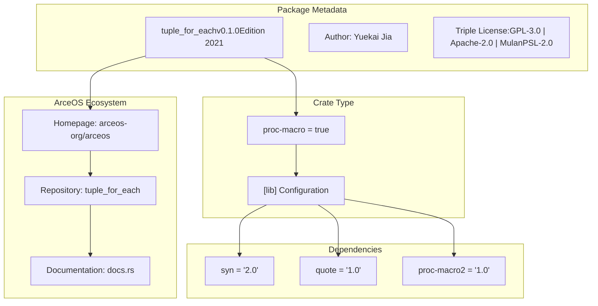
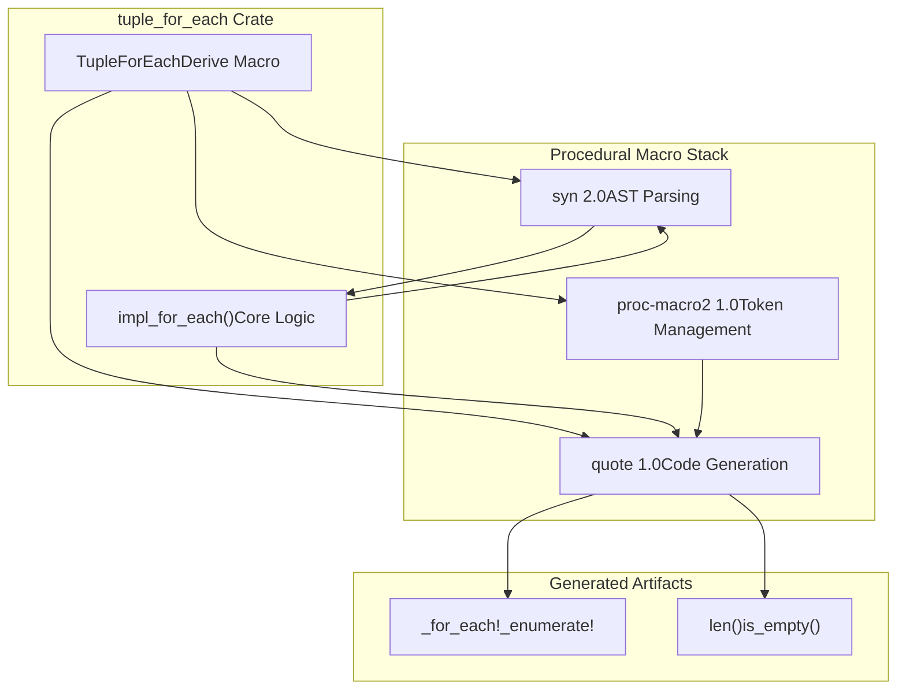
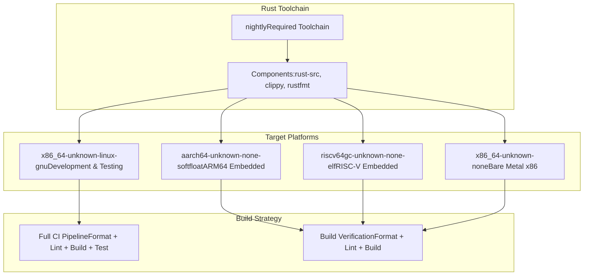
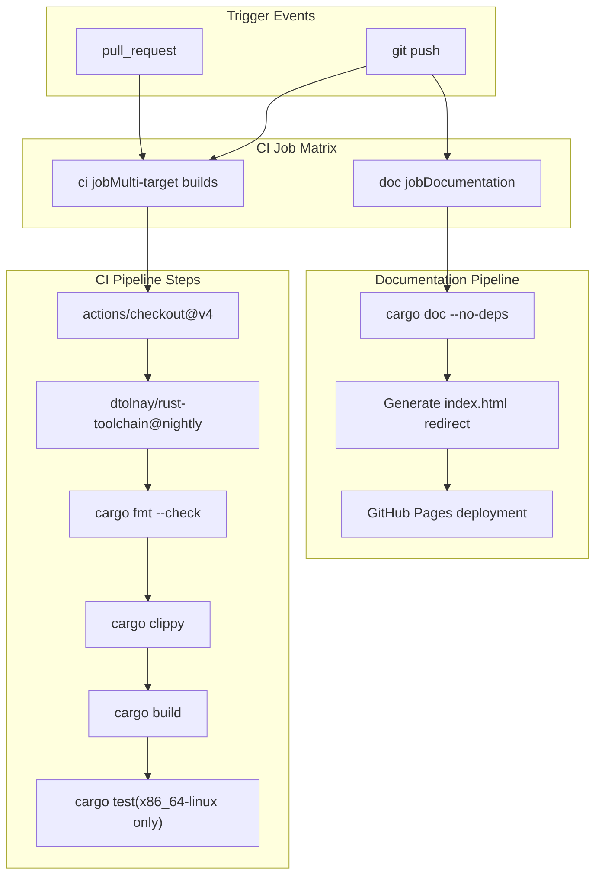
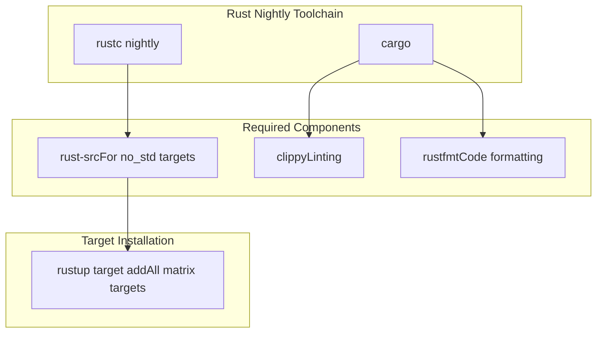

# Project Structure

> **Relevant source files**
> * [.github/workflows/ci.yml](https://github.com/arceos-org/tuple_for_each/blob/19a3b4d3/.github/workflows/ci.yml)
> * [.gitignore](https://github.com/arceos-org/tuple_for_each/blob/19a3b4d3/.gitignore)
> * [Cargo.toml](https://github.com/arceos-org/tuple_for_each/blob/19a3b4d3/Cargo.toml)

This document describes the architectural organization of the `tuple_for_each` crate, including its dependencies, build configuration, and development infrastructure. The project is a procedural macro library designed to generate iteration utilities for tuple structs, with particular emphasis on cross-platform compatibility for embedded systems development.

For details about the core macro implementation, see [3.1](/arceos-org/tuple_for_each/3.1-derive-macro-processing). For information about the CI/CD pipeline specifics, see [4.2](/arceos-org/tuple_for_each/4.2-cicd-pipeline).

## Crate Architecture

The `tuple_for_each` crate follows a standard Rust procedural macro library structure, with the core implementation residing in `src/lib.rs` and supporting infrastructure for multi-platform builds and documentation.

### Crate Configuration

**Crate Configuration Details**

The crate is configured as a procedural macro library through the `proc-macro = true` setting in [Cargo.toml(L19 - L20)&emsp;](https://github.com/arceos-org/tuple_for_each/blob/19a3b4d3/Cargo.toml#L19-L20) This enables the crate to export procedural macros that operate at compile time. The package metadata indicates this is part of the ArceOS project ecosystem, focusing on systems programming and embedded development.

**Sources:** [Cargo.toml(L1 - L21)&emsp;](https://github.com/arceos-org/tuple_for_each/blob/19a3b4d3/Cargo.toml#L1-L21)

### Dependency Architecture

**Dependency Roles**

|Dependency|Version|Purpose|
| --- | --- | --- |
|syn|2.0|Parsing Rust syntax trees from macro input tokens|
|quote|1.0|Generating Rust code from templates and interpolation|
|proc-macro2|1.0|Low-level token stream manipulation and span handling|

The dependency selection follows Rust procedural macro best practices, using the latest stable versions of the core macro development libraries.

**Sources:** [Cargo.toml(L14 - L17)&emsp;](https://github.com/arceos-org/tuple_for_each/blob/19a3b4d3/Cargo.toml#L14-L17)

## Build Matrix and Target Support

### Multi-Platform Build Configuration

**Target Platform Strategy**

The build matrix demonstrates the crate's focus on embedded and systems programming:

* **Primary Development**: `x86_64-unknown-linux-gnu` with full testing support
* **Bare Metal x86**: `x86_64-unknown-none` for bootloader and kernel development
* **RISC-V Embedded**: `riscv64gc-unknown-none-elf` for RISC-V microcontrollers
* **ARM64 Embedded**: `aarch64-unknown-none-softfloat` for ARM embedded systems

Testing is restricted to the Linux target due to the embedded nature of other platforms, which typically lack standard library support required for test execution.

**Sources:** [.github/workflows/ci.yml(L10 - L12)&emsp;](https://github.com/arceos-org/tuple_for_each/blob/19a3b4d3/.github/workflows/ci.yml#L10-L12) [.github/workflows/ci.yml(L28 - L30)&emsp;](https://github.com/arceos-org/tuple_for_each/blob/19a3b4d3/.github/workflows/ci.yml#L28-L30)

## Development Infrastructure

### CI/CD Pipeline Architecture

**Quality Assurance Steps**

The CI pipeline enforces code quality through multiple verification stages:

1. **Format Checking**: `cargo fmt --all -- --check` ensures consistent code style
2. **Linting**: `cargo clippy` with custom configuration excluding `new_without_default` warnings
3. **Multi-target Building**: Verification across all supported platforms
4. **Testing**: Unit tests executed only on `x86_64-unknown-linux-gnu`

**Sources:** [.github/workflows/ci.yml(L22 - L30)&emsp;](https://github.com/arceos-org/tuple_for_each/blob/19a3b4d3/.github/workflows/ci.yml#L22-L30)

### Documentation Deployment

The documentation system automatically builds and deploys to GitHub Pages on pushes to the default branch. The deployment includes:

* **API Documentation**: Generated via `cargo doc --no-deps --all-features`
* **Redirect Setup**: Automatic index.html generation for seamless navigation
* **Single Commit Deployment**: Clean deployment strategy to the `gh-pages` branch

**Sources:** [.github/workflows/ci.yml(L44 - L55)&emsp;](https://github.com/arceos-org/tuple_for_each/blob/19a3b4d3/.github/workflows/ci.yml#L44-L55)

## Development Environment

### Required Toolchain Components

**Development Setup Requirements**

* **Rust Nightly**: Required for advanced procedural macro features
* **rust-src Component**: Essential for building `no_std` embedded targets
* **Cross-compilation Support**: All target platforms must be installed via `rustup`

**Sources:** [.github/workflows/ci.yml(L15 - L19)&emsp;](https://github.com/arceos-org/tuple_for_each/blob/19a3b4d3/.github/workflows/ci.yml#L15-L19)

### Project File Structure

|File/Directory|Purpose|
| --- | --- |
|Cargo.toml|Package configuration and dependencies|
|src/lib.rs|Core procedural macro implementation|
|tests/|Integration tests for macro functionality|
|.github/workflows/|CI/CD pipeline definitions|
|.gitignore|Version control exclusions|

The project follows standard Rust library conventions with emphasis on procedural macro development patterns.

**Sources:** [.gitignore(L1 - L5)&emsp;](https://github.com/arceos-org/tuple_for_each/blob/19a3b4d3/.gitignore#L1-L5)