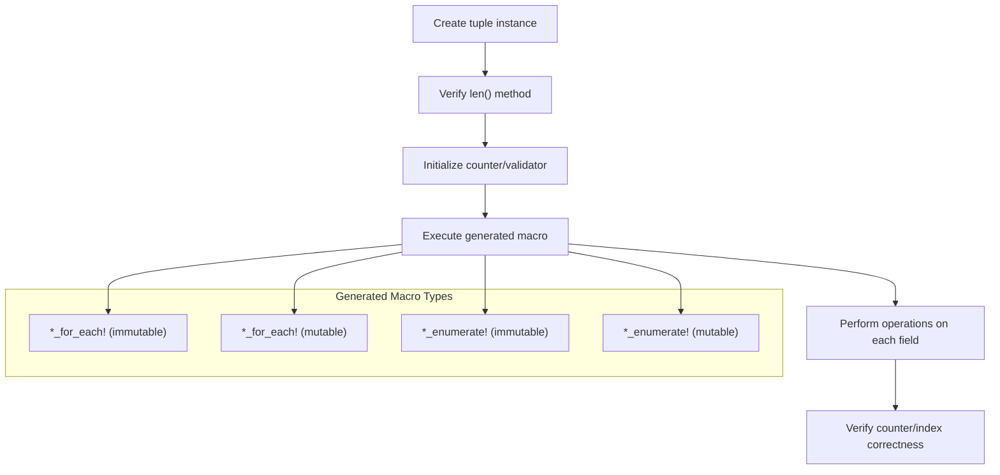
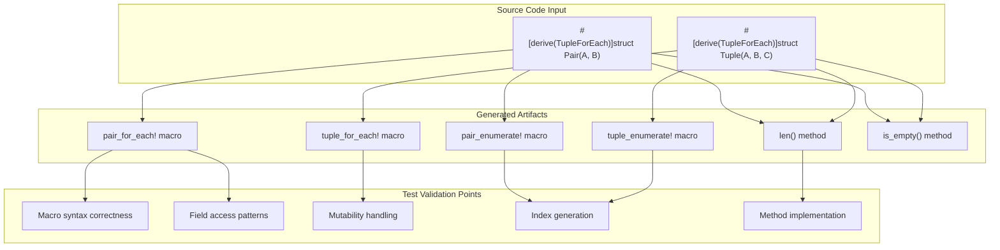

# Testing

> **Relevant source files**
> * [tests/test_tuple_for_each.rs](https://github.com/arceos-org/tuple_for_each/blob/19a3b4d3/tests/test_tuple_for_each.rs)

This document covers the testing strategy and test patterns for the `tuple_for_each` crate. It explains how to verify that the derive macro correctly generates iteration utilities and provides guidance for testing procedural macro functionality. For information about the CI/CD pipeline and automated testing infrastructure, see [CI/CD Pipeline](/arceos-org/tuple_for_each/4.2-cicd-pipeline).

## Test Structure Overview

The `tuple_for_each` crate uses integration tests to validate macro functionality. All tests are located in [tests/test_tuple_for_each.rs(L1 - L107)&emsp;](https://github.com/arceos-org/tuple_for_each/blob/19a3b4d3/tests/test_tuple_for_each.rs#L1-L107) and follow a pattern-based approach to verify that the `TupleForEach` derive macro generates correct code for different tuple struct configurations.

### Test Foundation Components

The tests establish a common foundation using a trait-based approach:

|Component|Purpose|Lines|
| --- | --- | --- |
|Basetrait|Provides common interface for test types|tests/test_tuple_for_each.rs3-8|
|Test types (A,B,C)|Concrete implementations with different associated types|tests/test_tuple_for_each.rs10-42|
|Test tuples (Pair,Tuple)|Tuple structs with varying field counts|tests/test_tuple_for_each.rs44-48|

The `Base` trait defines methods that return different types (`u32`, `f32`, `&'static str`) to verify that the generated macros handle heterogeneous tuple fields correctly.

**Sources:** [tests/test_tuple_for_each.rs(L1 - L48)&emsp;](https://github.com/arceos-org/tuple_for_each/blob/19a3b4d3/tests/test_tuple_for_each.rs#L1-L48)

## Integration Test Patterns

### Test Function Structure

Each test function follows a consistent pattern that validates both the generated macros and utility methods:



**Test Pattern Validation Flow**

**Sources:** [tests/test_tuple_for_each.rs(L50 - L106)&emsp;](https://github.com/arceos-org/tuple_for_each/blob/19a3b4d3/tests/test_tuple_for_each.rs#L50-L106)

### Macro Functionality Coverage

The test suite covers four distinct macro generation scenarios:

|Test Function|Macro Tested|Mutability|Enumeration|Tuple Type|
| --- | --- | --- | --- | --- |
|test_for_each|pair_for_each!|Immutable|No|Pair(A, B)|
|test_for_each_mut|tuple_for_each!|Mutable|No|Tuple(A, B, C)|
|test_enumerate|tuple_enumerate!|Immutable|Yes|Tuple(A, B, C)|
|test_enumerate_mut|pair_enumerate!|Mutable|Yes|Pair(A, B)|

Each test validates:

* **Generated method functionality**: `len()` returns correct field count
* **Macro syntax**: Proper expansion of macro rules
* **Field access**: Ability to call methods on tuple fields
* **Iteration count**: Verification that all fields are processed
* **Index accuracy**: For enumerate variants, index values match expected sequence

**Sources:** [tests/test_tuple_for_each.rs(L50 - L106)&emsp;](https://github.com/arceos-org/tuple_for_each/blob/19a3b4d3/tests/test_tuple_for_each.rs#L50-L106)

## Test Execution Validation

### Immutable Iteration Testing

The `test_for_each` function [tests/test_tuple_for_each.rs(L50 - L62)&emsp;](https://github.com/arceos-org/tuple_for_each/blob/19a3b4d3/tests/test_tuple_for_each.rs#L50-L62) validates immutable field access:

* Creates `Pair(A, B)` instance
* Verifies `len()` returns `2`
* Uses `pair_for_each!` macro to iterate over fields
* Calls `foo()` and `bar()` methods on each field
* Confirms iteration count matches field count

### Mutable Iteration Testing

The `test_for_each_mut` function [tests/test_tuple_for_each.rs(L64 - L76)&emsp;](https://github.com/arceos-org/tuple_for_each/blob/19a3b4d3/tests/test_tuple_for_each.rs#L64-L76) validates mutable field access:

* Creates `Tuple(A, B, C)` instance
* Uses `tuple_for_each!` with `mut` keyword
* Calls `bar_mut()` method requiring mutable access
* Verifies all three fields are processed

### Enumeration Testing

The enumeration tests [tests/test_tuple_for_each.rs(L78 - L106)&emsp;](https://github.com/arceos-org/tuple_for_each/blob/19a3b4d3/tests/test_tuple_for_each.rs#L78-L106) verify index generation:

* `test_enumerate`: Tests `tuple_enumerate!` with immutable access
* `test_enumerate_mut`: Tests `pair_enumerate!` with mutable access
* Both validate that indices start at `0` and increment sequentially
* Confirm index values match expected position in tuple

**Sources:** [tests/test_tuple_for_each.rs(L50 - L106)&emsp;](https://github.com/arceos-org/tuple_for_each/blob/19a3b4d3/tests/test_tuple_for_each.rs#L50-L106)

## Code Generation Verification



**Generated Code Validation Matrix**

**Sources:** [tests/test_tuple_for_each.rs(L44 - L48)&emsp;](https://github.com/arceos-org/tuple_for_each/blob/19a3b4d3/tests/test_tuple_for_each.rs#L44-L48) [tests/test_tuple_for_each.rs(L50 - L106)&emsp;](https://github.com/arceos-org/tuple_for_each/blob/19a3b4d3/tests/test_tuple_for_each.rs#L50-L106)

## Running Tests

Tests are executed using standard Cargo commands:

```markdown
cargo test                    # Run all tests
cargo test test_for_each      # Run specific test function
cargo test --verbose          # Run with detailed output
```

The tests validate macro functionality at compile time (macro expansion correctness) and runtime (iteration behavior). Since this is a procedural macro crate, successful compilation indicates that the macro generates syntactically correct Rust code, while test execution verifies semantic correctness.

**Sources:** [tests/test_tuple_for_each.rs(L1 - L107)&emsp;](https://github.com/arceos-org/tuple_for_each/blob/19a3b4d3/tests/test_tuple_for_each.rs#L1-L107)