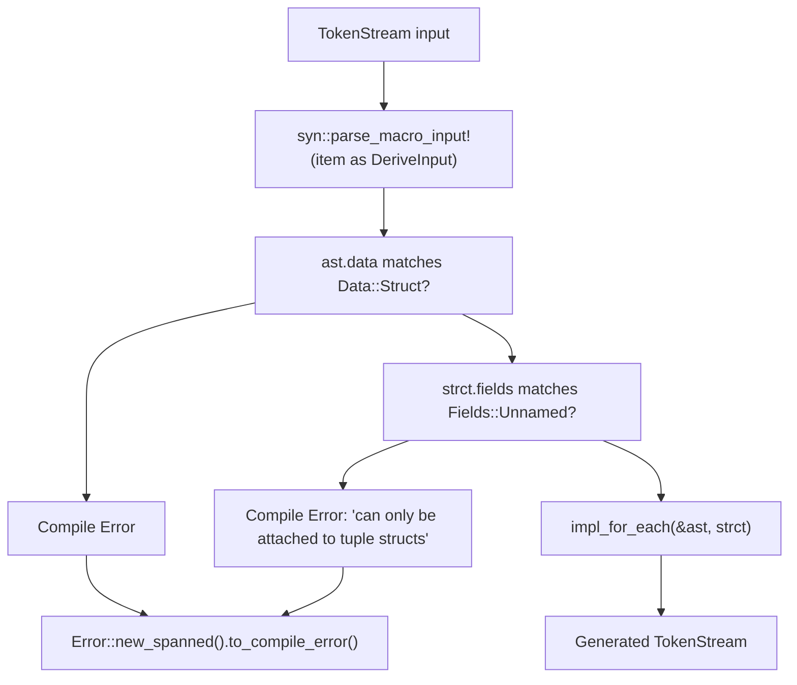
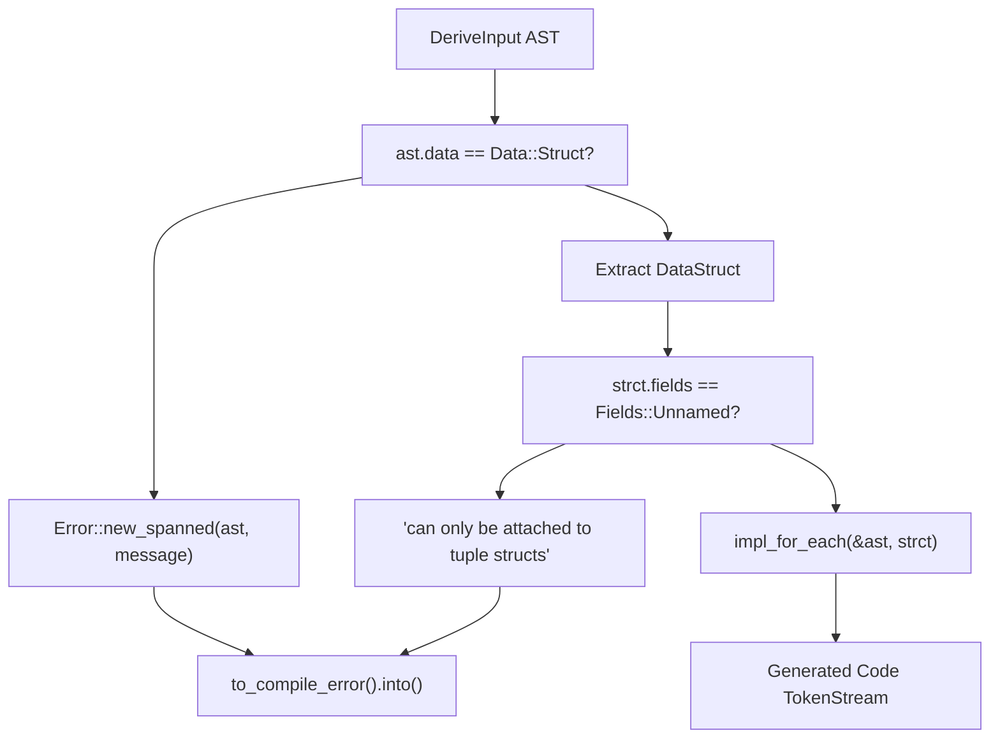
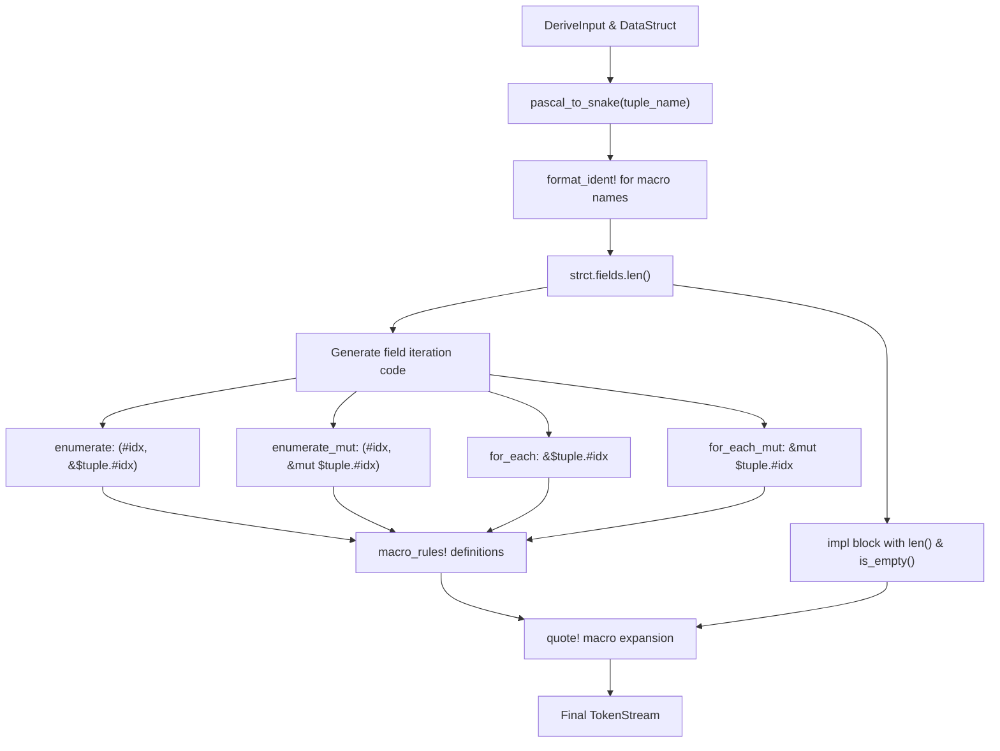
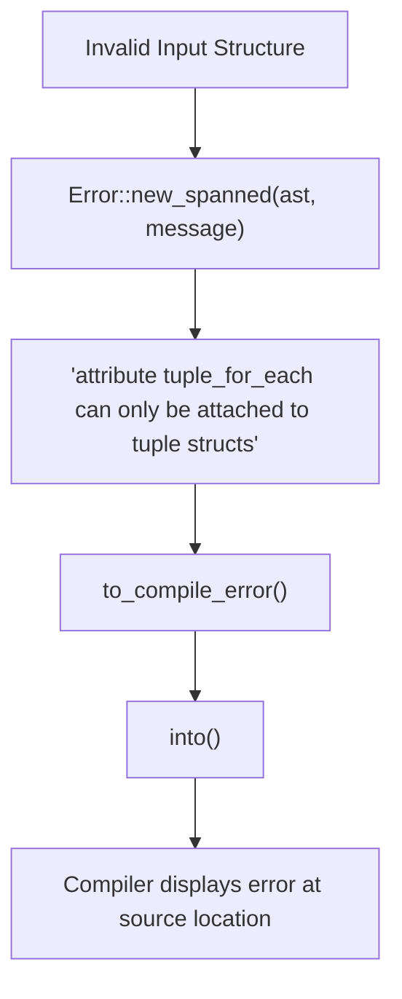

# TupleForEach Derive Macro

> **Relevant source files**
> * [src/lib.rs](https://github.com/arceos-org/tuple_for_each/blob/19a3b4d3/src/lib.rs)

This document provides comprehensive reference documentation for the `TupleForEach` derive macro, which is the core procedural macro that generates iteration utilities for tuple structs. For information about the generated macros themselves, see [Generated Macros](/arceos-org/tuple_for_each/5.2-generated-macros). For information about the generated methods, see [Generated Methods](/arceos-org/tuple_for_each/5.3-generated-methods).

## Purpose and Scope

The `TupleForEach` derive macro is a procedural macro that automatically generates iteration utilities for tuple structs at compile time. When applied to a tuple struct, it creates field iteration macros and utility methods that enable ergonomic access to tuple fields without manual indexing.

## Macro Declaration

The derive macro is declared as a procedural macro using the `#[proc_macro_derive]` attribute:

```rust
#[proc_macro_derive(TupleForEach)]
pub fn tuple_for_each(item: TokenStream) -> TokenStream
```

**Entry Point Flow**



Sources: [src/lib.rs(L11 - L24)&emsp;](https://github.com/arceos-org/tuple_for_each/blob/19a3b4d3/src/lib.rs#L11-L24)

## Requirements and Constraints

### Valid Input Types

The derive macro can only be applied to **tuple structs** - structs with unnamed fields. The validation logic enforces two conditions:

|Condition|Requirement|Error if Failed|
| --- | --- | --- |
|Struct Type|Must beData::Structvariant|Compile error with span|
|Field Type|Must haveFields::Unnamed|"attributetuple_for_eachcan only be attached to tuple structs"|

### Supported Tuple Struct Examples

```css
// ✅ Valid - basic tuple struct
#[derive(TupleForEach)]
struct Point(i32, i32);

// ✅ Valid - mixed types
#[derive(TupleForEach)]
struct Mixed(String, i32, bool);

// ✅ Valid - generic tuple struct
#[derive(TupleForEach)]
struct Generic<T, U>(T, U);

// ❌ Invalid - named struct
#[derive(TupleForEach)]
struct Named { x: i32, y: i32 }

// ❌ Invalid - unit struct
#[derive(TupleForEach)]
struct Unit;
```

**Validation Logic Flow**



Sources: [src/lib.rs(L13 - L23)&emsp;](https://github.com/arceos-org/tuple_for_each/blob/19a3b4d3/src/lib.rs#L13-L23)

## Code Generation Process

### Name Resolution

The macro converts tuple struct names from PascalCase to snake_case using the `pascal_to_snake` function to create macro names:

|Tuple Struct Name|Generated Macro Prefix|For Each Macro|Enumerate Macro|
| --- | --- | --- | --- |
|Point|point|point_for_each!|point_enumerate!|
|MyTuple|my_tuple|my_tuple_for_each!|my_tuple_enumerate!|
|HttpResponse|http_response|http_response_for_each!|http_response_enumerate!|

### Generated Code Structure

For each tuple struct, the macro generates:

1. **Utility Methods**: `len()` and `is_empty()` implementations
2. **For Each Macro**: Field iteration with immutable and mutable variants
3. **Enumerate Macro**: Indexed field iteration with immutable and mutable variants

**Code Generation Pipeline**



Sources: [src/lib.rs(L58 - L122)&emsp;](https://github.com/arceos-org/tuple_for_each/blob/19a3b4d3/src/lib.rs#L58-L122)

### Field Access Pattern Generation

The macro generates field access code for each tuple field using zero-based indexing:

```
// For a 3-field tuple struct, generates:
// Field 0: &$tuple.0, &mut $tuple.0
// Field 1: &$tuple.1, &mut $tuple.1  
// Field 2: &$tuple.2, &mut $tuple.2
```

The field iteration logic creates four variants of access patterns:

|Pattern Type|Mutability|Generated Code Template|
| --- | --- | --- |
|for_each|Immutable|{ let $item = &$tuple.#idx; $code }|
|for_each_mut|Mutable|{ let $item = &mut $tuple.#idx; $code }|
|enumerate|Immutable|{ let $idx = #idx; let $item = &$tuple.#idx; $code }|
|enumerate_mut|Mutable|{ let $idx = #idx; let $item = &mut $tuple.#idx; $code }|

Sources: [src/lib.rs(L64 - L83)&emsp;](https://github.com/arceos-org/tuple_for_each/blob/19a3b4d3/src/lib.rs#L64-L83)

## Error Handling

The derive macro implements compile-time validation with descriptive error messages:

### Error Cases

1. **Non-Struct Types**: Applied to enums, unions, or other non-struct types
2. **Named Structs**: Applied to structs with named fields instead of tuple structs
3. **Unit Structs**: Applied to unit structs (no fields)

### Error Message Generation

```yaml
Error::new_spanned(
    ast,
    "attribute `tuple_for_each` can only be attached to tuple structs",
)
.to_compile_error()
.into()
```

The error uses `syn::Error::new_spanned` to provide precise source location information and converts to a `TokenStream` containing the compile error.

**Error Handling Flow**



Sources: [src/lib.rs(L18 - L23)&emsp;](https://github.com/arceos-org/tuple_for_each/blob/19a3b4d3/src/lib.rs#L18-L23)

## Implementation Dependencies

The derive macro relies on several key crates for parsing and code generation:

|Dependency|Purpose|Usage in Code|
| --- | --- | --- |
|syn|AST parsing|syn::parse_macro_input!,DeriveInput,DataStruct|
|quote|Code generation|quote!macro,format_ident!|
|proc_macro2|Token stream handling|Return type forimpl_for_each|
|proc_macro|Procedural macro interface|TokenStreaminput/output|

Sources: [src/lib.rs(L3 - L5)&emsp;](https://github.com/arceos-org/tuple_for_each/blob/19a3b4d3/src/lib.rs#L3-L5)