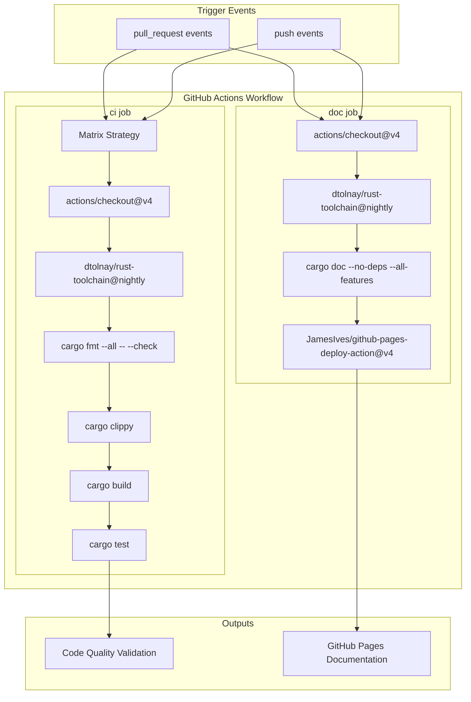
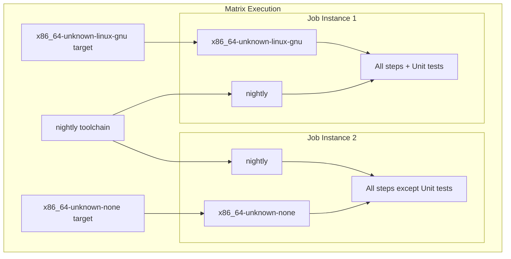
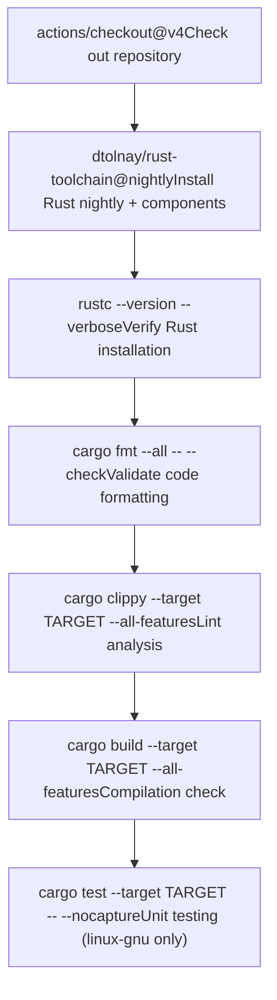
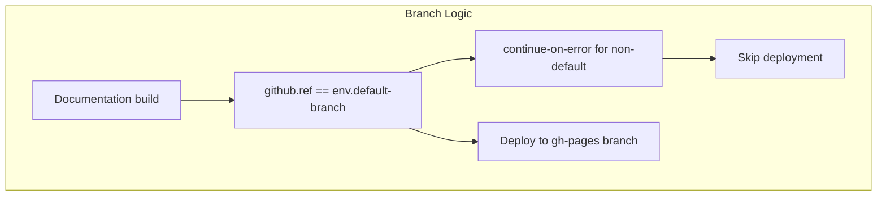

# CI/CD Pipeline

> **Relevant source files**
> * [.github/workflows/ci.yml](https://github.com/arceos-org/x86_rtc/blob/1990537d/.github/workflows/ci.yml)

This document details the continuous integration and continuous deployment (CI/CD) pipeline for the x86_rtc crate, implemented through GitHub Actions. The pipeline ensures code quality, cross-platform compatibility, and automated documentation deployment.

For information about the development environment setup and local development workflows, see [Development Environment Setup](/arceos-org/x86_rtc/4.2-development-environment-setup). For details about the crate's platform requirements and target architectures, see [Platform and Architecture Requirements](/arceos-org/x86_rtc/3.2-platform-and-architecture-requirements).

## Pipeline Overview

The CI/CD pipeline is defined in [.github/workflows/ci.yml(L1 - L56)&emsp;](https://github.com/arceos-org/x86_rtc/blob/1990537d/.github/workflows/ci.yml#L1-L56) and consists of two primary jobs: `ci` for code quality and testing, and `doc` for documentation generation and deployment.

Sources: [.github/workflows/ci.yml(L1 - L56)&emsp;](https://github.com/arceos-org/x86_rtc/blob/1990537d/.github/workflows/ci.yml#L1-L56)

## CI Job Configuration

The `ci` job implements a comprehensive testing strategy using a matrix approach to validate the crate across multiple target platforms.

### Matrix Strategy

|Parameter|Values|
| --- | --- |
|rust-toolchain|nightly|
|targets|x86_64-unknown-linux-gnu,x86_64-unknown-none|

The matrix configuration in [.github/workflows/ci.yml(L8 - L12)&emsp;](https://github.com/arceos-org/x86_rtc/blob/1990537d/.github/workflows/ci.yml#L8-L12) ensures the crate builds and functions correctly for both standard Linux environments and bare-metal/kernel environments.

Sources: [.github/workflows/ci.yml(L8 - L12)&emsp;](https://github.com/arceos-org/x86_rtc/blob/1990537d/.github/workflows/ci.yml#L8-L12) [.github/workflows/ci.yml(L29 - L30)&emsp;](https://github.com/arceos-org/x86_rtc/blob/1990537d/.github/workflows/ci.yml#L29-L30)

### CI Job Steps

The CI job executes the following validation steps in sequence:

Sources: [.github/workflows/ci.yml(L13 - L30)&emsp;](https://github.com/arceos-org/x86_rtc/blob/1990537d/.github/workflows/ci.yml#L13-L30)

The Rust toolchain setup [.github/workflows/ci.yml(L15 - L19)&emsp;](https://github.com/arceos-org/x86_rtc/blob/1990537d/.github/workflows/ci.yml#L15-L19) includes essential components:

* `rust-src`: Source code for cross-compilation
* `clippy`: Linting tool
* `rustfmt`: Code formatting tool

Unit tests are conditionally executed only for the `x86_64-unknown-linux-gnu` target [.github/workflows/ci.yml(L29 - L30)&emsp;](https://github.com/arceos-org/x86_rtc/blob/1990537d/.github/workflows/ci.yml#L29-L30) since the bare-metal target (`x86_64-unknown-none`) cannot execute standard test harnesses.

## Documentation Job

The `doc` job handles automated documentation generation and deployment to GitHub Pages.

### Documentation Build Process

```mermaid
flowchart TD
subgraph subGraph2["Documentation Generation"]
    DOC_START["Job trigger"]
    CHECKOUT["actions/checkout@v4"]
    TOOLCHAIN["dtolnay/rust-toolchain@nightly"]
    BUILD_DOC["cargo doc --no-deps --all-features"]
    INDEX_GEN["Generate index.html redirect"]
    subgraph subGraph1["Conditional Deployment"]
        BRANCH_CHECK["Check if default branch"]
        DEPLOY["JamesIves/github-pages-deploy-action@v4"]
        PAGES_OUTPUT["GitHub Pages deployment"]
    end
    subgraph subGraph0["Build Configuration"]
        FLAGS["RUSTDOCFLAGS environment"]
        BROKEN_LINKS["-D rustdoc::broken_intra_doc_links"]
        MISSING_DOCS["-D missing-docs"]
    end
end

BRANCH_CHECK --> DEPLOY
BROKEN_LINKS --> BUILD_DOC
BUILD_DOC --> INDEX_GEN
CHECKOUT --> TOOLCHAIN
DEPLOY --> PAGES_OUTPUT
DOC_START --> CHECKOUT
FLAGS --> BROKEN_LINKS
FLAGS --> MISSING_DOCS
INDEX_GEN --> BRANCH_CHECK
MISSING_DOCS --> BUILD_DOC
TOOLCHAIN --> FLAGS
```

Sources: [.github/workflows/ci.yml(L32 - L56)&emsp;](https://github.com/arceos-org/x86_rtc/blob/1990537d/.github/workflows/ci.yml#L32-L56)

### Documentation Configuration

The documentation build enforces strict quality standards through `RUSTDOCFLAGS` [.github/workflows/ci.yml(L40)&emsp;](https://github.com/arceos-org/x86_rtc/blob/1990537d/.github/workflows/ci.yml#L40-L40):

|Flag|Purpose|
| --- | --- |
|-D rustdoc::broken_intra_doc_links|Treat broken internal documentation links as errors|
|-D missing-docs|Require documentation for all public APIs|

The build process [.github/workflows/ci.yml(L44 - L48)&emsp;](https://github.com/arceos-org/x86_rtc/blob/1990537d/.github/workflows/ci.yml#L44-L48) generates documentation using `cargo doc --no-deps --all-features` and creates an automatic redirect index page pointing to the crate's documentation root.

### Deployment Strategy

Documentation deployment follows a branch-based strategy:

Sources: [.github/workflows/ci.yml(L45)&emsp;](https://github.com/arceos-org/x86_rtc/blob/1990537d/.github/workflows/ci.yml#L45-L45) [.github/workflows/ci.yml(L49 - L55)&emsp;](https://github.com/arceos-org/x86_rtc/blob/1990537d/.github/workflows/ci.yml#L49-L55)

Only builds from the default branch [.github/workflows/ci.yml(L50)&emsp;](https://github.com/arceos-org/x86_rtc/blob/1990537d/.github/workflows/ci.yml#L50-L50) trigger deployment to GitHub Pages using the `JamesIves/github-pages-deploy-action@v4` action with `single-commit: true` to maintain a clean deployment history.

## Pipeline Features

### Error Handling and Robustness

The pipeline implements several error handling strategies:

* **Fail-fast disabled** [.github/workflows/ci.yml(L9)&emsp;](https://github.com/arceos-org/x86_rtc/blob/1990537d/.github/workflows/ci.yml#L9-L9): Matrix jobs continue execution even if one target fails
* **Conditional execution** [.github/workflows/ci.yml(L29)&emsp;](https://github.com/arceos-org/x86_rtc/blob/1990537d/.github/workflows/ci.yml#L29-L29): Unit tests only run where applicable
* **Continue-on-error** [.github/workflows/ci.yml(L45)&emsp;](https://github.com/arceos-org/x86_rtc/blob/1990537d/.github/workflows/ci.yml#L45-L45): Documentation builds for non-default branches don't fail the pipeline

### Security and Permissions

The documentation job requires specific permissions [.github/workflows/ci.yml(L36 - L37)&emsp;](https://github.com/arceos-org/x86_rtc/blob/1990537d/.github/workflows/ci.yml#L36-L37):

* `contents: write` for GitHub Pages deployment

### Build Optimization

Key optimization features include:

* **No-deps documentation** [.github/workflows/ci.yml(L47)&emsp;](https://github.com/arceos-org/x86_rtc/blob/1990537d/.github/workflows/ci.yml#L47-L47): Faster builds by excluding dependency documentation
* **Single-commit deployment** [.github/workflows/ci.yml(L53)&emsp;](https://github.com/arceos-org/x86_rtc/blob/1990537d/.github/workflows/ci.yml#L53-L53): Reduced repository size for GitHub Pages
* **All-features builds** [.github/workflows/ci.yml(L25 - L47)&emsp;](https://github.com/arceos-org/x86_rtc/blob/1990537d/.github/workflows/ci.yml#L25-L47): Comprehensive feature coverage

Sources: [.github/workflows/ci.yml(L1 - L56)&emsp;](https://github.com/arceos-org/x86_rtc/blob/1990537d/.github/workflows/ci.yml#L1-L56)