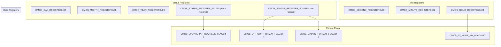
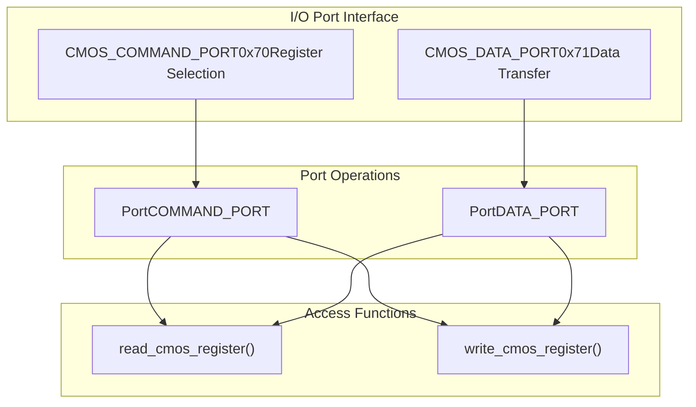
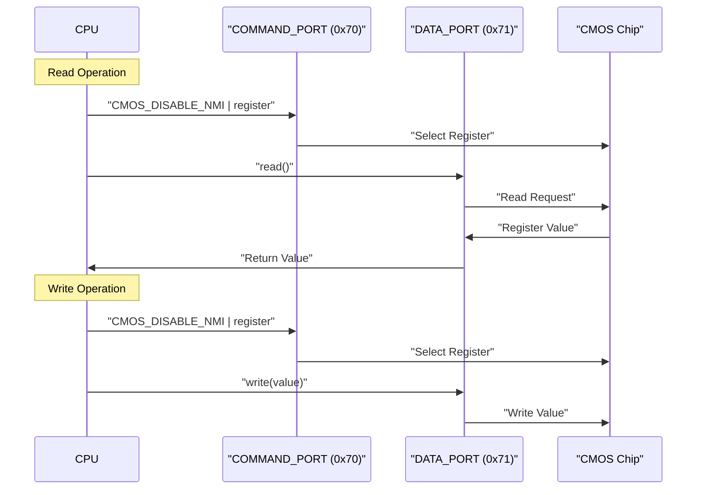
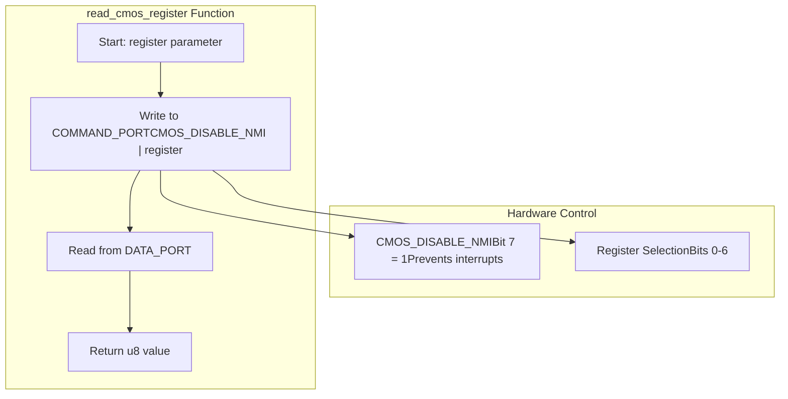
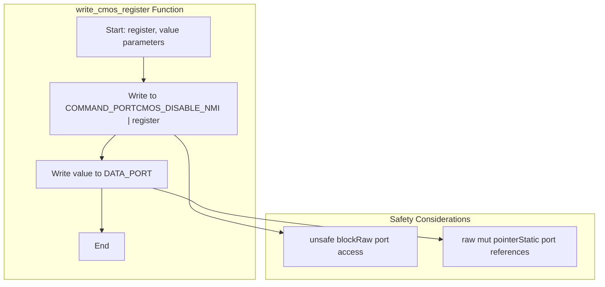
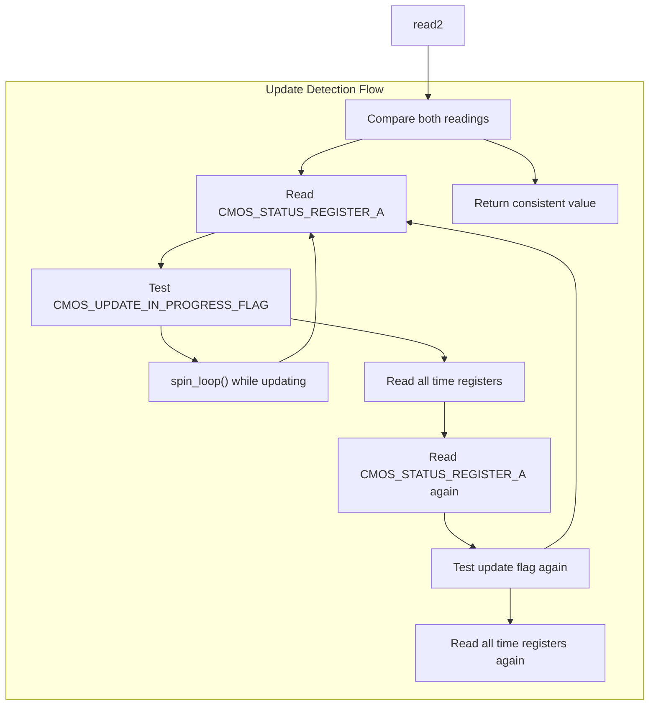
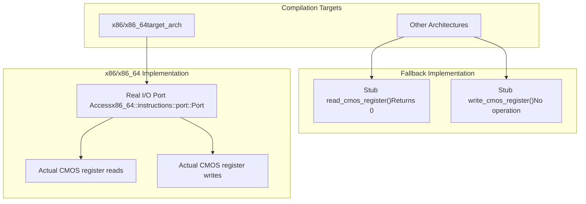

# CMOS Hardware Interface

> **Relevant source files**
> * [src/lib.rs](https://github.com/arceos-org/x86_rtc/blob/1990537d/src/lib.rs)

This document explains the low-level hardware interface for accessing the Real Time Clock (RTC) through CMOS registers on x86_64 systems. It covers the I/O port protocol, register mapping, hardware synchronization, and platform-specific implementation details.

For high-level RTC API usage, see [RTC Driver API](/arceos-org/x86_rtc/2.1-rtc-driver-api). For data format conversion details, see [Data Format Handling](/arceos-org/x86_rtc/2.3-data-format-handling).

## CMOS Register Map

The CMOS RTC uses a well-defined register layout accessible through I/O ports. The implementation defines specific register addresses and control flags for accessing time, date, and status information.

### Time and Date Registers

**Sources:** [src/lib.rs(L10 - L23)&emsp;](https://github.com/arceos-org/x86_rtc/blob/1990537d/src/lib.rs#L10-L23)

### Register Access Pattern

|Register|Address|Purpose|Format Dependencies|
| --- | --- | --- | --- |
|CMOS_SECOND_REGISTER|0x00|Current second (0-59)|BCD/Binary|
|CMOS_MINUTE_REGISTER|0x02|Current minute (0-59)|BCD/Binary|
|CMOS_HOUR_REGISTER|0x04|Current hour|BCD/Binary + 12/24-hour|
|CMOS_DAY_REGISTER|0x07|Day of month (1-31)|BCD/Binary|
|CMOS_MONTH_REGISTER|0x08|Month (1-12)|BCD/Binary|
|CMOS_YEAR_REGISTER|0x09|Year (0-99, + 2000)|BCD/Binary|
|CMOS_STATUS_REGISTER_A|0x0A|Update status|Raw binary|
|CMOS_STATUS_REGISTER_B|0x0B|Format configuration|Raw binary|

## I/O Port Protocol

The CMOS interface uses a two-port protocol where register selection and data transfer are performed through separate I/O ports.

### Port Configuration

**Sources:** [src/lib.rs(L198 - L204)&emsp;](https://github.com/arceos-org/x86_rtc/blob/1990537d/src/lib.rs#L198-L204)

### Hardware Communication Protocol

The CMOS access protocol follows a strict sequence to ensure reliable register access:

**Sources:** [src/lib.rs(L206 - L218)&emsp;](https://github.com/arceos-org/x86_rtc/blob/1990537d/src/lib.rs#L206-L218)

## Hardware Access Implementation

### Register Read Operation

The `read_cmos_register` function implements the low-level hardware access protocol:

**Sources:** [src/lib.rs(L206 - L211)&emsp;](https://github.com/arceos-org/x86_rtc/blob/1990537d/src/lib.rs#L206-L211)

### Register Write Operation

The `write_cmos_register` function handles data updates to CMOS registers:

**Sources:** [src/lib.rs(L213 - L218)&emsp;](https://github.com/arceos-org/x86_rtc/blob/1990537d/src/lib.rs#L213-L218)

## Status Register Management

### Update Synchronization

The CMOS chip updates its registers autonomously, requiring careful synchronization to avoid reading inconsistent values:

**Sources:** [src/lib.rs(L107 - L129)&emsp;](https://github.com/arceos-org/x86_rtc/blob/1990537d/src/lib.rs#L107-L129)

### Format Detection

The implementation reads `CMOS_STATUS_REGISTER_B` during initialization to determine data format:

|Flag|Bit Position|Purpose|Impact|
| --- | --- | --- | --- |
|CMOS_24_HOUR_FORMAT_FLAG|1|Hour format detection|Affects hour register interpretation|
|CMOS_BINARY_FORMAT_FLAG|2|Number format detection|Determines BCD vs binary conversion|

**Sources:** [src/lib.rs(L30 - L36)&emsp;](https://github.com/arceos-org/x86_rtc/blob/1990537d/src/lib.rs#L30-L36)

## Platform Abstraction

### Conditional Compilation

The implementation uses conditional compilation to provide platform-specific functionality:

**Sources:** [src/lib.rs(L196 - L226)&emsp;](https://github.com/arceos-org/x86_rtc/blob/1990537d/src/lib.rs#L196-L226)

### Safety Considerations

The hardware access requires `unsafe` code due to direct I/O port manipulation:

* **Raw pointer access**: Static `Port<u8>` instances require raw mutable references
* **Interrupt safety**: `CMOS_DISABLE_NMI` flag prevents hardware interrupts during access
* **Atomic operations**: The two-port protocol ensures atomic register selection and data transfer

**Sources:** [src/lib.rs(L207 - L217)&emsp;](https://github.com/arceos-org/x86_rtc/blob/1990537d/src/lib.rs#L207-L217)