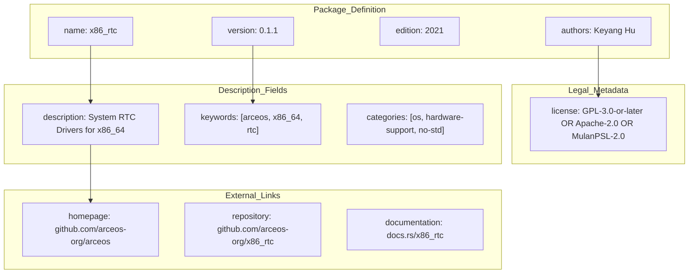
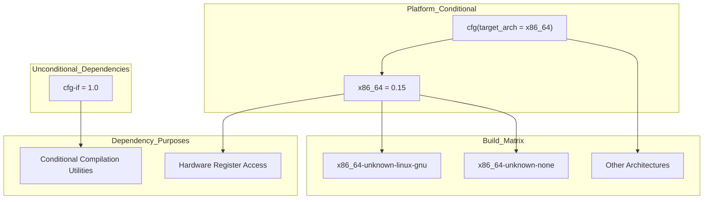
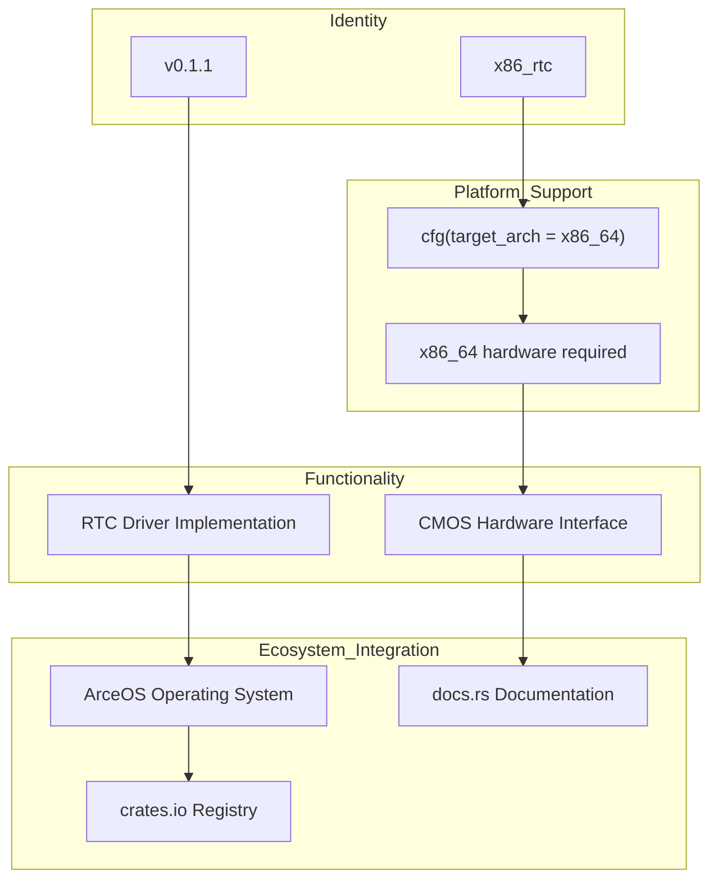

# Crate Definition and Metadata

> **Relevant source files**
> * [Cargo.toml](https://github.com/arceos-org/x86_rtc/blob/1990537d/Cargo.toml)

This page provides a detailed examination of the `x86_rtc` crate's configuration as defined in `Cargo.toml`. It covers package metadata, dependency specifications, build configurations, and platform-specific settings that define the crate's behavior and integration requirements.

For implementation details of the RTC driver functionality, see [RTC Driver API](/arceos-org/x86_rtc/2.1-rtc-driver-api). For broader dependency analysis including transitive dependencies, see [Dependency Analysis](/arceos-org/x86_rtc/3.1-dependency-analysis).

## Package Identification and Core Metadata

The crate is defined with specific metadata that establishes its identity and purpose within the Rust ecosystem.

|Field|Value|Purpose|
| --- | --- | --- |
|name|"x86_rtc"|Unique crate identifier|
|version|"0.1.1"|Semantic version following SemVer|
|edition|"2021"|Rust language edition|
|authors|["Keyang Hu <keyang.hu@qq.com>"]|Primary maintainer contact|

**Crate Metadata Structure**



Sources: [Cargo.toml(L1 - L12)&emsp;](https://github.com/arceos-org/x86_rtc/blob/1990537d/Cargo.toml#L1-L12)

## Functional Classification and Discovery

The crate uses specific classification metadata to enable discovery and communicate its intended use cases.

The `description` field [Cargo.toml(L6)&emsp;](https://github.com/arceos-org/x86_rtc/blob/1990537d/Cargo.toml#L6-L6) explicitly identifies this as "System Real Time Clock (RTC) Drivers for x86_64 based on CMOS", establishing both the hardware target (`x86_64`) and the underlying technology (`CMOS`).

The `keywords` array [Cargo.toml(L11)&emsp;](https://github.com/arceos-org/x86_rtc/blob/1990537d/Cargo.toml#L11-L11) includes:

* `"arceos"` - Associates with the ArceOS operating system project
* `"x86_64"` - Specifies the target architecture
* `"rtc"` - Identifies the Real Time Clock functionality

The `categories` array [Cargo.toml(L12)&emsp;](https://github.com/arceos-org/x86_rtc/blob/1990537d/Cargo.toml#L12-L12) places the crate in:

* `"os"` - Operating system development
* `"hardware-support"` - Hardware abstraction and drivers
* `"no-std"` - Embedded and kernel development compatibility

Sources: [Cargo.toml(L6)&emsp;](https://github.com/arceos-org/x86_rtc/blob/1990537d/Cargo.toml#L6-L6) [Cargo.toml(L11 - L12)&emsp;](https://github.com/arceos-org/x86_rtc/blob/1990537d/Cargo.toml#L11-L12)

## Dependency Architecture and Conditional Compilation

The crate implements a two-tier dependency strategy with conditional compilation for platform-specific functionality.

**Dependency Configuration Structure**



### Core Dependencies

**cfg-if v1.0** [Cargo.toml(L15)&emsp;](https://github.com/arceos-org/x86_rtc/blob/1990537d/Cargo.toml#L15-L15)

* Provides conditional compilation utilities
* Included unconditionally across all platforms
* Enables clean platform-specific code organization

### Platform-Specific Dependencies

**x86_64 v0.15** [Cargo.toml(L17 - L18)&emsp;](https://github.com/arceos-org/x86_rtc/blob/1990537d/Cargo.toml#L17-L18)

* Only included when `target_arch = "x86_64"`
* Provides low-level hardware register access
* Essential for CMOS port I/O operations
* Version constraint allows compatible updates within 0.15.x

Sources: [Cargo.toml(L14 - L18)&emsp;](https://github.com/arceos-org/x86_rtc/blob/1990537d/Cargo.toml#L14-L18)

## Licensing and Legal Framework

The crate implements a triple-license strategy providing maximum compatibility across different use cases and legal requirements.

The license specification [Cargo.toml(L7)&emsp;](https://github.com/arceos-org/x86_rtc/blob/1990537d/Cargo.toml#L7-L7) uses the SPDX format: `"GPL-3.0-or-later OR Apache-2.0 OR MulanPSL-2.0"`

This allows users to choose from:

* **GPL-3.0-or-later**: Copyleft license for open-source projects
* **Apache-2.0**: Permissive license for commercial integration
* **MulanPSL-2.0**: Chinese-origin permissive license for regional compliance

Sources: [Cargo.toml(L7)&emsp;](https://github.com/arceos-org/x86_rtc/blob/1990537d/Cargo.toml#L7-L7)

## Repository and Documentation Infrastructure

The crate establishes a distributed documentation and development infrastructure across multiple platforms.

|Link Type|URL|Purpose|
| --- | --- | --- |
|homepage|https://github.com/arceos-org/arceos|Parent project (ArceOS)|
|repository|https://github.com/arceos-org/x86_rtc|Source code and issues|
|documentation|https://docs.rs/x86_rtc|API documentation|

The separation between `homepage` and `repository` [Cargo.toml(L8 - L9)&emsp;](https://github.com/arceos-org/x86_rtc/blob/1990537d/Cargo.toml#L8-L9) indicates this crate is part of the larger ArceOS ecosystem while maintaining its own development repository.

Sources: [Cargo.toml(L8 - L10)&emsp;](https://github.com/arceos-org/x86_rtc/blob/1990537d/Cargo.toml#L8-L10)

## Build Configuration and Code Quality

The crate defines specific linting rules to customize Clippy behavior for its use case.

**Clippy Configuration** [Cargo.toml(L20 - L21)&emsp;](https://github.com/arceos-org/x86_rtc/blob/1990537d/Cargo.toml#L20-L21)

```
[lints.clippy]
new_without_default = "allow"
```

This configuration allows the `new_without_default` lint, permitting constructor functions named `new()` without requiring a corresponding `Default` implementation. This is appropriate for hardware drivers where default initialization may not be meaningful or safe.

Sources: [Cargo.toml(L20 - L21)&emsp;](https://github.com/arceos-org/x86_rtc/blob/1990537d/Cargo.toml#L20-L21)

## Crate Architecture Summary

**Complete Crate Definition Flow**



The `Cargo.toml` configuration establishes `x86_rtc` as a specialized hardware driver crate with strict platform requirements, flexible licensing, and integration into the ArceOS ecosystem. The conditional dependency structure ensures the crate only pulls in hardware-specific dependencies when building for compatible targets.

Sources: [Cargo.toml(L1 - L22)&emsp;](https://github.com/arceos-org/x86_rtc/blob/1990537d/Cargo.toml#L1-L22)