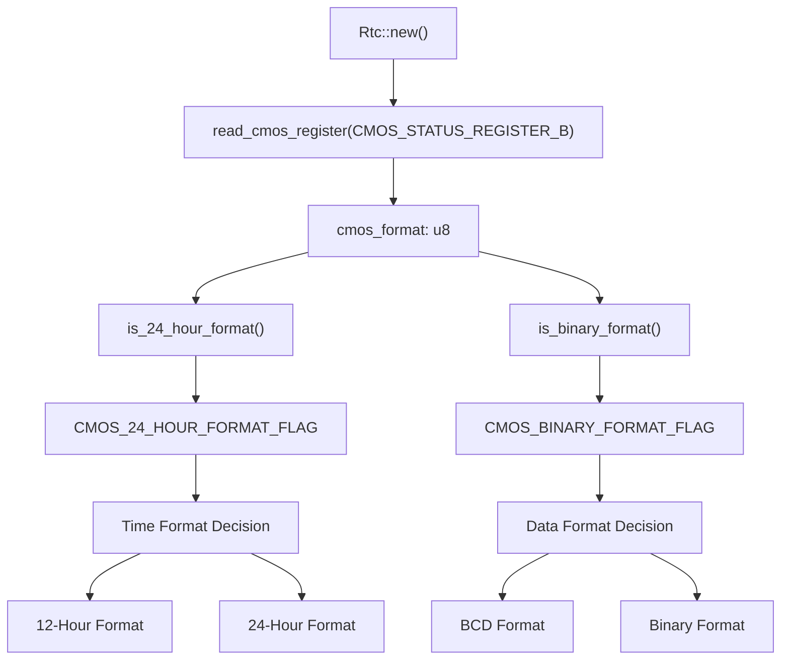
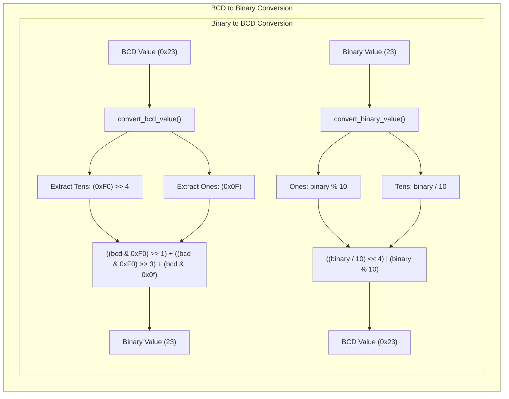
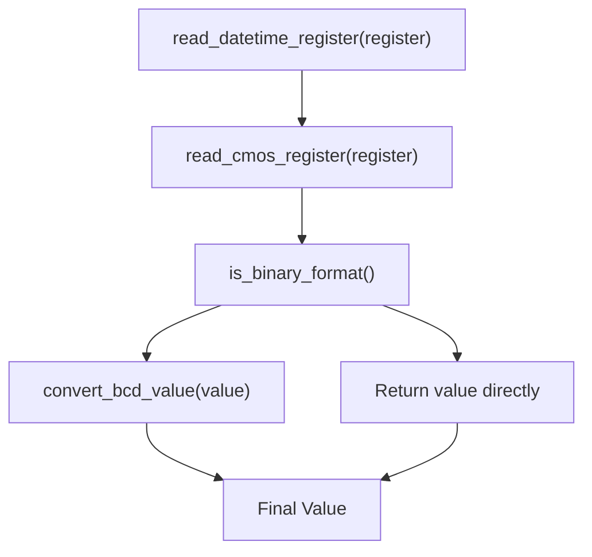
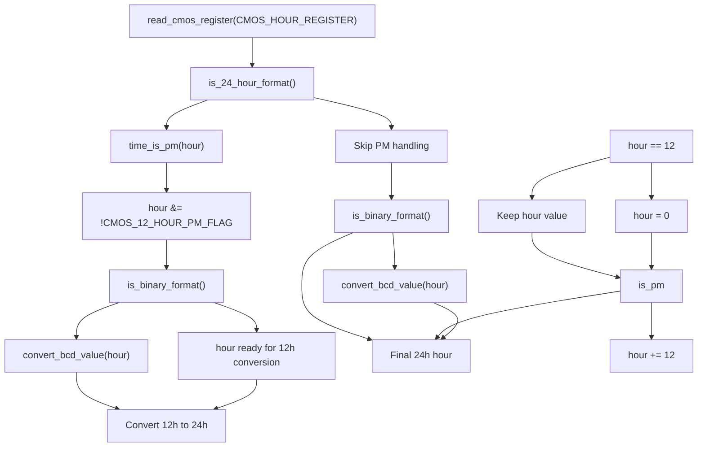
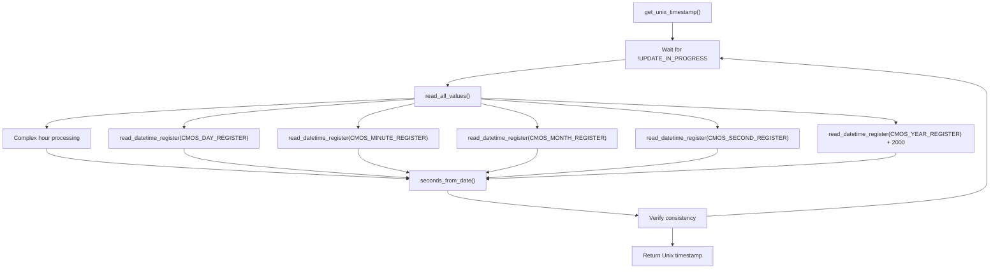
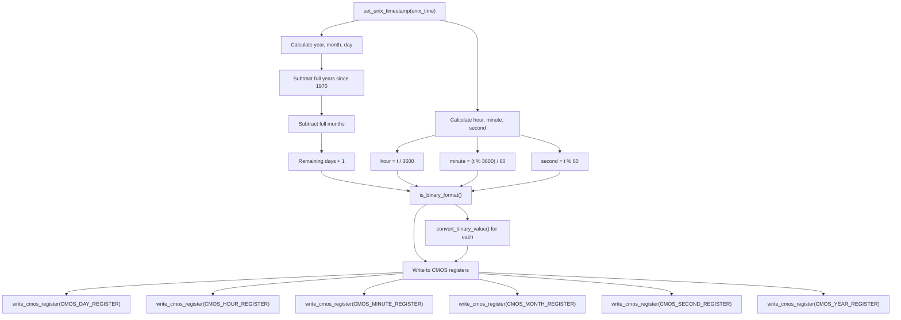
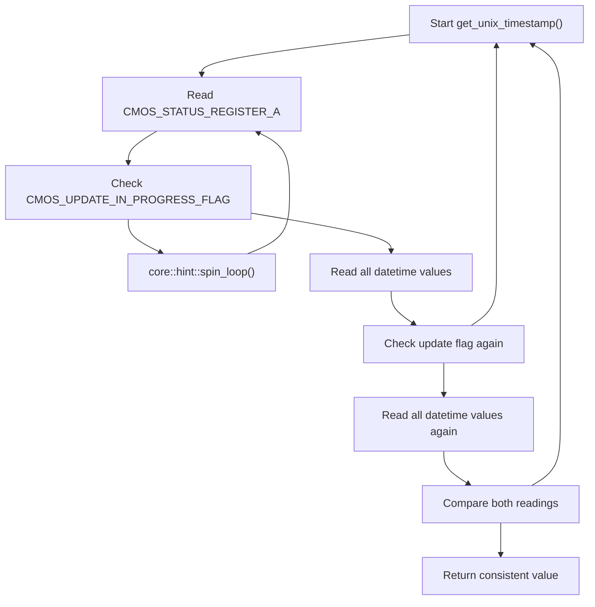

# Data Format Handling

> **Relevant source files**
> * [src/lib.rs](https://github.com/arceos-org/x86_rtc/blob/1990537d/src/lib.rs)

This document covers the data format conversion and handling mechanisms within the x86_rtc crate. The RTC driver must handle multiple data representation formats used by CMOS hardware, including BCD/binary encoding, 12/24-hour time formats, and Unix timestamp conversions. This section focuses specifically on the format detection, conversion algorithms, and data consistency mechanisms.

For hardware register access details, see [CMOS Hardware Interface](/arceos-org/x86_rtc/2.2-cmos-hardware-interface). For the high-level API usage, see [RTC Driver API](/arceos-org/x86_rtc/2.1-rtc-driver-api).

## Format Detection and Configuration

The RTC hardware can store time values in different formats, and the driver must detect and handle these variations dynamically. The format configuration is stored in the CMOS Status Register B and cached in the `Rtc` struct.

The format detection methods use bitwise operations to check specific flags:

|Method|Flag Constant|Bit Position|Purpose|
| --- | --- | --- | --- |
|is_24_hour_format()|CMOS_24_HOUR_FORMAT_FLAG|Bit 1|Determines 12/24 hour format|
|is_binary_format()|CMOS_BINARY_FORMAT_FLAG|Bit 2|Determines BCD/binary encoding|

Sources: [src/lib.rs(L30 - L36)&emsp;](https://github.com/arceos-org/x86_rtc/blob/1990537d/src/lib.rs#L30-L36) [src/lib.rs(L20 - L21)&emsp;](https://github.com/arceos-org/x86_rtc/blob/1990537d/src/lib.rs#L20-L21) [src/lib.rs(L97 - L101)&emsp;](https://github.com/arceos-org/x86_rtc/blob/1990537d/src/lib.rs#L97-L101)

## BCD and Binary Format Conversion

The CMOS chip can store datetime values in either Binary-Coded Decimal (BCD) or pure binary format. The driver provides bidirectional conversion functions to handle both representations.

The `read_datetime_register()` method automatically applies the appropriate conversion based on the detected format:

Sources: [src/lib.rs(L38 - L48)&emsp;](https://github.com/arceos-org/x86_rtc/blob/1990537d/src/lib.rs#L38-L48) [src/lib.rs(L253 - L260)&emsp;](https://github.com/arceos-org/x86_rtc/blob/1990537d/src/lib.rs#L253-L260) [src/lib.rs(L171 - L177)&emsp;](https://github.com/arceos-org/x86_rtc/blob/1990537d/src/lib.rs#L171-L177)

## Hour Format Handling

Hour values require the most complex format handling due to the combination of BCD/binary encoding with 12/24-hour format variations and PM flag management.

The conversion logic handles these specific cases:

|Input (12h)|is_pm|Converted (24h)|Logic|
| --- | --- | --- | --- |
|12:xx AM|false|00:xx|hour = 0|
|01:xx AM|false|01:xx|hour unchanged|
|12:xx PM|true|12:xx|hour = 0 + 12 = 12|
|01:xx PM|true|13:xx|hour = 1 + 12 = 13|

Sources: [src/lib.rs(L56 - L84)&emsp;](https://github.com/arceos-org/x86_rtc/blob/1990537d/src/lib.rs#L56-L84) [src/lib.rs(L247 - L249)&emsp;](https://github.com/arceos-org/x86_rtc/blob/1990537d/src/lib.rs#L247-L249) [src/lib.rs(L22)&emsp;](https://github.com/arceos-org/x86_rtc/blob/1990537d/src/lib.rs#L22-L22)

## Unix Timestamp Conversion

The driver provides bidirectional conversion between CMOS datetime values and Unix timestamps (seconds since January 1, 1970).

### Reading: CMOS to Unix Timestamp

### Writing: Unix Timestamp to CMOS

Sources: [src/lib.rs(L106 - L129)&emsp;](https://github.com/arceos-org/x86_rtc/blob/1990537d/src/lib.rs#L106-L129) [src/lib.rs(L132 - L193)&emsp;](https://github.com/arceos-org/x86_rtc/blob/1990537d/src/lib.rs#L132-L193) [src/lib.rs(L264 - L276)&emsp;](https://github.com/arceos-org/x86_rtc/blob/1990537d/src/lib.rs#L264-L276)

## Data Consistency and Synchronization

The CMOS hardware updates its registers periodically, which can cause inconsistent reads if accessed during an update cycle. The driver implements a consistency check mechanism.

This double-read mechanism ensures that:

1. No update is in progress before reading
2. No update occurred during reading
3. Two consecutive reads produce identical results

Sources: [src/lib.rs(L107 - L129)&emsp;](https://github.com/arceos-org/x86_rtc/blob/1990537d/src/lib.rs#L107-L129) [src/lib.rs(L19)&emsp;](https://github.com/arceos-org/x86_rtc/blob/1990537d/src/lib.rs#L19-L19)

## Calendar Arithmetic Functions

The driver includes helper functions for calendar calculations needed during timestamp conversion:

|Function|Purpose|Key Logic|
| --- | --- | --- |
|is_leap_year()|Leap year detection|(year % 4 == 0 && year % 100 != 0) \|\| (year % 400 == 0)|
|days_in_month()|Days per month|Handles leap year February (28/29 days)|
|seconds_from_date()|Date to Unix timestamp|Uses optimized algorithm from Linux kernel|

The `seconds_from_date()` function uses an optimized algorithm that adjusts the year and month to simplify leap year calculations by treating March as the start of the year.

Sources: [src/lib.rs(L228 - L245)&emsp;](https://github.com/arceos-org/x86_rtc/blob/1990537d/src/lib.rs#L228-L245) [src/lib.rs(L264 - L276)&emsp;](https://github.com/arceos-org/x86_rtc/blob/1990537d/src/lib.rs#L264-L276)