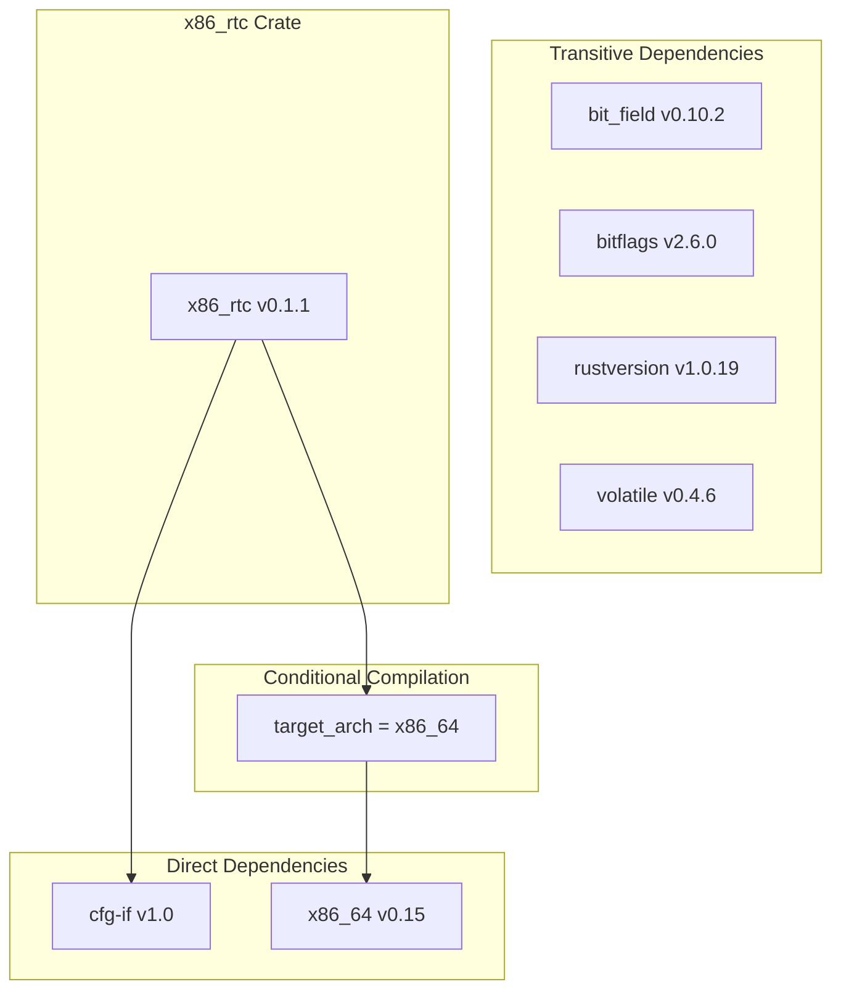
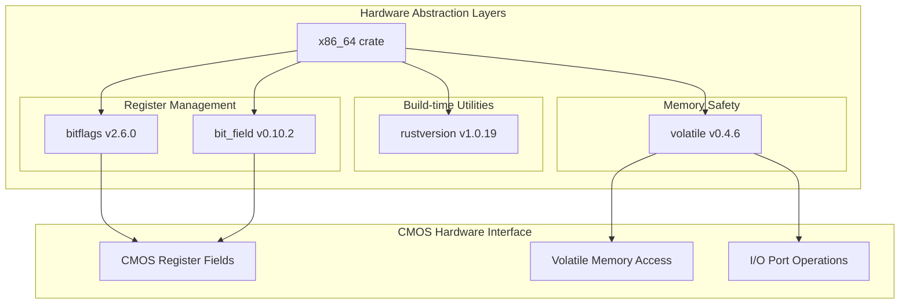
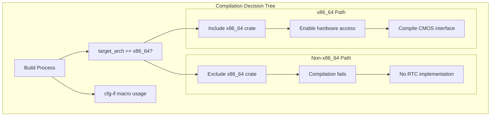

# Dependencies and Platform Support

> **Relevant source files**
> * [Cargo.lock](https://github.com/arceos-org/x86_rtc/blob/1990537d/Cargo.lock)
> * [Cargo.toml](https://github.com/arceos-org/x86_rtc/blob/1990537d/Cargo.toml)

This document provides a comprehensive analysis of the `x86_rtc` crate's dependencies, platform requirements, and architecture-specific constraints. It covers both direct and transitive dependencies, explains the conditional compilation strategy, and documents the specific platform support matrix.

For detailed crate configuration and metadata information, see [Crate Definition and Metadata](/arceos-org/x86_rtc/1.1-crate-definition-and-metadata). For implementation-specific dependency usage, see [Implementation](/arceos-org/x86_rtc/2-implementation).

## Dependency Architecture Overview

The `x86_rtc` crate follows a minimal dependency strategy, with only two direct dependencies and a small transitive dependency tree focused on hardware abstraction and conditional compilation.



**Sources:** [Cargo.toml(L14 - L18)&emsp;](https://github.com/arceos-org/x86_rtc/blob/1990537d/Cargo.toml#L14-L18) [Cargo.lock(L48 - L53)&emsp;](https://github.com/arceos-org/x86_rtc/blob/1990537d/Cargo.lock#L48-L53)

## Direct Dependencies

### cfg-if v1.0

The `cfg-if` crate provides ergonomic conditional compilation macros, essential for platform-specific code paths in the RTC driver.

|Attribute|Value|
| --- | --- |
|Version|1.0.0|
|Purpose|Conditional compilation utilities|
|Usage|Platform-specific code branching|
|License Compatibility|MIT/Apache-2.0|

**Sources:** [Cargo.toml(L15)&emsp;](https://github.com/arceos-org/x86_rtc/blob/1990537d/Cargo.toml#L15-L15) [Cargo.lock(L18 - L21)&emsp;](https://github.com/arceos-org/x86_rtc/blob/1990537d/Cargo.lock#L18-L21)

### x86_64 v0.15 (Conditional)

The `x86_64` crate is the primary hardware abstraction layer, providing safe access to x86_64-specific instructions and memory-mapped I/O operations required for CMOS interaction.

|Attribute|Value|
| --- | --- |
|Version|0.15.2|
|Condition|target_arch = "x86_64"|
|Purpose|Hardware abstraction for x86_64 architecture|
|Key Features|I/O port access, memory safety primitives|

**Sources:** [Cargo.toml(L17 - L18)&emsp;](https://github.com/arceos-org/x86_rtc/blob/1990537d/Cargo.toml#L17-L18) [Cargo.lock(L36 - L45)&emsp;](https://github.com/arceos-org/x86_rtc/blob/1990537d/Cargo.lock#L36-L45)

## Transitive Dependencies

The `x86_64` crate brings in four transitive dependencies that provide low-level hardware access capabilities:

### Hardware Access Stack



**Sources:** [Cargo.lock(L40 - L44)&emsp;](https://github.com/arceos-org/x86_rtc/blob/1990537d/Cargo.lock#L40-L44)

### Dependency Details

|Crate|Version|Purpose|Role in RTC|
| --- | --- | --- | --- |
|bit_field|0.10.2|Bit field manipulation|CMOS register field extraction|
|bitflags|2.6.0|Type-safe bit flag operations|Status register flags|
|volatile|0.4.6|Volatile memory access|Hardware register safety|
|rustversion|1.0.19|Rust version detection|Conditional API compilation|

**Sources:** [Cargo.lock(L6 - L45)&emsp;](https://github.com/arceos-org/x86_rtc/blob/1990537d/Cargo.lock#L6-L45)

## Platform Requirements

### Architecture Specificity

The `x86_rtc` crate is exclusively designed for x86_64 architecture due to its dependence on CMOS hardware implementation specific to x86-compatible systems.

|Requirement|Specification|
| --- | --- |
|Target Architecture|x86_64only|
|Hardware Interface|CMOS via I/O ports 0x70/0x71|
|Memory Model|Physical memory access required|
|Privilege Level|Kernel/supervisor mode for I/O operations|

**Sources:** [Cargo.toml(L17)&emsp;](https://github.com/arceos-org/x86_rtc/blob/1990537d/Cargo.toml#L17-L17) [Cargo.toml(L11)&emsp;](https://github.com/arceos-org/x86_rtc/blob/1990537d/Cargo.toml#L11-L11)

### no_std Compatibility

The crate is designed for `no_std` environments, making it suitable for:

* Operating system kernels
* Embedded systems
* Bootloaders
* Hypervisors

**Sources:** [Cargo.toml(L12)&emsp;](https://github.com/arceos-org/x86_rtc/blob/1990537d/Cargo.toml#L12-L12)

## Conditional Compilation Strategy

The crate employs a sophisticated conditional compilation strategy to ensure platform safety and optimal builds.



**Sources:** [Cargo.toml(L17 - L18)&emsp;](https://github.com/arceos-org/x86_rtc/blob/1990537d/Cargo.toml#L17-L18)

### Conditional Dependency Declaration

The conditional dependency syntax in `Cargo.toml` ensures that the `x86_64` crate and its transitive dependencies are only included when building for compatible targets:

```
[target.'cfg(target_arch = "x86_64")'.dependencies]
x86_64 = "0.15"
```

**Sources:** [Cargo.toml(L17 - L18)&emsp;](https://github.com/arceos-org/x86_rtc/blob/1990537d/Cargo.toml#L17-L18)

## Supported Build Targets

### Primary Targets

|Target Triple|Environment|Support Level|
| --- | --- | --- |
|x86_64-unknown-linux-gnu|Standard Linux|Full support|
|x86_64-unknown-none|Bare metal/kernel|Full support|

### Unsupported Architectures

The following architectures are explicitly unsupported due to hardware constraints:

* ARM64 (aarch64)
* ARM32 (arm)
* RISC-V (riscv64)
* WebAssembly (wasm32)

**Sources:** [Cargo.toml(L11)&emsp;](https://github.com/arceos-org/x86_rtc/blob/1990537d/Cargo.toml#L11-L11) [Cargo.toml(L17)&emsp;](https://github.com/arceos-org/x86_rtc/blob/1990537d/Cargo.toml#L17-L17)

## Version Constraints and Compatibility

The crate maintains conservative version constraints to ensure stability:

### Direct Dependency Versions

|Dependency|Constraint|Rationale|
| --- | --- | --- |
|cfg-if|1.0|Stable API, wide compatibility|
|x86_64|0.15|Latest stable hardware abstraction|

### Transitive Version Resolution

The locked dependency versions provide a stable foundation:

* All transitive dependencies use semantic versioning
* Version locks prevent unexpected breaking changes
* Regular updates maintain security and compatibility

**Sources:** [Cargo.toml(L15)&emsp;](https://github.com/arceos-org/x86_rtc/blob/1990537d/Cargo.toml#L15-L15) [Cargo.toml(L18)&emsp;](https://github.com/arceos-org/x86_rtc/blob/1990537d/Cargo.toml#L18-L18) [Cargo.lock(L1 - L54)&emsp;](https://github.com/arceos-org/x86_rtc/blob/1990537d/Cargo.lock#L1-L54)