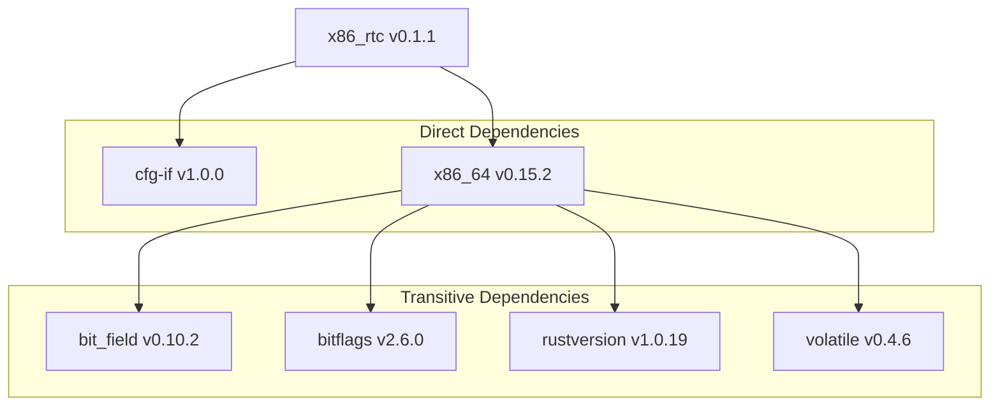
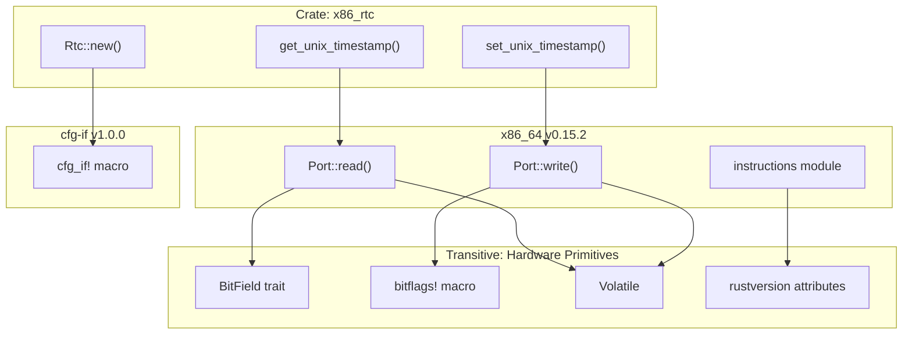

# Dependency Analysis

> **Relevant source files**
> * [Cargo.lock](https://github.com/arceos-org/x86_rtc/blob/1990537d/Cargo.lock)
> * [Cargo.toml](https://github.com/arceos-org/x86_rtc/blob/1990537d/Cargo.toml)

This document provides a comprehensive analysis of the x86_rtc crate's dependency structure, including direct dependencies, transitive dependencies, version constraints, and conditional compilation requirements. This analysis covers both the explicit dependencies declared in the build configuration and the full resolved dependency tree.

For information about platform-specific compilation targets and architecture requirements, see [Platform and Architecture Requirements](/arceos-org/x86_rtc/3.2-platform-and-architecture-requirements). For details about the crate's overall configuration and metadata, see [Crate Definition and Metadata](/arceos-org/x86_rtc/1.1-crate-definition-and-metadata).

## Direct Dependencies

The x86_rtc crate declares two direct dependencies in its `Cargo.toml` configuration:

|Dependency|Version|Scope|Purpose|
| --- | --- | --- | --- |
|cfg-if|1.0|Unconditional|Conditional compilation utilities|
|x86_64|0.15|x86_64 architecture only|Hardware abstraction layer|

### cfg-if Dependency

The `cfg-if` crate provides conditional compilation macros that simplify platform-specific code organization. This dependency is declared unconditionally in [Cargo.toml(L15)&emsp;](https://github.com/arceos-org/x86_rtc/blob/1990537d/Cargo.toml#L15-L15) and resolves to version 1.0.0 in the lock file.

### x86_64 Architecture Dependency

The `x86_64` crate is conditionally included only when building for x86_64 architecture targets, as specified in [Cargo.toml(L17 - L18)&emsp;](https://github.com/arceos-org/x86_rtc/blob/1990537d/Cargo.toml#L17-L18) This dependency provides low-level hardware access primitives essential for CMOS register manipulation.

**Dependency Graph - Direct Dependencies**

```

```

Sources: [Cargo.toml(L14 - L18)&emsp;](https://github.com/arceos-org/x86_rtc/blob/1990537d/Cargo.toml#L14-L18) [Cargo.lock(L48 - L53)&emsp;](https://github.com/arceos-org/x86_rtc/blob/1990537d/Cargo.lock#L48-L53)

## Transitive Dependencies

The x86_64 crate introduces four transitive dependencies that provide essential low-level functionality:

|Dependency|Version|Source|Purpose|
| --- | --- | --- | --- |
|bit_field|0.10.2|x86_64|Bit field manipulation for registers|
|bitflags|2.6.0|x86_64|Type-safe bit flag operations|
|rustversion|1.0.19|x86_64|Rust compiler version detection|
|volatile|0.4.6|x86_64|Memory-mapped I/O safety|

### Hardware Abstraction Dependencies

The transitive dependencies fall into two categories:

**Register Manipulation**: `bit_field` and `bitflags` provide safe abstractions for manipulating hardware register bits and flags, essential for CMOS register operations.

**Memory Safety**: `volatile` ensures proper memory-mapped I/O semantics, preventing compiler optimizations that could break hardware communication protocols.

**Build-time Utilities**: `rustversion` enables conditional compilation based on Rust compiler versions, ensuring compatibility across different toolchain versions.

**Complete Dependency Tree**



Sources: [Cargo.lock(L40 - L45)&emsp;](https://github.com/arceos-org/x86_rtc/blob/1990537d/Cargo.lock#L40-L45) [Cargo.lock(L5 - L53)&emsp;](https://github.com/arceos-org/x86_rtc/blob/1990537d/Cargo.lock#L5-L53)

## Version Constraints and Compatibility

### Semantic Versioning Strategy

The crate uses semantic versioning with specific constraint patterns:

* **Major version pinning**: `cfg-if = "1.0"` allows patch updates within the 1.x series
* **Minor version pinning**: `x86_64 = "0.15"` allows patch updates within the 0.15.x series

### Resolved Version Analysis

The dependency resolution in `Cargo.lock` shows the specific versions chosen within the declared constraints:

**Code Entity Dependency Mapping**



Sources: [Cargo.toml(L14 - L18)&emsp;](https://github.com/arceos-org/x86_rtc/blob/1990537d/Cargo.toml#L14-L18) [Cargo.lock(L36 - L45)&emsp;](https://github.com/arceos-org/x86_rtc/blob/1990537d/Cargo.lock#L36-L45)

## Conditional Compilation Structure

### Architecture-Specific Dependencies

The dependency structure implements a conditional compilation pattern where core hardware dependencies are only included for supported architectures:

```
// From Cargo.toml structure
[target.'cfg(target_arch = "x86_64")'.dependencies]
x86_64 = "0.15"
```

This pattern ensures that:

* The crate can be parsed on non-x86_64 platforms without pulling in architecture-specific dependencies
* Hardware-specific functionality is only available when targeting compatible architectures
* Build times are optimized for cross-compilation scenarios

### Dependency Resolution Matrix

|Build Target|cfg-if|x86_64|Transitive Dependencies|
| --- | --- | --- | --- |
|x86_64-unknown-linux-gnu|✓|✓|All included|
|x86_64-unknown-none|✓|✓|All included|
|other architectures|✓|✗|None included|

**Conditional Dependency Flow**

```

```

Sources: [Cargo.toml(L17 - L18)&emsp;](https://github.com/arceos-org/x86_rtc/blob/1990537d/Cargo.toml#L17-L18) [Cargo.lock(L40 - L53)&emsp;](https://github.com/arceos-org/x86_rtc/blob/1990537d/Cargo.lock#L40-L53)

## Dependency Security and Maintenance

### Version Stability

All dependencies use stable release versions:

* No pre-release or development versions
* Established crates with mature APIs
* Conservative version constraints that allow security updates

### Maintenance Burden

The dependency tree is intentionally minimal:

* Only 6 total crates in the dependency graph
* Well-maintained crates from established authors
* Clear separation between conditional and unconditional dependencies

The focused dependency set reduces maintenance overhead while providing essential hardware abstraction capabilities required for x86_64 RTC operations.

Sources: [Cargo.toml(L14 - L18)&emsp;](https://github.com/arceos-org/x86_rtc/blob/1990537d/Cargo.toml#L14-L18) [Cargo.lock(L1 - L53)&emsp;](https://github.com/arceos-org/x86_rtc/blob/1990537d/Cargo.lock#L1-L53)