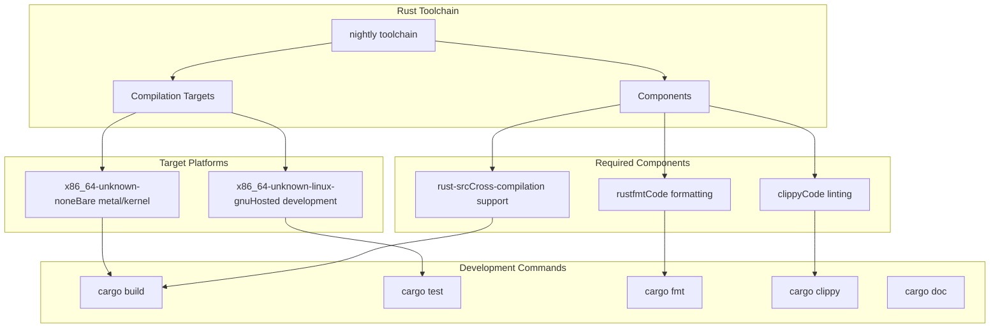
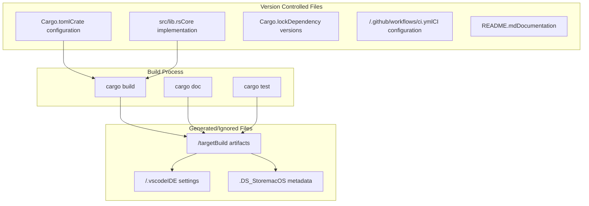
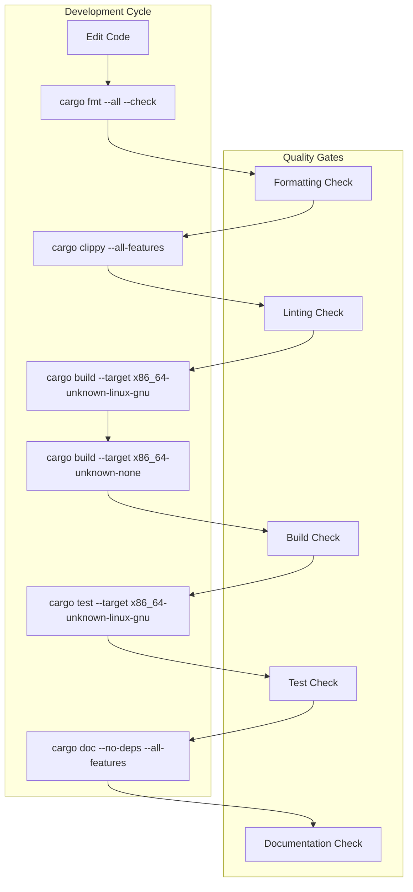
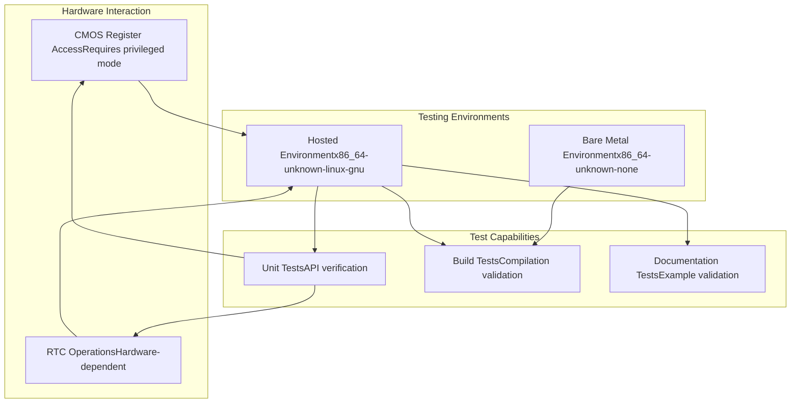

# Development Environment Setup

> **Relevant source files**
> * [.github/workflows/ci.yml](https://github.com/arceos-org/x86_rtc/blob/1990537d/.github/workflows/ci.yml)
> * [.gitignore](https://github.com/arceos-org/x86_rtc/blob/1990537d/.gitignore)

## Purpose and Scope

This document provides comprehensive guidelines for setting up a development environment for the x86_rtc crate, including toolchain requirements, project structure understanding, and development best practices. It covers the essential tools, configurations, and workflows needed to contribute effectively to this hardware-level RTC driver.

For information about the automated CI/CD pipeline that validates these development practices, see [CI/CD Pipeline](/arceos-org/x86_rtc/4.1-cicd-pipeline).

## Prerequisites and Toolchain Requirements

The x86_rtc crate requires a specific Rust toolchain configuration to support its hardware-focused, no_std development model and target platforms.

### Required Rust Toolchain

The project mandates the Rust nightly toolchain with specific components and targets:

|Component|Purpose|Required|
| --- | --- | --- |
|nightlytoolchain|Access to unstable features for hardware programming|Yes|
|rust-src|Source code for cross-compilation|Yes|
|clippy|Linting and code quality analysis|Yes|
|rustfmt|Code formatting standards|Yes|
|x86_64-unknown-linux-gnu|Standard Linux development target|Yes|
|x86_64-unknown-none|Bare metal/kernel development target|Yes|

### Toolchain Installation Commands

```markdown
# Install nightly toolchain
rustup toolchain install nightly

# Add required components
rustup component add --toolchain nightly rust-src clippy rustfmt

# Add compilation targets
rustup target add --toolchain nightly x86_64-unknown-linux-gnu
rustup target add --toolchain nightly x86_64-unknown-none

# Set nightly as default (optional)
rustup default nightly
```

Sources: [.github/workflows/ci.yml(L11 - L19)&emsp;](https://github.com/arceos-org/x86_rtc/blob/1990537d/.github/workflows/ci.yml#L11-L19)

### Development Toolchain Architecture



Sources: [.github/workflows/ci.yml(L15 - L19)&emsp;](https://github.com/arceos-org/x86_rtc/blob/1990537d/.github/workflows/ci.yml#L15-L19)

## Repository Structure and Ignored Files

Understanding the project's file organization and what gets excluded from version control is essential for effective development.

### Version Control Exclusions

The `.gitignore` configuration maintains a clean repository by excluding build artifacts and development-specific files:

|Path|Description|Reason for Exclusion|
| --- | --- | --- |
|/target|Cargo build output directory|Generated artifacts, platform-specific|
|/.vscode|Visual Studio Code workspace settings|IDE-specific, personal preferences|
|.DS_Store|macOS file system metadata|Platform-specific system files|

### Development File Structure



Sources: [.gitignore(L1 - L4)&emsp;](https://github.com/arceos-org/x86_rtc/blob/1990537d/.gitignore#L1-L4)

## Development Workflow and Code Quality

The development workflow is designed around the CI pipeline requirements, ensuring code quality and platform compatibility before integration.

### Code Quality Pipeline

The development process follows a structured approach that mirrors the automated CI checks:



Sources: [.github/workflows/ci.yml(L22 - L30)&emsp;](https://github.com/arceos-org/x86_rtc/blob/1990537d/.github/workflows/ci.yml#L22-L30)

### Development Commands Reference

|Command|Purpose|Target Platform|CI Equivalent|
| --- | --- | --- | --- |
|cargo fmt --all -- --check|Verify code formatting|All|Line 23|
|cargo clippy --target <target> --all-features -- -D warnings|Lint analysis|Both targets|Line 25|
|cargo build --target <target> --all-features|Compilation check|Both targets|Line 27|
|cargo test --target x86_64-unknown-linux-gnu -- --nocapture|Unit testing|Linux only|Line 30|
|cargo doc --no-deps --all-features|Documentation generation|Default|Line 47|

## Local Testing Environment

### Target-Specific Testing

Testing is platform-dependent due to the hardware-specific nature of the crate:

|Test Type|Platform|Capability|Limitations|
| --- | --- | --- | --- |
|Unit Tests|x86_64-unknown-linux-gnu|Full test execution|Requires hosted environment|
|Build Tests|x86_64-unknown-none|Compilation verification only|No test execution in bare metal|
|Documentation|Default target|API documentation generation|No hardware interaction|

### Hardware Testing Considerations

Since this crate provides hardware-level RTC access, comprehensive testing requires understanding of the limitations:



Sources: [.github/workflows/ci.yml(L28 - L30)&emsp;](https://github.com/arceos-org/x86_rtc/blob/1990537d/.github/workflows/ci.yml#L28-L30)

## Documentation Development

### Local Documentation Generation

The project uses strict documentation standards enforced through `RUSTDOCFLAGS`:

```markdown
# Generate documentation with strict checks
RUSTDOCFLAGS="-D rustdoc::broken_intra_doc_links -D missing-docs" cargo doc --no-deps --all-features
```

The documentation generation process creates a redirect index for easy navigation:

```markdown
# Generate redirect index (automated in CI)
printf '<meta http-equiv="refresh" content="0;url=%s/index.html">' $(cargo tree | head -1 | cut -d' ' -f1) > target/doc/index.html
```

Sources: [.github/workflows/ci.yml(L40)&emsp;](https://github.com/arceos-org/x86_rtc/blob/1990537d/.github/workflows/ci.yml#L40-L40) [.github/workflows/ci.yml(L47 - L48)&emsp;](https://github.com/arceos-org/x86_rtc/blob/1990537d/.github/workflows/ci.yml#L47-L48)

## Best Practices Summary

1. **Always use nightly toolchain** - Required for hardware programming features
2. **Test on both targets** - Ensure compatibility with hosted and bare metal environments
3. **Run full quality pipeline locally** - Mirror CI checks before committing
4. **Maintain documentation standards** - All public APIs must be documented
5. **Respect platform limitations** - Understand hardware testing constraints
6. **Keep repository clean** - Respect `.gitignore` patterns for collaborative development

Sources: [.github/workflows/ci.yml(L1 - L56)&emsp;](https://github.com/arceos-org/x86_rtc/blob/1990537d/.github/workflows/ci.yml#L1-L56) [.gitignore(L1 - L4)&emsp;](https://github.com/arceos-org/x86_rtc/blob/1990537d/.gitignore#L1-L4)