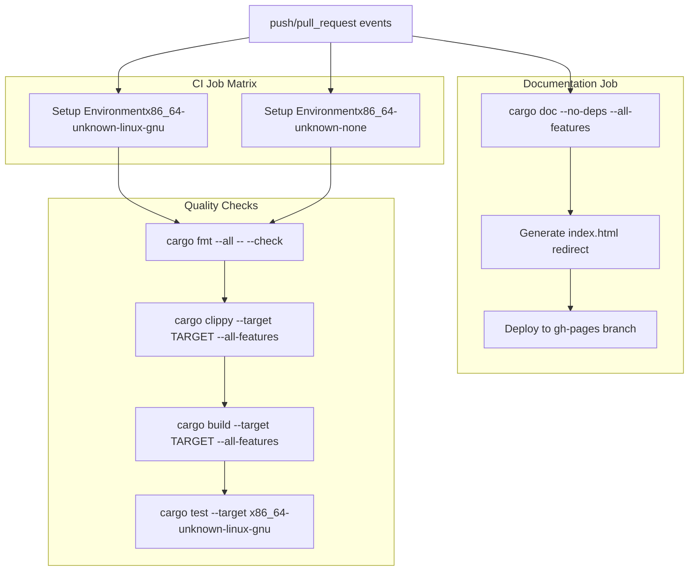
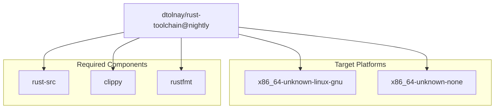
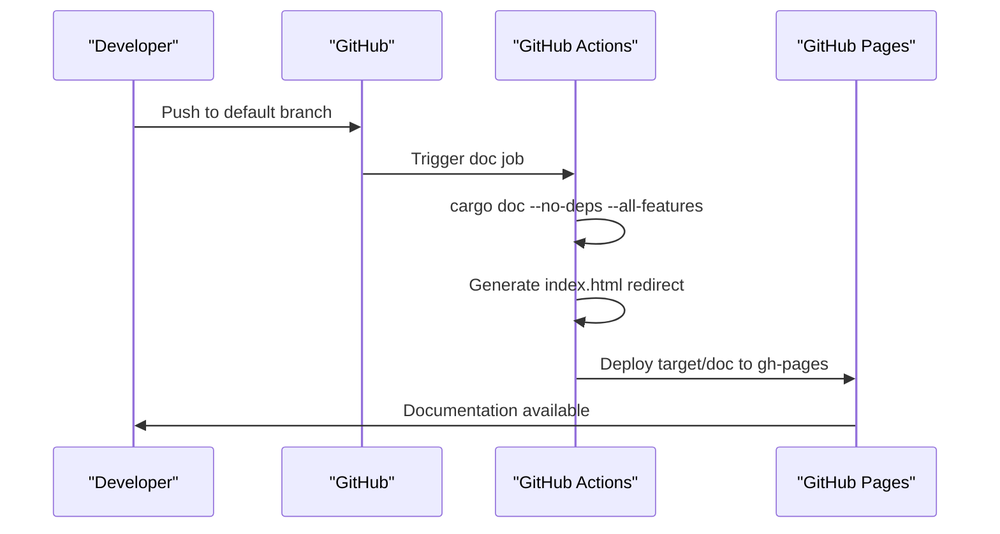
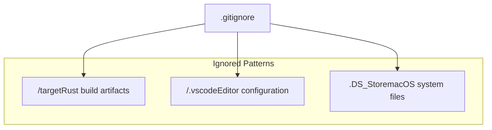

# Development Workflow

> **Relevant source files**
> * [.github/workflows/ci.yml](https://github.com/arceos-org/x86_rtc/blob/1990537d/.github/workflows/ci.yml)
> * [.gitignore](https://github.com/arceos-org/x86_rtc/blob/1990537d/.gitignore)

This document covers the development, testing, and deployment processes for the x86_rtc crate. It details the automated CI/CD pipeline, development environment requirements, and the workflow for contributing to and maintaining the codebase.

For detailed information about the crate's dependencies and platform requirements, see [Dependencies and Platform Support](/arceos-org/x86_rtc/3-dependencies-and-platform-support). For implementation details of the RTC driver functionality, see [Implementation](/arceos-org/x86_rtc/2-implementation).

## CI/CD Pipeline Overview

The x86_rtc crate uses GitHub Actions for continuous integration and deployment, configured through a comprehensive workflow that ensures code quality, cross-platform compatibility, and automated documentation deployment.

### Pipeline Architecture



**Sources:** [.github/workflows/ci.yml(L1 - L56)&emsp;](https://github.com/arceos-org/x86_rtc/blob/1990537d/.github/workflows/ci.yml#L1-L56)

### Job Configuration Details

The CI pipeline consists of two primary jobs with specific configurations:

|Job|Purpose|Matrix Strategy|Key Steps|
| --- | --- | --- | --- |
|ci|Code quality and cross-platform builds|2 targets × 1 toolchain|Format check, clippy, build, test|
|doc|Documentation generation and deployment|Single configuration|Doc build, GitHub Pages deployment|

#### CI Job Matrix Strategy

The `ci` job uses a matrix strategy to test across multiple compilation targets:

```yaml
strategy:
  fail-fast: false
  matrix:
    rust-toolchain: [nightly]
    targets: [x86_64-unknown-linux-gnu, x86_64-unknown-none]
```

This configuration ensures compatibility with both standard Linux environments and bare-metal/kernel development contexts.

**Sources:** [.github/workflows/ci.yml(L8 - L12)&emsp;](https://github.com/arceos-org/x86_rtc/blob/1990537d/.github/workflows/ci.yml#L8-L12)

#### Toolchain and Component Setup

The pipeline uses the nightly Rust toolchain with specific components:



**Sources:** [.github/workflows/ci.yml(L15 - L19)&emsp;](https://github.com/arceos-org/x86_rtc/blob/1990537d/.github/workflows/ci.yml#L15-L19)

### Quality Assurance Steps

The CI pipeline enforces code quality through multiple sequential checks:

#### 1. Code Formatting Verification

```
cargo fmt --all -- --check
```

Ensures all code adheres to standard Rust formatting conventions.

#### 2. Linting with Clippy

```
cargo clippy --target ${{ matrix.targets }} --all-features -- -D warnings
```

Performs static analysis and treats all warnings as errors to maintain code quality.

#### 3. Cross-Platform Build Verification

```
cargo build --target ${{ matrix.targets }} --all-features
```

Validates that the crate compiles successfully on both hosted and bare-metal targets.

#### 4. Unit Testing

```
cargo test --target ${{ matrix.targets }} -- --nocapture
```

Executes unit tests, but only on `x86_64-unknown-linux-gnu` target due to hardware dependencies.

**Sources:** [.github/workflows/ci.yml(L22 - L30)&emsp;](https://github.com/arceos-org/x86_rtc/blob/1990537d/.github/workflows/ci.yml#L22-L30)

### Documentation Deployment

The documentation job handles automated generation and deployment of API documentation:



#### Documentation Build Configuration

The documentation build uses specific flags to ensure quality:

```yaml
RUSTDOCFLAGS: -D rustdoc::broken_intra_doc_links -D missing-docs
```

These flags treat broken documentation links and missing documentation as errors.

**Sources:** [.github/workflows/ci.yml(L40)&emsp;](https://github.com/arceos-org/x86_rtc/blob/1990537d/.github/workflows/ci.yml#L40-L40)

#### Conditional Deployment Logic

Documentation deployment occurs only on the default branch:

```css
if: ${{ github.ref == env.default-branch }}
```

This prevents documentation pollution from feature branches while ensuring the main documentation stays current.

**Sources:** [.github/workflows/ci.yml(L50)&emsp;](https://github.com/arceos-org/x86_rtc/blob/1990537d/.github/workflows/ci.yml#L50-L50)

## Development Environment Setup

### Required Tools and Configuration

Developers working on the x86_rtc crate need to configure their environment to match the CI pipeline requirements:

#### Rust Toolchain Requirements

* **Toolchain**: Nightly Rust (required for certain features)
* **Components**: `rust-src`, `clippy`, `rustfmt`
* **Targets**: `x86_64-unknown-linux-gnu`, `x86_64-unknown-none`

#### Installation Commands

```markdown
# Install nightly toolchain
rustup toolchain install nightly

# Add required components
rustup component add rust-src clippy rustfmt --toolchain nightly

# Add compilation targets
rustup target add x86_64-unknown-linux-gnu x86_64-unknown-none --toolchain nightly
```

### Ignored Files and Artifacts

The repository uses `.gitignore` to exclude development artifacts and environment-specific files:



**Sources:** [.gitignore(L1 - L4)&emsp;](https://github.com/arceos-org/x86_rtc/blob/1990537d/.gitignore#L1-L4)

### Local Development Workflow

#### Pre-commit Validation

Before submitting changes, developers should run the same checks as the CI pipeline:

```markdown
# Format check
cargo fmt --all -- --check

# Linting
cargo clippy --target x86_64-unknown-linux-gnu --all-features -- -D warnings
cargo clippy --target x86_64-unknown-none --all-features -- -D warnings

# Build verification
cargo build --target x86_64-unknown-linux-gnu --all-features
cargo build --target x86_64-unknown-none --all-features

# Unit tests
cargo test --target x86_64-unknown-linux-gnu -- --nocapture
```

#### Documentation Development

Local documentation can be built and reviewed using:

```markdown
# Build documentation
cargo doc --no-deps --all-features --open

# Check for documentation issues
RUSTDOCFLAGS="-D rustdoc::broken_intra_doc_links -D missing-docs" cargo doc
```

## Contribution and Release Workflow

### Branch Protection and Automation

The workflow is designed to support a development model where:

1. **All commits** trigger format checking, linting, and cross-platform builds
2. **Pull requests** receive the same validation without documentation deployment
3. **Default branch pushes** additionally trigger documentation deployment to GitHub Pages

### Integration Points

The development workflow integrates with several external systems:

|Integration|Purpose|Configuration|
| --- | --- | --- |
|GitHub Actions|CI/CD automation|.github/workflows/ci.yml|
|GitHub Pages|Documentation hosting|Automated deployment togh-pagesbranch|
|Rust toolchain|Build and validation|Nightly toolchain with specific components|

**Sources:** [.github/workflows/ci.yml(L1 - L56)&emsp;](https://github.com/arceos-org/x86_rtc/blob/1990537d/.github/workflows/ci.yml#L1-L56) [.gitignore(L1 - L4)&emsp;](https://github.com/arceos-org/x86_rtc/blob/1990537d/.gitignore#L1-L4)