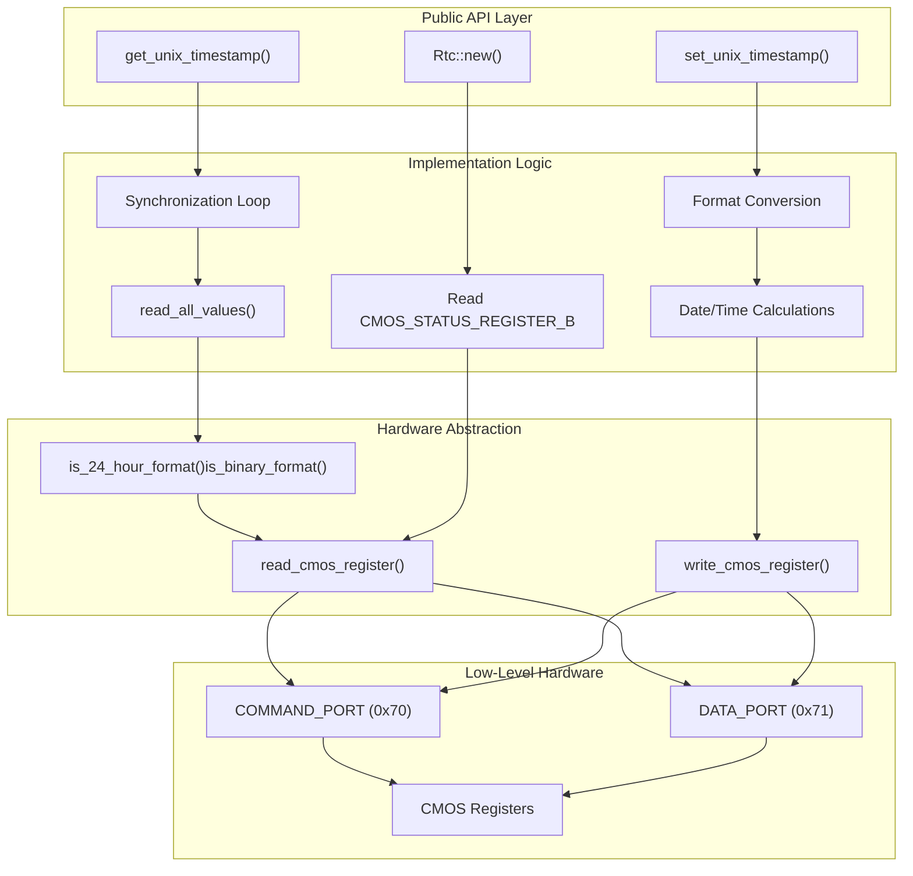
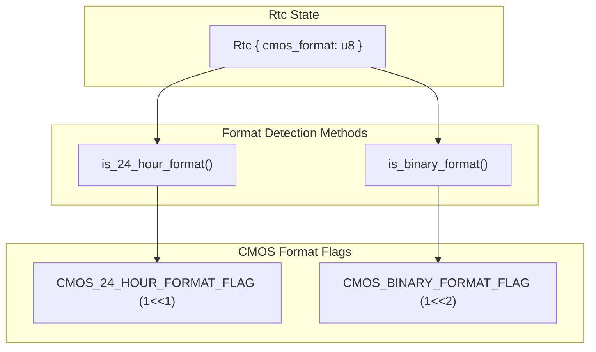
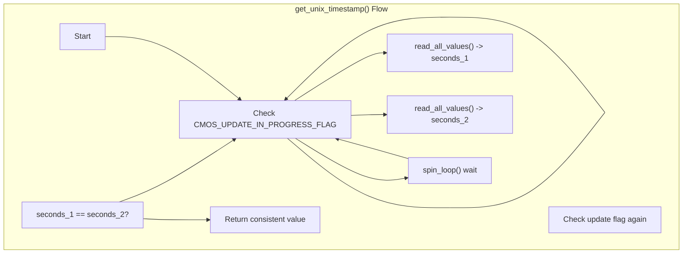
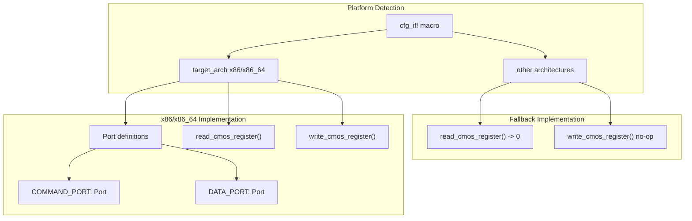
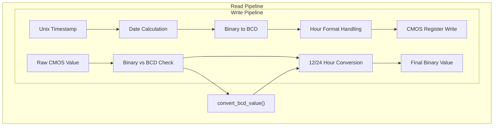
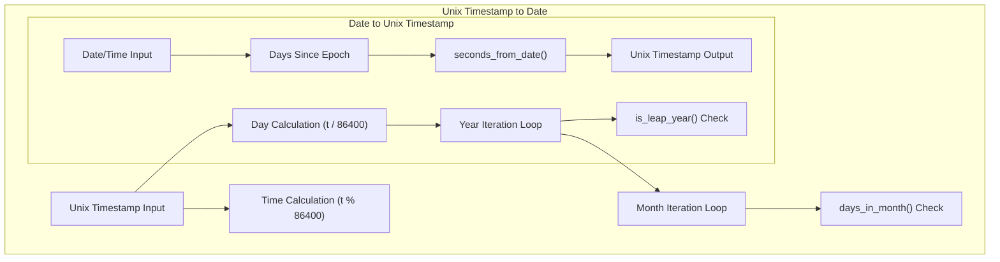

# Implementation

> **Relevant source files**
> * [src/lib.rs](https://github.com/arceos-org/x86_rtc/blob/1990537d/src/lib.rs)

This document provides a comprehensive overview of the x86_rtc crate's implementation architecture, covering the core RTC driver functionality, hardware abstraction mechanisms, and the interaction between different system components. For detailed API documentation, see [RTC Driver API](/arceos-org/x86_rtc/2.1-rtc-driver-api). For low-level hardware interface specifics, see [CMOS Hardware Interface](/arceos-org/x86_rtc/2.2-cmos-hardware-interface). For data format conversion details, see [Data Format Handling](/arceos-org/x86_rtc/2.3-data-format-handling).

## Implementation Architecture

The x86_rtc implementation follows a layered architecture that abstracts hardware complexity while maintaining performance and safety. The core implementation centers around the `Rtc` struct, which encapsulates CMOS format configuration and provides high-level time operations.

### Core Implementation Flow

Sources: [src/lib.rs(L24 - L194)&emsp;](https://github.com/arceos-org/x86_rtc/blob/1990537d/src/lib.rs#L24-L194)

The implementation follows a clear separation of concerns where each layer handles specific responsibilities. The public API provides Unix timestamp operations, the implementation logic handles format detection and conversion, and the hardware abstraction layer manages safe access to CMOS registers.

### Rtc Structure and State Management

The `Rtc` struct maintains minimal state to optimize performance while ensuring thread safety through stateless operations where possible.

Sources: [src/lib.rs(L24 - L36)&emsp;](https://github.com/arceos-org/x86_rtc/blob/1990537d/src/lib.rs#L24-L36)

The `cmos_format` field stores the value from `CMOS_STATUS_REGISTER_B` during initialization, allowing efficient format checking without repeated hardware access.

### Synchronization and Consistency Mechanisms

The implementation employs sophisticated synchronization to handle CMOS update cycles and ensure data consistency.

Sources: [src/lib.rs(L106 - L129)&emsp;](https://github.com/arceos-org/x86_rtc/blob/1990537d/src/lib.rs#L106-L129)

This double-read verification pattern ensures that time values remain consistent even during CMOS hardware updates, which occur approximately once per second.

### Hardware Interface Abstraction

The implementation uses conditional compilation to provide platform-specific hardware access while maintaining a consistent interface.

Sources: [src/lib.rs(L196 - L226)&emsp;](https://github.com/arceos-org/x86_rtc/blob/1990537d/src/lib.rs#L196-L226)

The conditional compilation ensures that the crate can be built on non-x86 platforms for testing purposes while providing no-op implementations for hardware functions.

### Register Access Pattern

The CMOS register access follows a strict two-step protocol for all operations.

|Operation|Step 1: Command Port|Step 2: Data Port|
| --- | --- | --- |
|Read|Write register address + NMI disable|Read value|
|Write|Write register address + NMI disable|Write value|

The `CMOS_DISABLE_NMI` flag (bit 7) is always set to prevent Non-Maskable Interrupts during CMOS access, ensuring atomic operations.

Sources: [src/lib.rs(L201 - L218)&emsp;](https://github.com/arceos-org/x86_rtc/blob/1990537d/src/lib.rs#L201-L218)

### Data Conversion Pipeline

The implementation handles multiple data format conversions in a structured pipeline:

Sources: [src/lib.rs(L38 - L48)&emsp;](https://github.com/arceos-org/x86_rtc/blob/1990537d/src/lib.rs#L38-L48) [src/lib.rs(L171 - L185)&emsp;](https://github.com/arceos-org/x86_rtc/blob/1990537d/src/lib.rs#L171-L185)

### Error Handling Strategy

The implementation prioritizes data consistency over error reporting, using several defensive programming techniques:

* **Spin-wait loops** for hardware synchronization rather than timeouts
* **Double-read verification** to detect inconsistent states
* **Format detection caching** to avoid repeated hardware queries
* **Const functions** where possible to enable compile-time optimization

The absence of explicit error types reflects the design philosophy that hardware RTC operations should either succeed or retry, as partial failures are generally not recoverable at the application level.

Sources: [src/lib.rs(L107 - L128)&emsp;](https://github.com/arceos-org/x86_rtc/blob/1990537d/src/lib.rs#L107-L128)

### Calendar Arithmetic Implementation

The date conversion logic implements efficient calendar arithmetic optimized for the Unix epoch:

Sources: [src/lib.rs(L147 - L166)&emsp;](https://github.com/arceos-org/x86_rtc/blob/1990537d/src/lib.rs#L147-L166) [src/lib.rs(L264 - L276)&emsp;](https://github.com/arceos-org/x86_rtc/blob/1990537d/src/lib.rs#L264-L276) [src/lib.rs(L228 - L245)&emsp;](https://github.com/arceos-org/x86_rtc/blob/1990537d/src/lib.rs#L228-L245)

The implementation uses const functions for calendar utilities to enable compile-time optimization and follows algorithms similar to the Linux kernel's `mktime64()` function for compatibility and reliability.