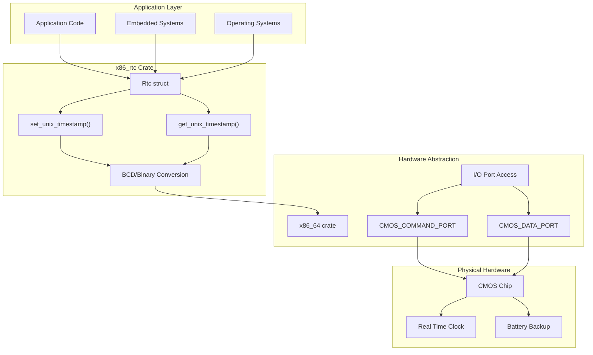
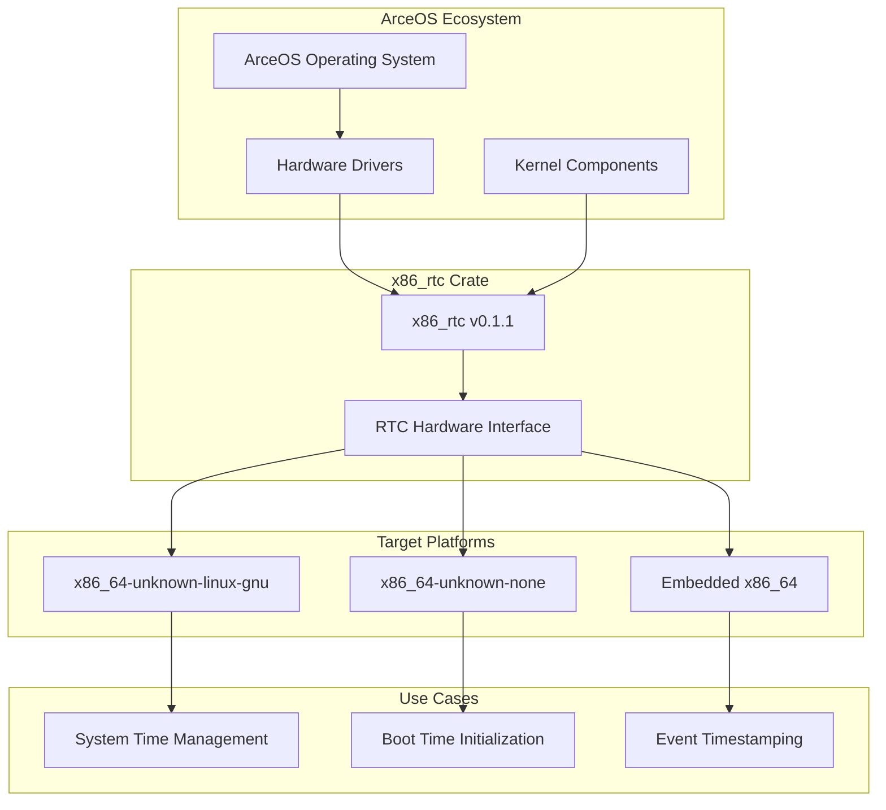

# Overview

> **Relevant source files**
> * [Cargo.toml](https://github.com/arceos-org/x86_rtc/blob/1990537d/Cargo.toml)
> * [README.md](https://github.com/arceos-org/x86_rtc/blob/1990537d/README.md)

This document provides a comprehensive overview of the `x86_rtc` crate, a specialized Rust library that provides low-level hardware access to the Real Time Clock (RTC) on x86_64 systems via CMOS interface. The crate is designed for operating system kernels, embedded systems, and bare-metal applications that require direct hardware clock access without relying on operating system services.

For detailed API documentation and usage patterns, see [RTC Driver API](/arceos-org/x86_rtc/2.1-rtc-driver-api). For information about the underlying hardware protocols and register access, see [CMOS Hardware Interface](/arceos-org/x86_rtc/2.2-cmos-hardware-interface). For build configuration and dependency management, see [Crate Definition and Metadata](/arceos-org/x86_rtc/1.1-crate-definition-and-metadata).

## System Architecture

The `x86_rtc` crate operates as a hardware abstraction layer between application code and the x86_64 CMOS hardware that maintains system time.

**High-Level System Architecture**



**Sources:** [Cargo.toml(L1 - L22)&emsp;](https://github.com/arceos-org/x86_rtc/blob/1990537d/Cargo.toml#L1-L22) [README.md(L1 - L13)&emsp;](https://github.com/arceos-org/x86_rtc/blob/1990537d/README.md#L1-L13)

## Code Entity Mapping

This diagram maps the crate's public interface to its internal implementation and hardware dependencies, showing the relationship between user-facing APIs and underlying code constructs.

**Code Entity Architecture**

```

```

**Sources:** [Cargo.toml(L14 - L18)&emsp;](https://github.com/arceos-org/x86_rtc/blob/1990537d/Cargo.toml#L14-L18) [README.md(L9 - L12)&emsp;](https://github.com/arceos-org/x86_rtc/blob/1990537d/README.md#L9-L12)

## Key Characteristics

|Characteristic|Value|Description|
| --- | --- | --- |
|Crate Name|x86_rtc|Primary identifier in Rust ecosystem|
|Version|0.1.1|Current stable release|
|Architecture Support|x86_64only|Hardware-specific implementation|
|Standard Library|no_stdcompatible|Suitable for bare-metal environments|
|Primary Dependencies|cfg-if,x86_64|Minimal dependency footprint|
|License|Triple-licensed|GPL-3.0-or-later OR Apache-2.0 OR MulanPSL-2.0|
|Target Applications|OS kernels, embedded systems|Low-level hardware access|

**Sources:** [Cargo.toml(L1 - L13)&emsp;](https://github.com/arceos-org/x86_rtc/blob/1990537d/Cargo.toml#L1-L13)

## Integration Context

The `x86_rtc` crate is part of the broader ArceOS ecosystem, as indicated by its homepage and keywords. It serves as a specialized hardware driver component that can be integrated into larger operating system or embedded system projects.

**Ecosystem Integration**



**Sources:** [Cargo.toml(L8 - L12)&emsp;](https://github.com/arceos-org/x86_rtc/blob/1990537d/Cargo.toml#L8-L12) [Cargo.toml(L11 - L12)&emsp;](https://github.com/arceos-org/x86_rtc/blob/1990537d/Cargo.toml#L11-L12)

The crate provides essential time-keeping functionality for systems that need direct hardware access to the RTC, particularly in contexts where higher-level operating system time services are unavailable or insufficient. Its design prioritizes minimal dependencies, hardware-specific optimization, and compatibility with both hosted and bare-metal environments.