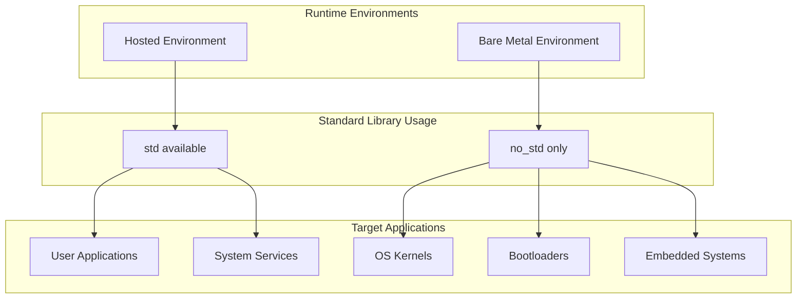
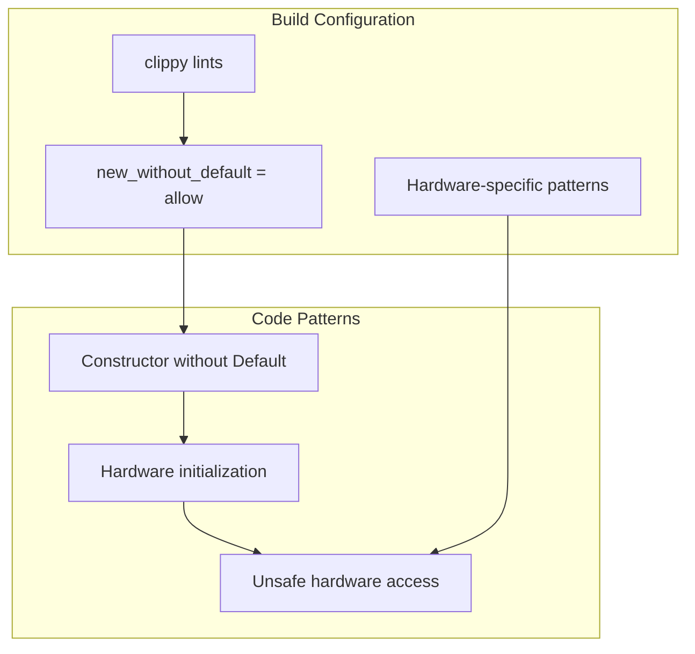

# Platform and Architecture Requirements

> **Relevant source files**
> * [Cargo.toml](https://github.com/arceos-org/x86_rtc/blob/1990537d/Cargo.toml)

This document covers the platform-specific requirements and architectural constraints of the x86_rtc crate. It explains the x86_64 architecture dependency, conditional compilation strategies, and target platform support. For information about the crate's direct and transitive dependencies, see [Dependency Analysis](/arceos-org/x86_rtc/3.1-dependency-analysis). For details about the core RTC implementation, see [Implementation](/arceos-org/x86_rtc/2-implementation).

## Architecture Specificity

The x86_rtc crate is exclusively designed for x86_64 architecture systems due to its reliance on x86-specific CMOS hardware interfaces. This architectural constraint is enforced through both crate metadata and conditional compilation directives.

### x86_64 Hardware Dependency

The crate targets x86_64 systems because the Real Time Clock implementation requires direct access to CMOS registers via specific I/O ports that are part of the x86 architecture specification. The hardware interface is not portable to other architectures like ARM, RISC-V, or other platforms.

```

```

Sources: [Cargo.toml(L6)&emsp;](https://github.com/arceos-org/x86_rtc/blob/1990537d/Cargo.toml#L6-L6) [Cargo.toml(L11)&emsp;](https://github.com/arceos-org/x86_rtc/blob/1990537d/Cargo.toml#L11-L11) [Cargo.toml(L17 - L18)&emsp;](https://github.com/arceos-org/x86_rtc/blob/1990537d/Cargo.toml#L17-L18)

## Conditional Compilation Strategy

The crate employs Rust's conditional compilation features to ensure the x86_64 dependency is only included on compatible target architectures. This prevents compilation errors on unsupported platforms while maintaining clean dependency management.

### Target-Specific Dependencies

The conditional dependency specification ensures that the `x86_64` crate is only pulled in when building for x86_64 targets:

|Configuration|Dependency|Purpose|
| --- | --- | --- |
|cfg(target_arch = "x86_64")|x86_64 = "0.15"|Hardware register access and I/O port operations|
|All targets|cfg-if = "1.0"|Conditional compilation utilities|

```

```

Sources: [Cargo.toml(L15)&emsp;](https://github.com/arceos-org/x86_rtc/blob/1990537d/Cargo.toml#L15-L15) [Cargo.toml(L17 - L18)&emsp;](https://github.com/arceos-org/x86_rtc/blob/1990537d/Cargo.toml#L17-L18)

## Target Platform Support

The crate supports multiple x86_64 target environments through its `no_std` compatibility, enabling deployment in both hosted and bare-metal contexts.

### Supported Build Targets

|Target Triple|Environment|Use Case|
| --- | --- | --- |
|x86_64-unknown-linux-gnu|Hosted Linux|Standard applications, system services|
|x86_64-unknown-none|Bare metal|Operating system kernels, embedded systems|

### No-Standard Library Compatibility

The crate's `no_std` categorization enables usage in resource-constrained and bare-metal environments where the standard library is unavailable. This is essential for:

* Operating system kernel development
* Embedded systems programming
* Bootloader implementations
* Real-time systems



Sources: [Cargo.toml(L12)&emsp;](https://github.com/arceos-org/x86_rtc/blob/1990537d/Cargo.toml#L12-L12)

## Hardware Abstraction Requirements

The platform requirements stem from the need to abstract x86_64-specific hardware features while maintaining safety and performance.

### Register Access Patterns

The crate requires direct hardware register access capabilities that are only available through x86_64-specific instructions and I/O operations. This creates a hard dependency on the underlying architecture's instruction set and memory-mapped I/O capabilities.

### Safety Constraints

Platform requirements also include memory safety considerations for hardware access:

* Volatile memory access for hardware registers
* Atomic operations for register synchronization
* Interrupt-safe register manipulation
* Proper handling of hardware timing constraints

Sources: [Cargo.toml(L6)&emsp;](https://github.com/arceos-org/x86_rtc/blob/1990537d/Cargo.toml#L6-L6) [Cargo.toml(L17 - L18)&emsp;](https://github.com/arceos-org/x86_rtc/blob/1990537d/Cargo.toml#L17-L18)

## Build Configuration Impact

The platform requirements influence several aspects of the build configuration and crate capabilities.

### Linting Adjustments

The crate includes specific clippy lint configurations that account for the hardware-specific nature of the implementation:



### Edition and Toolchain Requirements

The crate specifies Rust 2021 edition compatibility, ensuring access to modern language features while maintaining compatibility with the x86_64 hardware abstraction layer.

Sources: [Cargo.toml(L4)&emsp;](https://github.com/arceos-org/x86_rtc/blob/1990537d/Cargo.toml#L4-L4) [Cargo.toml(L20 - L21)&emsp;](https://github.com/arceos-org/x86_rtc/blob/1990537d/Cargo.toml#L20-L21)