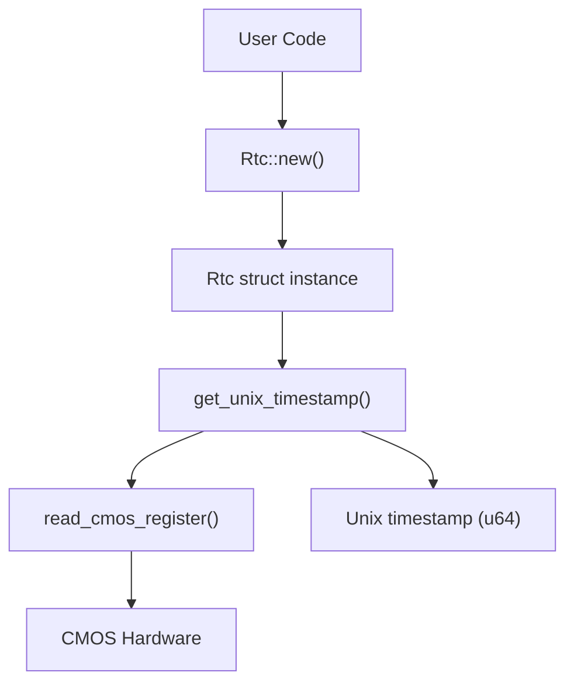
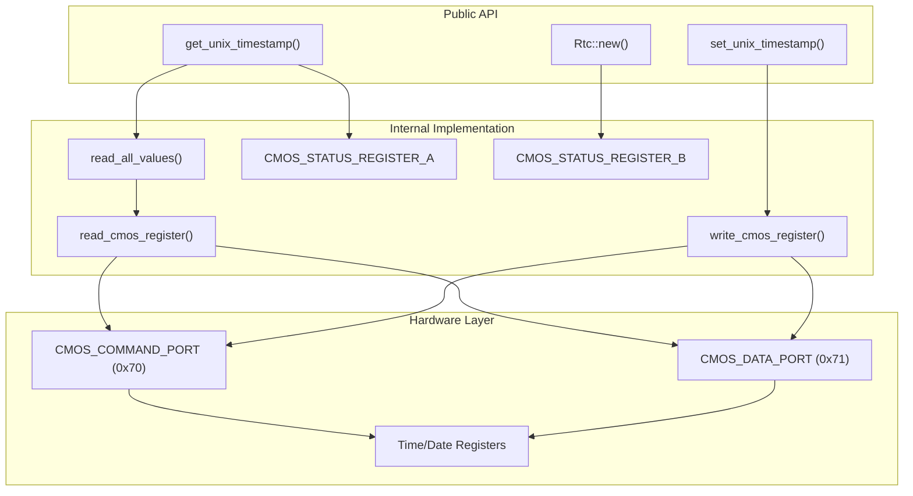
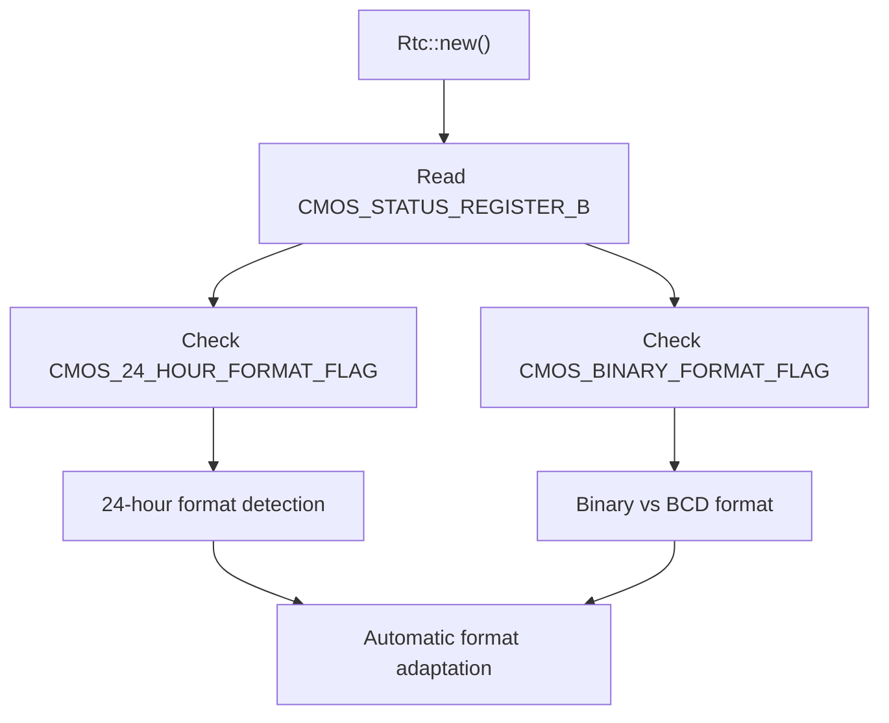

# Quick Start Guide

> **Relevant source files**
> * [README.md](https://github.com/arceos-org/x86_rtc/blob/1990537d/README.md)
> * [src/lib.rs](https://github.com/arceos-org/x86_rtc/blob/1990537d/src/lib.rs)

This page provides essential information for getting started with the `x86_rtc` crate, including basic usage patterns and immediate setup requirements. It covers the fundamental API calls needed to read and write system time via the x86_64 CMOS Real Time Clock interface.

For detailed information about the crate's configuration and dependencies, see [Crate Definition and Metadata](/arceos-org/x86_rtc/1.1-crate-definition-and-metadata). For comprehensive API documentation, see [RTC Driver API](/arceos-org/x86_rtc/2.1-rtc-driver-api). For platform-specific requirements and architecture details, see [Platform and Architecture Requirements](/arceos-org/x86_rtc/3.2-platform-and-architecture-requirements).

## Prerequisites

The `x86_rtc` crate requires an x86_64 target architecture and operates at a low level that typically requires kernel or bare-metal environments. The crate is `no_std` compatible and designed for system-level programming.

### Platform Requirements

|Requirement|Details|
| --- | --- |
|Architecture|x86_64 only|
|Environment|Bare metal, kernel, or privileged user space|
|Rust Edition|2021|
|no_stdSupport|Yes|

Sources: [src/lib.rs(L8)&emsp;](https://github.com/arceos-org/x86_rtc/blob/1990537d/src/lib.rs#L8-L8) [src/lib.rs(L196 - L226)&emsp;](https://github.com/arceos-org/x86_rtc/blob/1990537d/src/lib.rs#L196-L226)

## Basic Usage Pattern

The core workflow involves three main steps: instantiation, reading time, and optionally setting time.

### Basic Time Reading Flow



Sources: [src/lib.rs(L96 - L101)&emsp;](https://github.com/arceos-org/x86_rtc/blob/1990537d/src/lib.rs#L96-L101) [src/lib.rs(L103 - L129)&emsp;](https://github.com/arceos-org/x86_rtc/blob/1990537d/src/lib.rs#L103-L129) [src/lib.rs(L206 - L211)&emsp;](https://github.com/arceos-org/x86_rtc/blob/1990537d/src/lib.rs#L206-L211)

### API Method Mapping



Sources: [src/lib.rs(L96 - L101)&emsp;](https://github.com/arceos-org/x86_rtc/blob/1990537d/src/lib.rs#L96-L101) [src/lib.rs(L103 - L129)&emsp;](https://github.com/arceos-org/x86_rtc/blob/1990537d/src/lib.rs#L103-L129) [src/lib.rs(L131 - L194)&emsp;](https://github.com/arceos-org/x86_rtc/blob/1990537d/src/lib.rs#L131-L194) [src/lib.rs(L199 - L201)&emsp;](https://github.com/arceos-org/x86_rtc/blob/1990537d/src/lib.rs#L199-L201) [src/lib.rs(L206 - L218)&emsp;](https://github.com/arceos-org/x86_rtc/blob/1990537d/src/lib.rs#L206-L218)

## Essential Usage Examples

### Reading Current Time

The most basic operation is reading the current Unix timestamp:

```javascript
use x86_rtc::Rtc;

let rtc = Rtc::new();
let current_time = rtc.get_unix_timestamp();
```

The `Rtc::new()` method automatically detects the CMOS format configuration by reading `CMOS_STATUS_REGISTER_B`, while `get_unix_timestamp()` returns seconds since the Unix epoch (January 1, 1970).

Sources: [src/lib.rs(L96 - L101)&emsp;](https://github.com/arceos-org/x86_rtc/blob/1990537d/src/lib.rs#L96-L101) [src/lib.rs(L103 - L129)&emsp;](https://github.com/arceos-org/x86_rtc/blob/1990537d/src/lib.rs#L103-L129) [README.md(L9 - L12)&emsp;](https://github.com/arceos-org/x86_rtc/blob/1990537d/README.md#L9-L12)

### Setting System Time

To update the hardware clock with a new Unix timestamp:

```javascript
use x86_rtc::Rtc;

let rtc = Rtc::new();
let new_time = 1672531200; // Example: January 1, 2023
rtc.set_unix_timestamp(new_time);
```

The `set_unix_timestamp()` method handles conversion from Unix time to the CMOS register format, including BCD conversion and format handling.

Sources: [src/lib.rs(L131 - L194)&emsp;](https://github.com/arceos-org/x86_rtc/blob/1990537d/src/lib.rs#L131-L194)

## Critical Implementation Details

### Interrupt Handling Requirement

The `get_unix_timestamp()` method includes an important synchronization mechanism to ensure consistent reads:

|Concern|Implementation|Register Used|
| --- | --- | --- |
|Update in Progress|Wait for completion|CMOS_STATUS_REGISTER_A|
|Consistency Check|Double-read verification|Multiple register reads|
|Atomic Operation|Loop until consistent|Status flag monitoring|

The method comment explicitly states: "The call to this RTC method requires the interrupt to be disabled, otherwise the value read may be inaccurate."

Sources: [src/lib.rs(L105)&emsp;](https://github.com/arceos-org/x86_rtc/blob/1990537d/src/lib.rs#L105-L105) [src/lib.rs(L107 - L129)&emsp;](https://github.com/arceos-org/x86_rtc/blob/1990537d/src/lib.rs#L107-L129) [src/lib.rs(L16)&emsp;](https://github.com/arceos-org/x86_rtc/blob/1990537d/src/lib.rs#L16-L16) [src/lib.rs(L19)&emsp;](https://github.com/arceos-org/x86_rtc/blob/1990537d/src/lib.rs#L19-L19)

### Hardware Format Detection

The `Rtc` struct automatically adapts to different hardware configurations:



Sources: [src/lib.rs(L98 - L100)&emsp;](https://github.com/arceos-org/x86_rtc/blob/1990537d/src/lib.rs#L98-L100) [src/lib.rs(L17)&emsp;](https://github.com/arceos-org/x86_rtc/blob/1990537d/src/lib.rs#L17-L17) [src/lib.rs(L20 - L21)&emsp;](https://github.com/arceos-org/x86_rtc/blob/1990537d/src/lib.rs#L20-L21) [src/lib.rs(L30 - L36)&emsp;](https://github.com/arceos-org/x86_rtc/blob/1990537d/src/lib.rs#L30-L36)

## Platform-Specific Behavior

The crate uses conditional compilation to handle different target architectures:

|Target Architecture|Behavior|Implementation|
| --- | --- | --- |
|x86/x86_64|Full hardware access|Usesx86_64::instructions::port::Port|
|Other architectures|Stub implementation|Returns zero/no-op|

The actual hardware interaction occurs through I/O port operations on `CMOS_COMMAND_PORT` (0x70) and `CMOS_DATA_PORT` (0x71).

Sources: [src/lib.rs(L196 - L226)&emsp;](https://github.com/arceos-org/x86_rtc/blob/1990537d/src/lib.rs#L196-L226) [src/lib.rs(L198 - L201)&emsp;](https://github.com/arceos-org/x86_rtc/blob/1990537d/src/lib.rs#L198-L201) [src/lib.rs(L203 - L204)&emsp;](https://github.com/arceos-org/x86_rtc/blob/1990537d/src/lib.rs#L203-L204)

## Common Integration Patterns

### Embedded/Bare Metal Usage

In `no_std` environments, the crate integrates directly without additional dependencies:

```javascript
#![no_std]
use x86_rtc::Rtc;

// Typical usage in kernel or embedded context
let rtc = Rtc::new();
let boot_time = rtc.get_unix_timestamp();
```

### Error Handling Considerations

The current API does not return `Result` types, operating under the assumption of successful hardware access. Error conditions are handled internally through retry loops and format detection.

Sources: [src/lib.rs(L8)&emsp;](https://github.com/arceos-org/x86_rtc/blob/1990537d/src/lib.rs#L8-L8) [src/lib.rs(L107 - L129)&emsp;](https://github.com/arceos-org/x86_rtc/blob/1990537d/src/lib.rs#L107-L129)

## Next Steps

* For detailed API documentation and method signatures, see [RTC Driver API](/arceos-org/x86_rtc/2.1-rtc-driver-api)
* For understanding the underlying CMOS protocol and hardware interface, see [CMOS Hardware Interface](/arceos-org/x86_rtc/2.2-cmos-hardware-interface)
* For information about BCD conversion and time format handling, see [Data Format Handling](/arceos-org/x86_rtc/2.3-data-format-handling)
* For development environment setup and testing, see [Development Environment Setup](/arceos-org/x86_rtc/4.2-development-environment-setup)

Sources: [src/lib.rs(L1 - L277)&emsp;](https://github.com/arceos-org/x86_rtc/blob/1990537d/src/lib.rs#L1-L277) [README.md(L1 - L13)&emsp;](https://github.com/arceos-org/x86_rtc/blob/1990537d/README.md#L1-L13)