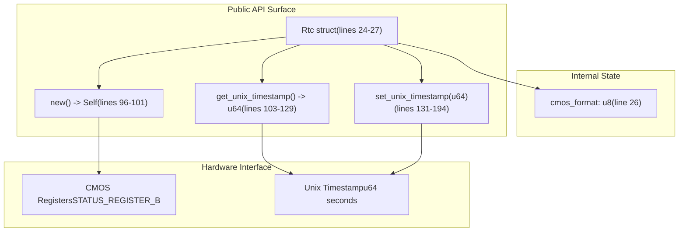
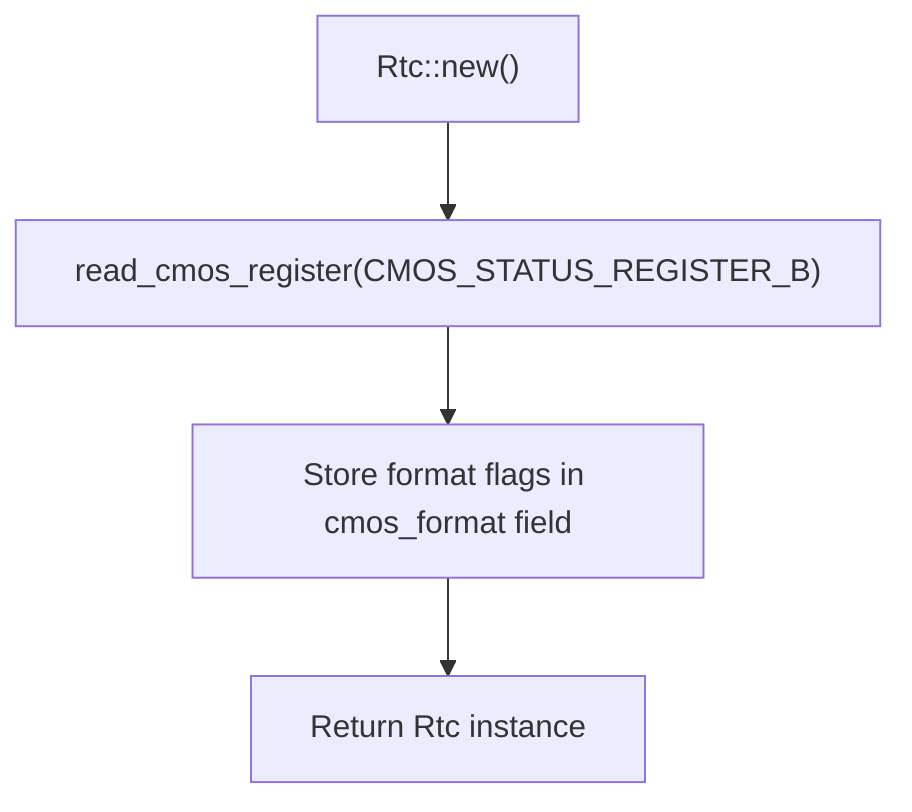
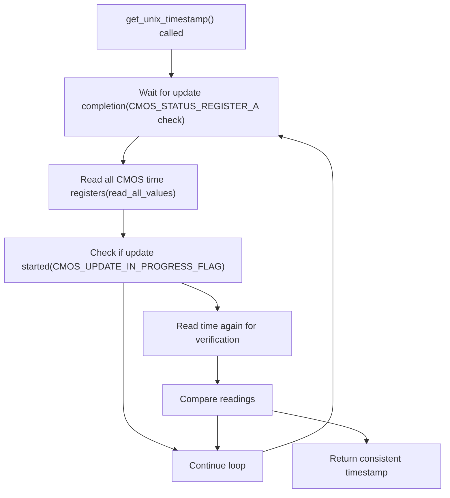
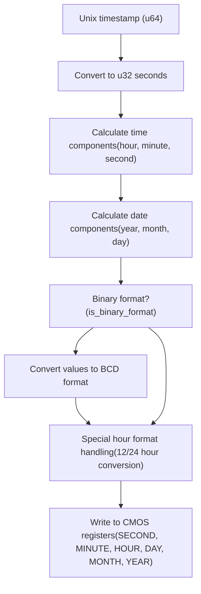

# RTC Driver API

> **Relevant source files**
> * [README.md](https://github.com/arceos-org/x86_rtc/blob/1990537d/README.md)
> * [src/lib.rs](https://github.com/arceos-org/x86_rtc/blob/1990537d/src/lib.rs)

This document covers the public interface of the x86_rtc crate's RTC driver, including the `Rtc` struct and its methods for reading and setting system time via CMOS hardware. This page focuses on the high-level API design and usage patterns. For information about the underlying CMOS hardware protocol and register operations, see [CMOS Hardware Interface](/arceos-org/x86_rtc/2.2-cmos-hardware-interface). For details about data format conversions and timestamp calculations, see [Data Format Handling](/arceos-org/x86_rtc/2.3-data-format-handling).

## API Structure Overview

The RTC driver provides a simple, safe interface to the x86_64 Real Time Clock through a single primary struct and three core methods.

### Core API Components



**Sources:** [src/lib.rs(L24 - L194)&emsp;](https://github.com/arceos-org/x86_rtc/blob/1990537d/src/lib.rs#L24-L194)

## Rtc Struct

The `Rtc` struct serves as the main entry point for all RTC operations. It maintains internal state about the CMOS hardware configuration.

|Field|Type|Purpose|
| --- | --- | --- |
|cmos_format|u8|Cached CMOS Status Register B value containing format flags|

The struct stores hardware format information to avoid repeatedly querying CMOS registers during time operations. This includes whether the hardware uses 24-hour format and binary vs BCD encoding.

**Sources:** [src/lib.rs(L24 - L27)&emsp;](https://github.com/arceos-org/x86_rtc/blob/1990537d/src/lib.rs#L24-L27)

## Constructor Method

### Rtc::new() -> Self

Creates a new `Rtc` instance by reading the current CMOS hardware configuration.



The constructor performs a single CMOS register read to determine hardware format configuration, which is then cached for the lifetime of the `Rtc` instance. This eliminates the need to re-read format flags on every time operation.

**Sources:** [src/lib.rs(L96 - L101)&emsp;](https://github.com/arceos-org/x86_rtc/blob/1990537d/src/lib.rs#L96-L101)

## Time Reading Method

### get_unix_timestamp(&self) -> u64

Returns the current time as seconds since Unix epoch (January 1, 1970 00:00:00 UTC).



The method implements a sophisticated synchronization protocol to ensure consistent readings despite hardware timing constraints. It uses a double-read verification pattern to detect and handle concurrent CMOS updates.

**Implementation Note:** The method requires interrupts to be disabled by the caller to ensure accurate timing, as documented in the method's comment at [src/lib.rs(L105)&emsp;](https://github.com/arceos-org/x86_rtc/blob/1990537d/src/lib.rs#L105-L105)

**Sources:** [src/lib.rs(L103 - L129)&emsp;](https://github.com/arceos-org/x86_rtc/blob/1990537d/src/lib.rs#L103-L129)

## Time Setting Method

### set_unix_timestamp(&self, unix_time: u64)

Sets the RTC to the specified Unix timestamp.



The method performs comprehensive date/time calculation including leap year handling and month-specific day counts. It respects the hardware's configured data format, converting between binary and BCD as needed.

**Sources:** [src/lib.rs(L131 - L194)&emsp;](https://github.com/arceos-org/x86_rtc/blob/1990537d/src/lib.rs#L131-L194)

## API Usage Patterns

### Basic Time Reading

```javascript
use x86_rtc::Rtc;
let rtc = Rtc::new();
let current_time = rtc.get_unix_timestamp();
```

### Time Setting

```javascript
use x86_rtc::Rtc;
let rtc = Rtc::new();
rtc.set_unix_timestamp(1640995200); // Set to specific Unix timestamp
```

### Thread Safety Considerations

The API is designed for single-threaded use in kernel or embedded contexts. Multiple concurrent accesses to the same `Rtc` instance require external synchronization, particularly for the `get_unix_timestamp()` method which requires interrupt-free execution.

**Sources:** [README.md(L9 - L12)&emsp;](https://github.com/arceos-org/x86_rtc/blob/1990537d/README.md#L9-L12) [src/lib.rs(L105)&emsp;](https://github.com/arceos-org/x86_rtc/blob/1990537d/src/lib.rs#L105-L105)

## Error Handling

The API uses a panic-free design with no explicit error return types. Invalid operations or hardware communication failures result in:

* Reading operations return potentially incorrect but valid `u64` values
* Writing operations complete without indication of success/failure
* Hardware communication errors are handled at the lower CMOS interface level

This design reflects the embedded/kernel context where panic-based error handling is preferred over Result types.

**Sources:** [src/lib.rs(L103 - L194)&emsp;](https://github.com/arceos-org/x86_rtc/blob/1990537d/src/lib.rs#L103-L194)